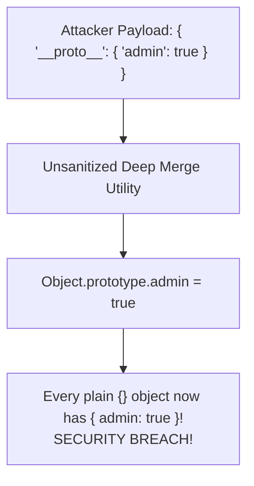

# Module 25: Prototypes and Prototype Chain — Prototypal Inheritance, `Object.create()`, and Prototype Pollution

## Overview

JavaScript implements **Prototypal Inheritance** rather than classical class-based inheritance.

Every JavaScript object contains an internal private reference slot named **`[[Prototype]]`** (exposed via `Object.getPrototypeOf()` or legacy `__proto__`) pointing to another object known as its prototype.

When accessing a property or invoking a method on an object, the V8 engine executes the **Prototype Chain Lookup Algorithm**, walking up the chain until the property is located or `null` is reached.

Understanding the difference between `Constructor.prototype` and `instance.[[Prototype]]`, the performance costs of `Object.setPrototypeOf()`, and **Prototype Pollution Security Hazards** is essential.

---

## 1. Prototype Chain Lookup Architecture

```mermaid
flowchart TD
    Instance["ranbir (Object Instance)<br/>{ name: 'Ranbir' }"] -->|[[Prototype]]| ParentProto["raj (Parent Prototype)<br/>{ family: 'Kapoor' }"]
    ParentProto -->|[[Prototype]]| GrandparentProto["prithviraj (Grandparent Prototype)<br/>{ legacy: 'Cinema' }"]
    GrandparentProto -->|[[Prototype]]| ObjectProto["Object.prototype<br/>{ toString, valueOf, hasOwnProperty }"]
    ObjectProto -->|[[Prototype]]| NullEnd["null (End of Prototype Chain)"]
```

```javascript
// Demonstrating Prototype Chain Property Resolution
const prithviraj = { legacy: "Cinema Pioneer" };

// Set raj.[[Prototype]] = prithviraj
const raj = Object.create(prithviraj);
raj.family = "Kapoor";

// Set ranbir.[[Prototype]] = raj
const ranbir = Object.create(raj);
ranbir.name = "Ranbir";

console.log(ranbir.name);    // "Ranbir" (Found on direct instance!)
console.log(ranbir.family);  // "Kapoor" (Found on raj prototype!)
console.log(ranbir.legacy);  // "Cinema Pioneer" (Found on prithviraj prototype!)
console.log(ranbir.unknown); // undefined (Walked to null at end of chain without finding key)
```

---

## 2. `Constructor.prototype` vs. `instance.[[Prototype]]`

```mermaid
flowchart TD
    subgraph Constructor Function
        ConstructorFn["function Hero(name)"] -->|prototype property| SharedProto["Hero.prototype Object<br/>{ attack() }"]
    end

    subgraph Instance Allocation via 'new'
        NewCall["const bheem = new Hero('Bheem')"] --> BheemInstance["bheem Instance Object<br/>{ name: 'Bheem' }"]
    end

    BheemInstance -->|__proto__ / [[Prototype]]| SharedProto
```

### Prototype Relationship Comparison

| Symbol / Term | What It Is | Where It Lives | Purpose |
| :--- | :--- | :--- | :--- |
| **`Constructor.prototype`** | Plain Object Property | On Constructor Functions / Classes | Blueprint containing shared methods for instances created via `new`. |
| **`instance.[[Prototype]]`**| Internal Private Pointer | On Object Instances | Points up the inheritance chain to the constructor's prototype. |

```javascript
function Hero(name) {
  this.name = name;
}

// Attach method once on prototype (Shared memory space!)
Hero.prototype.attack = function () {
  return `${this.name} performs a strike!`;
};

const bheem = new Hero("Bheem");

console.log(Object.getPrototypeOf(bheem) === Hero.prototype); // true
console.log(bheem.attack()); // "Bheem performs a strike!"
```

---

## 3. Prototype Manipulation: `Object.create()` vs. `Object.setPrototypeOf()`

```javascript
// 1. GOOD: Object.create(proto) establishes prototype at allocation time
const animal = { eats: true };
const rabbit = Object.create(animal);
rabbit.jumps = true;

console.log(rabbit.eats); // true (Inherited from animal)

// 2. DANGER: Object.setPrototypeOf() Performance Hazard!
const dog = { sound: "Woof" };
const pet = { name: "Buddy" };

// DANGER: Mutating [[Prototype]] at runtime invalidates V8 Inline Caches across the ENTIRE app!
Object.setPrototypeOf(pet, dog); 
console.log(pet.sound); // "Woof"
```

> [!WARNING]
> **Performance Anti-Pattern**: Never call `Object.setPrototypeOf(obj, newProto)` on active objects! Mutating an object's prototype at runtime de-optimizes V8 Hidden Classes and invalidates monomorphic inline caches. Always use `Object.create(proto)` at object creation time.

---

## 4. Prototype Pollution Security Vulnerability

**Prototype Pollution** is a critical security vulnerability where an attacker injects properties into `Object.prototype` via recursive merging functions or JSON payloads, corrupting all objects across the application:



```javascript
// 1. Vulnerability Demonstration
const maliciousPayload = JSON.parse('{"__proto__": {"isAdmin": true}}');
// Object.assign({}, maliciousPayload); // Modifies Object.prototype!

// 2. Safeguard 1: Dictionary Maps without Prototype
const safeDictionary = Object.create(null); // No prototype! Object.prototype is completely omitted.
console.log(Object.getPrototypeOf(safeDictionary)); // null (Immune to prototype pollution!)

// 3. Safeguard 2: Object.freeze(Object.prototype)
// Object.freeze(Object.prototype); // Prevents property injection globally
```

---

## Key Production Takeaways

1. **Use `Object.getPrototypeOf(obj)`**: Never read or write legacy `__proto__` properties directly. Use standard `Object.getPrototypeOf(obj)` to inspect prototype links.
2. **Avoid `Object.setPrototypeOf()`**: Avoid mutating object prototypes dynamically at runtime; use `Object.create(proto)` at object creation time.
3. **Use `Object.create(null)` for Clean Hash Maps**: Instantiate dictionary lookup maps using `Object.create(null)` to eliminate prototype inheritance overhead and prevent Prototype Pollution.
4. **Attach Shared Methods to `Constructor.prototype`**: Attach methods to `Constructor.prototype` instead of inside constructor bodies to share memory across all instances.

