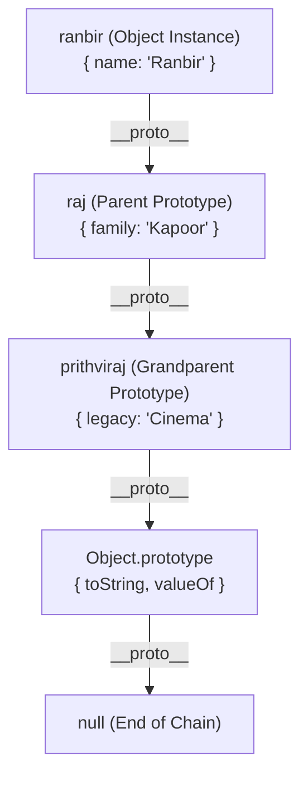

# File 25: Prototypes and Prototype Chain

## Overview
JavaScript achieves inheritance via **Prototypes**. Every object possesses an internal reference link (`[[Prototype]]` or `__proto__`) pointing to another object called its prototype. When accessing a property, the engine searches the object, then walks up the **Prototype Chain** until the key is found or `null` is reached.

---

## 1. The Prototype Chain Architecture



---

## 2. Property Lookup Walking Algorithm

```javascript
const prithviraj = { legacy: "Cinema" };
const raj = Object.create(prithviraj); // Set raj.__proto__ = prithviraj
raj.family = "Kapoor";

const ranbir = Object.create(raj);     // Set ranbir.__proto__ = raj
ranbir.name = "Ranbir";

console.log(ranbir.name);    // "Ranbir" (Found on instance)
console.log(ranbir.family);  // "Kapoor" (Found on raj prototype)
console.log(ranbir.legacy);  // "Cinema" (Found on prithviraj prototype)
console.log(ranbir.unknown); // undefined (Walks to null, not found)
```

---

## 3. Prototype vs `__proto__` distinction

- **`prototype`**: A property existing solely on **Constructor Functions / Classes** used as the prototype blueprint for instances created via `new`.
- **`__proto__` / `[[Prototype]]`**: An internal reference property on **actual object instances** pointing up the inheritance chain.

```javascript
function Hero(name) { this.name = name; }
Hero.prototype.fight = function() { return "Attacking!"; };

const bheem = new Hero("Bheem");

console.log(bheem.__proto__ === Hero.prototype); // true
```

---

## 4. `Object.getPrototypeOf()` & `Object.setPrototypeOf()`

```javascript
const dog = { sound: "Woof" };
const pet = Object.create(dog);

console.log(Object.getPrototypeOf(pet) === dog); // true

// Modern Prototype Check
console.log(dog.isPrototypeOf(pet)); // true
```

---

## Key Takeaways
1. All JS objects inherit properties by walking up the **Prototype Chain**.
2. **`Constructor.prototype`** defines shared methods for instances.
3. **`instance.__proto__`** points to its parent prototype object.
4. The prototype chain ends at **`Object.prototype.__proto__ === null`**.
5. Use **`Object.getPrototypeOf(obj)`** instead of inspecting legacy `__proto__`.
