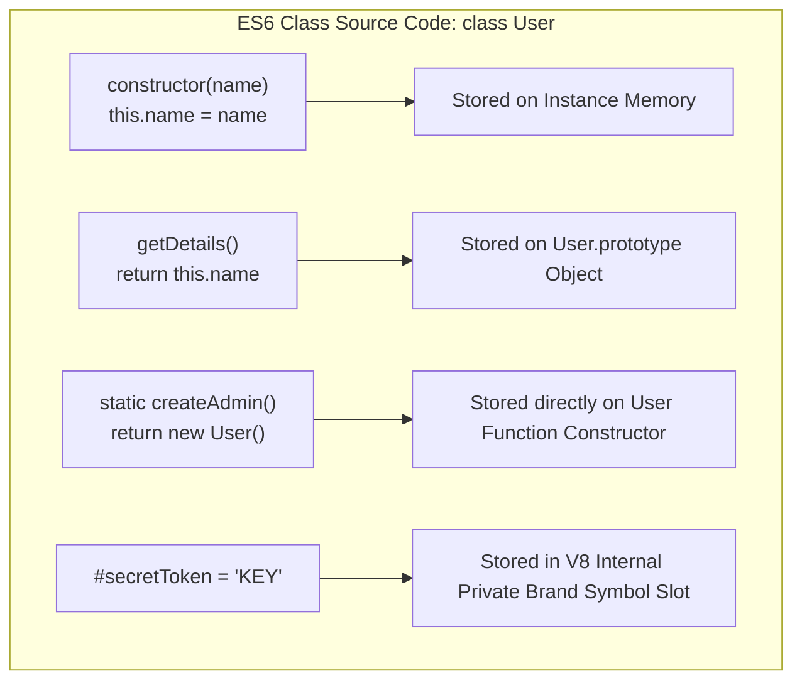
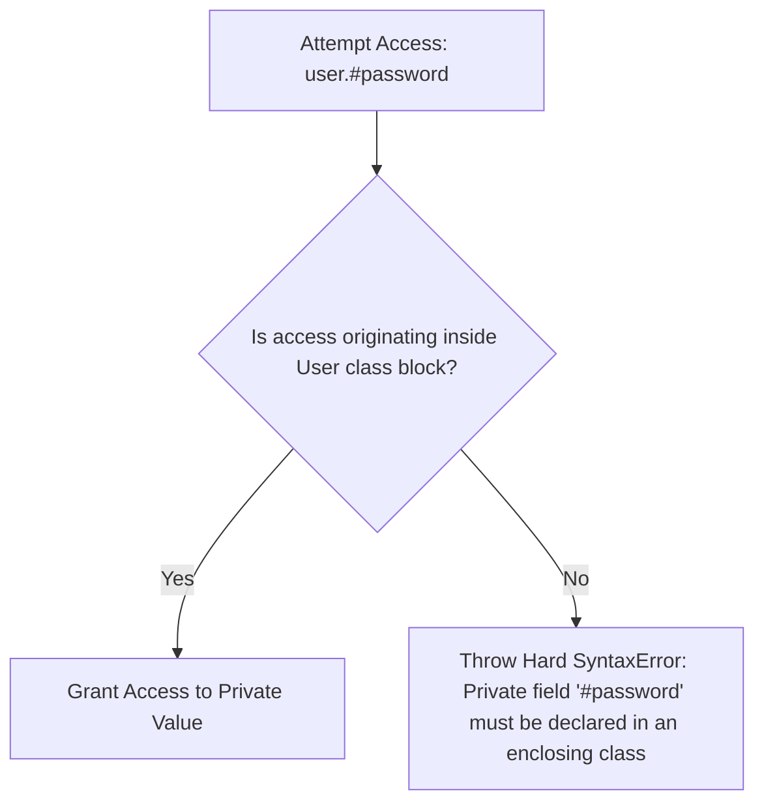

# Module 26: ES6 Classes — Syntactic Sugar, ES2022 Private Fields `#`, and Prototype Mapping

## Overview

Introduced in ECMAScript 2015 (ES6), **Classes** provide a clean, declarative syntax for object-oriented programming in JavaScript.

While ES6 class syntax resembles classical object-oriented languages like Java or C#, JavaScript classes remain **Syntactic Sugar over Prototypal Inheritance**. Under the hood, class methods are assigned directly to `Class.prototype`.

Understanding ES2022 **Private Fields (`#field`)**, private methods (`#method()`), public class fields, and how classes differ from legacy constructor functions is essential.

---

## 1. Class Syntax to Prototype Memory Mapping



### ES6 Classes vs. Legacy Constructor Functions Comparison

| Feature Dimension | ES6 Classes (`class User {}`) | Legacy Constructors (`function User() {}`) |
| :--- | :--- | :--- |
| **Underlying Mechanism**| Prototype-based inheritance | Prototype-based inheritance |
| **Hoisting Behavior** | **Not Hoisted** (Lives in TDZ) | Fully Hoisted |
| **`new` Invocation Requirement**| **Mandatory** (Invoking without `new` throws `TypeError`) | Optional (Invoking without `new` mutates `globalThis`) |
| **Strict Mode Execution**| **Always Strict Mode** | Non-strict by default |
| **Method Enumerability**| Prototype methods are **Non-Enumerable** (`enumerable: false`) | Prototype methods are Enumerable by default |

---

## 2. ES2022 Private Fields (`#`) & Private Methods

Before ES2022, developers used leading underscores (`_privateVar`) as naming conventions to hint at privacy. ES2022 introduced true language-enforced **Private Class Fields (`#field`)**:



```javascript
class UserAccount {
  // 1. ES2022 Private Field Declaration
  #passwordHash;
  #accessLogs = [];

  constructor(username, rawPassword) {
    this.username = username; // Public property
    this.#passwordHash = this.#hashPassword(rawPassword); // Private method call
  }

  // 2. ES2022 Private Method
  #hashPassword(password) {
    return `HASHED_${password}_SALT99`;
  }

  // Public Interface Method
  verifyPassword(inputPassword) {
    const isMatched = this.#passwordHash === this.#hashPassword(inputPassword);
    this.#accessLogs.push({ time: new Date(), result: isMatched });
    return isMatched;
  }
}

const user = new UserAccount("Priya", "SuperSecret123");
console.log("Username:", user.username); // "Priya"
console.log("Password Verified:", user.verifyPassword("SuperSecret123")); // true

// HARD PRIVACY ENFORCEMENT: Accessing private fields outside class throws SyntaxError!
// console.log(user.#passwordHash); // SyntaxError: Private field '#passwordHash' must be declared in enclosing class
```

---

## 3. Public Class Fields & Arrow Method Properties

Class fields allow initializing properties directly inside the class body without explicit `this` assignments inside the constructor:

```javascript
class InteractiveButton {
  // Public Class Field
  label = "Click Me";
  clickCount = 0;

  // Class Field Arrow Property: Automatically binds 'this' lexically to instance!
  handleClick = () => {
    this.clickCount++;
    console.log(`Button '${this.label}' clicked ${this.clickCount} times.`);
  };
}

const btn = new InteractiveButton();

// Safe extraction: 'handleClick' retains 'this' binding even when passed as standalone callback!
const standaloneCallback = btn.handleClick;
standaloneCallback(); // "Button 'Click Me' clicked 1 times."
```

---

## 4. ES2022 Static Initialization Blocks

Static initialization blocks allow multi-step evaluation and error handling when setting up static class properties:

```javascript
class DatabaseConfig {
  static connectionString;
  static isInitialized = false;

  // ES2022 Static Initialization Block
  static {
    try {
      const host = "127.0.0.1";
      const port = 5432;
      this.connectionString = `postgres://${host}:${port}/main_db`;
      this.isInitialized = true;
    } catch (error) {
      console.error("Failed to initialize static db config:", error);
    }
  }
}

console.log(DatabaseConfig.connectionString); // "postgres://127.0.0.1:5432/main_db"
```

---

## Key Production Takeaways

1. **Use ES2022 Private Fields (`#`) for Encapsulation**: Use `#field` syntax to enforce true data privacy instead of legacy underscore naming conventions (`_field`).
2. **Remember Class Prototype Methods are Non-Enumerable**: Methods defined inside class blocks do not appear during `for...in` loops or `Object.keys()` iterations.
3. **Use Class Field Arrows for Event Callbacks**: Use class field arrow properties (`handleClick = () => {}`) for DOM event listeners or React handlers to eliminate manual `.bind(this)` boilerplate.
4. **Instantiate Classes with `new`**: Always instantiate classes using `new ClassName()`; calling a class like a function (`ClassName()`) throws a `TypeError`.

