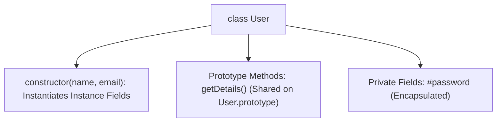

# File 26: ES6 Classes

## Overview
Introduced in ES6, **Classes** provide a cleaner, clearer syntax for creating object blueprints and managing inheritance. Classes are syntactic sugar over JavaScript's existing prototype-based inheritance model.

---

## 1. Class Structure & Syntax



---

## 2. ES6 Class Implementation

```javascript
class User {
    // Private Field Declaration (ES2022 syntax prefix #)
    #password;

    constructor(name, email, password) {
        this.name = name;
        this.email = email;
        this.#password = password; // Encapsulated private field
    }

    // Prototype Method (Stored once on User.prototype)
    getDetails() {
        return `${this.name} (${this.email})`;
    }

    // Private Method
    #validatePassword(input) {
        return input === this.#password;
    }

    verifyLogin(input) {
        return this.#validatePassword(input);
    }
}

const user = new User("Priya", "priya@example.com", "Secret123");
console.log(user.getDetails());     // "Priya (priya@example.com)"
console.log(user.verifyLogin("Secret123")); // true
// console.log(user.#password);     // SyntaxError: Private field '#password' must be declared in an enclosing class
```

---

## 3. Classes vs Constructor Functions

```javascript
// Classes are NOT hoisted! Accessing before declaration throws ReferenceError.
// Classes run inside implicit Strict Mode ("use strict").
// Methods defined inside class blocks are non-enumerable.
```

---

## Key Takeaways
1. ES6 classes provide **syntactic sugar** over standard prototype-based inheritance.
2. Methods inside class definitions are stored on **`Class.prototype`**.
3. Prefix fields with **`#`** to create true private class properties (ES2022).
4. Classes are **not hoisted**; declare classes before instantiating them.
