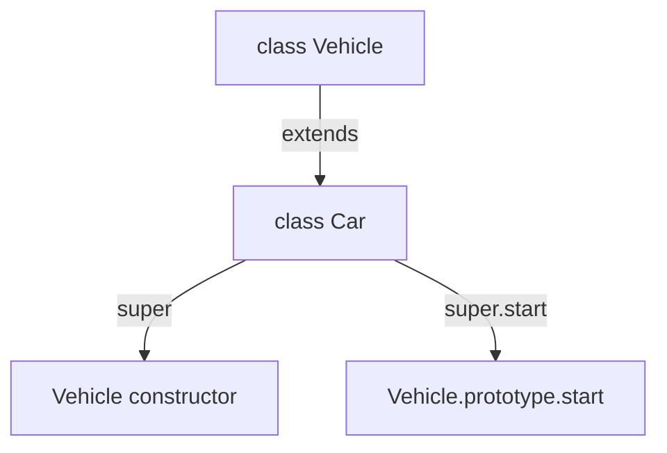

# File 27: Class Inheritance and `super`

## Overview
Class inheritance allows a child class to inherit properties and methods from a parent class using the **`extends`** keyword. The **`super`** keyword is used inside derived classes to invoke parent constructors and methods.

---

## 1. Class Inheritance Mechanics



---

## 2. Implementation with `extends` & `super`

```javascript
// Base Parent Class
class Vehicle {
    constructor(make, model) {
        this.make = make;
        this.model = model;
    }

    start() {
        return `${this.make} ${this.model} engine started`;
    }
}

// Derived Child Class
class Car extends Vehicle {
    constructor(make, model, doors) {
        // MANDATORY: Call super() BEFORE accessing 'this' in child constructor!
        super(make, model);
        this.doors = doors;
    }

    // Method Overriding
    start() {
        // Call parent method via super.start()
        return `${super.start()} with ${this.doors} doors`;
    }

    honk() {
        return "Beep Beep!";
    }
}

const nexon = new Car("Tata", "Nexon", 4);
console.log(nexon.start()); // "Tata Nexon engine started with 4 doors"
console.log(nexon.honk());  // "Beep Beep!"
```

---

## 3. Polymorphism & `instanceof` Operator
`instanceof` traverses the prototype chain to verify whether an instance belongs to a class hierarchy.

```javascript
console.log(nexon instanceof Car);     // true
console.log(nexon instanceof Vehicle); // true
console.log(nexon instanceof Object);  // true
```

---

## Key Takeaways
1. Use **`extends`** to establish parent-child class inheritance.
2. Invoke **`super(...args)`** at the top of derived class constructors before accessing `this`.
3. Override parent methods in child classes and invoke parent logic via **`super.methodName()`**.
4. The **`instanceof`** operator checks whether an object inherits from a class along its prototype chain.
