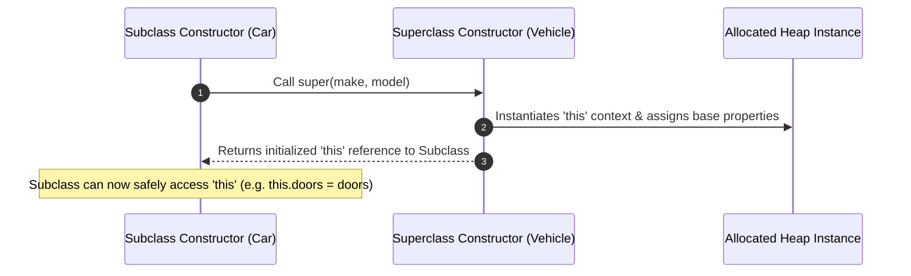

# Module 27: Class Inheritance and `super` — Prototype Linkages, Method Overriding, and Polymorphism

## Overview

Class Inheritance in JavaScript allows a child subclass to inherit state and behaviors from a parent superclass using the **`extends`** keyword.

Under the hood, `extends` configures **two distinct prototype links**:
1. **Instance Prototype Linkage**: `ChildClass.prototype.__proto__ === ParentClass.prototype` (Inherits instance methods).
2. **Static Prototype Linkage**: `ChildClass.__proto__ === ParentClass` (Inherits static methods and static fields).

Understanding the **`super()` Constructor Execution Requirement**, method overriding rules, polymorphism, and `instanceof` inspection is fundamental to building robust object models.

---

## 1. Subclass Prototype Linkage Architecture

```mermaid
flowchart TD
    subgraph Class Static Linkage (Inherits static methods)
        CarClass["Car (Subclass)"] -->|__proto__| VehicleClass["Vehicle (Superclass)"]
    end

    subgraph Prototype Method Linkage (Inherits instance methods)
        CarProto["Car.prototype Object<br/>{ start(), honk() }"] -->|__proto__| VehicleProto["Vehicle.prototype Object<br/>{ start() }"]
    end

    subgraph Instance Linkage
        CarInstance["nexon (Car Instance)<br/>{ make, model, doors }"] -->|__proto__| CarProto
    end
```

---

## 2. The `super()` Constructor Execution Requirement

In a derived subclass constructor, calling **`super(...args)` is MANDATORY before accessing `this`**:



> [!CRITICAL]
> **`ReferenceError` Warning**: Attempting to reference `this` or return from a derived class constructor before invoking `super()` throws a fatal `ReferenceError: Must call super constructor in derived class before accessing 'this'`.

```javascript
// Base Parent Class
class Vehicle {
  constructor(make, model) {
    this.make = make;
    this.model = model;
    this.isEngineRunning = false;
  }

  start() {
    this.isEngineRunning = true;
    return `${this.make} ${this.model}: Engine Ignited.`;
  }
}

// Derived Child Subclass
class ElectricCar extends Vehicle {
  constructor(make, model, batteryCapacityKw) {
    // MANDATORY STEP 1: Must invoke super() before touching 'this'!
    super(make, model); 

    // STEP 2: Safe to attach child instance properties to 'this'
    this.batteryCapacityKw = batteryCapacityKw;
  }

  // 1. Method Overriding (Extends parent method)
  start() {
    const parentStatus = super.start(); // Invoke parent method via super.start()
    return `${parentStatus} EV Systems Online (${this.batteryCapacityKw} kWh).`;
  }

  // 2. Subclass Specific Method
  chargeBattery() {
    return `Charging ${this.make} ${this.model}...`;
  }
}

const nexonEV = new ElectricCar("Tata", "Nexon EV", 40);
console.log(nexonEV.start());
// Output: "Tata Nexon EV: Engine Ignited. EV Systems Online (40 kWh)."
console.log(nexonEV.chargeBattery()); // "Charging Tata Nexon EV..."
```

---

## 3. Polymorphism & Prototype Chain Inspection (`instanceof`)

Polymorphism allows subclasses to provide custom implementations of parent methods while preserving a uniform contract interface.

The **`instanceof`** operator evaluates whether `Constructor.prototype` exists anywhere along the object instance's prototype chain:

```javascript
// Polymorphism: Calling start() on heterogeneous vehicle collections
const fleet = [
  new Vehicle("Generic", "Truck"),
  new ElectricCar("MG", "ZS EV", 50)
];

fleet.forEach((vehicle) => {
  console.log("Fleet Entry Start:", vehicle.start()); // Dynamically dispatches to subclass method!
});

// Prototype Inspection via instanceof
console.log(nexonEV instanceof ElectricCar); // true
console.log(nexonEV instanceof Vehicle);     // true (Found on prototype chain!)
console.log(nexonEV instanceof Object);      // true (Found at top of prototype chain!)
```

---

## Key Production Takeaways

1. **Invoke `super()` First in Derived Constructors**: Always place `super(...args)` as the first line of a derived class constructor before referencing `this`.
2. **Understand Dual Subclass Prototype Links**: Remember that `extends` links both `Child.prototype.__proto__` (for instance methods) AND `Child.__proto__` (for static methods).
3. **Use `super.methodName()` for Extension**: When overriding a parent method, call `super.methodName()` to leverage existing parent logic rather than duplicating code.
4. **Prefer Composition Over Deep Inheritance Trees**: Avoid creating deep multi-level inheritance hierarchies (e.g. `A extends B extends C extends D`); prefer object composition when combining capabilities.

