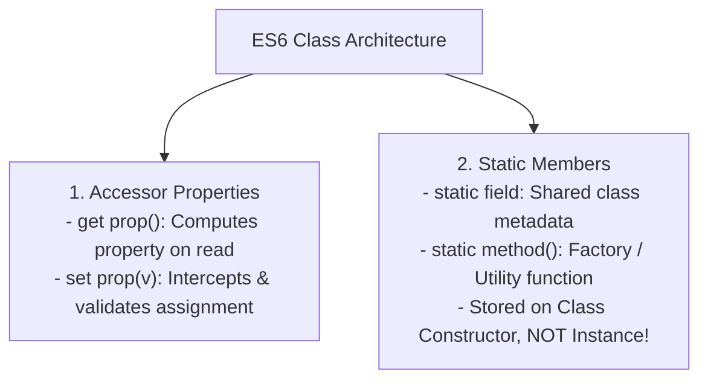
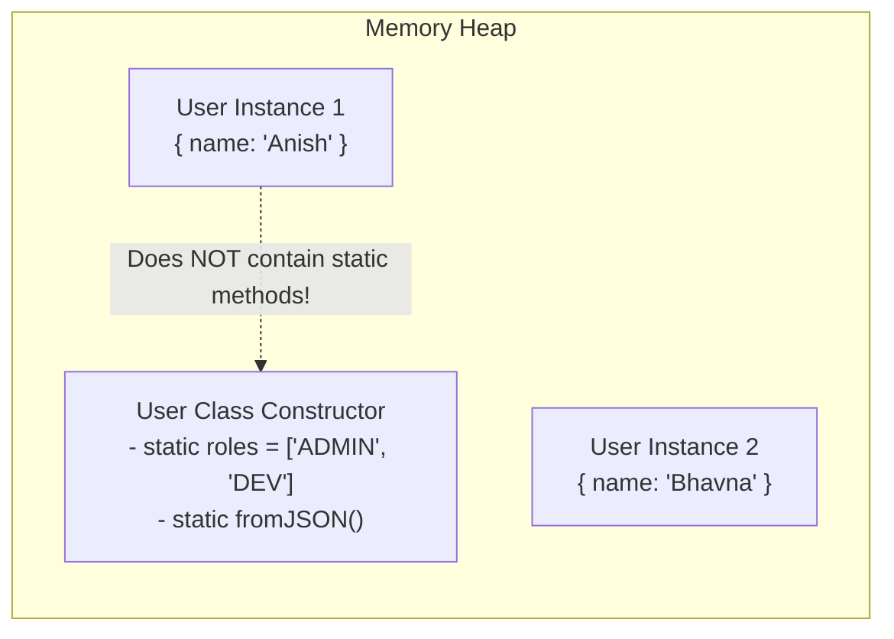

# Module 28: Getters, Setters, and Static Members — Accessors, Static Factories, and Memory Models

## Overview

Modern ECMAScript provides **Accessor Properties (`get` and `set`)** and **Static Members (`static`)** to structure enterprise class interfaces:
- **Getters (`get`)**: Functions bound to a property that execute dynamically when the property is read (without parentheses).
- **Setters (`set`)**: Functions bound to a property that intercept, validate, and sanitize value assignments.
- **Static Members (`static`)**: Properties and methods bound directly to the Class Constructor function rather than instance payloads, ideal for utility methods and factory patterns.

---

## 1. Accessor Property vs. Static Member Architecture



---

## 2. Getters and Setters: Accessor Descriptor Interception

Under the hood, `get` and `set` define property descriptors with `[[Get]]` and `[[Set]]` internal methods rather than standard `[[Value]]` slots:

```mermaid
flowchart TD
    subgraph Property Read (temp.fahrenheit)
        Read["Read Property: temp.fahrenheit"] --> ExecGet["Execute 'get fahrenheit()' Method<br/>- Computes: (celsius * 9/5) + 32<br/>- Returns Computed Result"]
    end

    subgraph Property Write (temp.celsius = 30)
        Write["Write Property: temp.celsius = 30"] --> ExecSet["Execute 'set celsius(val)' Interceptor<br/>- Validate val >= -273.15<br/>- Assigns #celsius = val"]
    end
```

```javascript
class TemperatureSensor {
  #celsius;

  constructor(initialCelsius) {
    this.celsius = initialCelsius; // Invokes setter validation immediately!
  }

  // 1. Getter Accessor (Read computed value without parentheses)
  get celsius() {
    return this.#celsius;
  }

  // 2. Setter Accessor (Intercepts and validates assignments)
  set celsius(value) {
    if (typeof value !== "number" || Number.isNaN(value)) {
      throw new TypeError("Invalid temperature value");
    }
    if (value < -273.15) {
      throw new RangeError("Temperature below Absolute Zero (-273.15°C)!");
    }
    this.#celsius = value;
  }

  // 3. Computed Getter Property
  get fahrenheit() {
    return (this.#celsius * 9) / 5 + 32;
  }
}

const sensor = new TemperatureSensor(25);
console.log("Celsius   :", sensor.celsius);    // 25
console.log("Fahrenheit:", sensor.fahrenheit); // 77

sensor.celsius = 30; // Triggers Setter Validation!
console.log("Updated Fahrenheit:", sensor.fahrenheit); // 86
```

---

## 3. Static Members & The Static Factory Pattern

Static properties exist on the Class Constructor object itself, avoiding duplicate allocations across instances.



```javascript
class UserProfile {
  // ES2022 Static Fields & Private Static Fields
  static #MAX_LOGIN_ATTEMPTS = 5;
  static DEFAULT_ROLE = "GUEST";

  constructor(name, role = UserProfile.DEFAULT_ROLE) {
    this.name = name;
    this.role = role;
  }

  // Static Factory Method Pattern
  static fromJSON(jsonString) {
    try {
      const parsed = JSON.parse(jsonString);
      if (!parsed.name) throw new Error("Invalid payload: missing name");
      return new UserProfile(parsed.name, parsed.role);
    } catch (error) {
      throw new Error(`Failed to instantiate UserProfile: ${error.message}`);
    }
  }

  // Static Helper Utility Method
  static compareRoles(userA, userB) {
    return userA.role === userB.role;
  }
}

// 1. Direct Static Factory Invocation
const rawJson = '{"name": "Deepa", "role": "Architect"}';
const userFromFactory = UserProfile.fromJSON(rawJson);

console.log("Factory Instantiated:", userFromFactory.name, userFromFactory.role);

// 2. Static Members on Instance Error
const userInstance = new UserProfile("Anita");
// userInstance.fromJSON(rawJson); // TypeError: userInstance.fromJSON is not a function!
```

---

## Key Production Takeaways

1. **Use Getters for Derived / Computed Properties**: Use `get propName()` to calculate derived properties dynamically on read instead of storing duplicate stale state.
2. **Use Setters for Data Validation & Normalization**: Intercept property assignments using `set propName(v)` to throw validation errors or sanitize strings before storing state.
3. **Use Static Factory Methods for Complex Deserialization**: Implement `static fromJSON()` or `static fromDTO()` factory methods to decouple instance creation from raw data parsing.
4. **Access Static Members via `ClassName.member`**: Remember that static methods belong to the Class Constructor function, not instances. Always invoke them via `ClassName.staticMethod()`.

