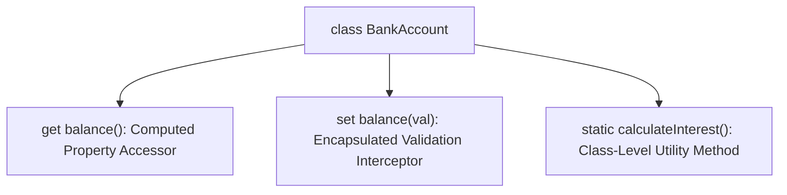

# File 28: Getters, Setters, and Static Members

## Overview
**Getters** (`get`) and **Setters** (`set`) bind object properties to functions, allowing validation and computed values. **Static members** (`static`) belong directly to the class constructor rather than individual instances.

---

## 1. Class Features Architecture



---

## 2. Getters & Setters Implementation

```javascript
class Temperature {
    #celsius;

    constructor(celsius) {
        this.#celsius = celsius;
    }

    // Getter Accessor
    get celsius() {
        return this.#celsius;
    }

    // Computed Getter
    get fahrenheit() {
        return (this.#celsius * 9) / 5 + 32;
    }

    // Setter Interceptor with Input Validation
    set celsius(value) {
        if (value < -273.15) {
            throw new RangeError("Temperature below absolute zero!");
        }
        this.#celsius = value;
    }
}

const temp = new Temperature(25);
console.log(temp.celsius);    // 25
console.log(temp.fahrenheit); // 77

temp.celsius = 30; // Triggers Setter Validation!
console.log(temp.fahrenheit); // 86
```

---

## 3. Static Methods & Fields
Static properties and methods exist directly on the class constructor. They are instantiated once and cannot be called on class instances.

```javascript
class MathUtils {
    // Static Field
    static PI = 3.14159;

    // Static Utility Method
    static square(x) {
        return x * x;
    }
}

console.log(MathUtils.PI);         // 3.14159
console.log(MathUtils.square(4));  // 16

const utils = new MathUtils();
// utils.square(4); // TypeError: utils.square is not a function
```

---

## Key Takeaways
1. Use **Getters (`get`)** for dynamic computed properties accessed without parentheses.
2. Use **Setters (`set`)** to validate and intercept property assignments.
3. Use **`static`** methods and fields for class-level utility functions (e.g., `MathUtils.square()`).
4. Static members are accessed via `ClassName.member`, not instance names.
