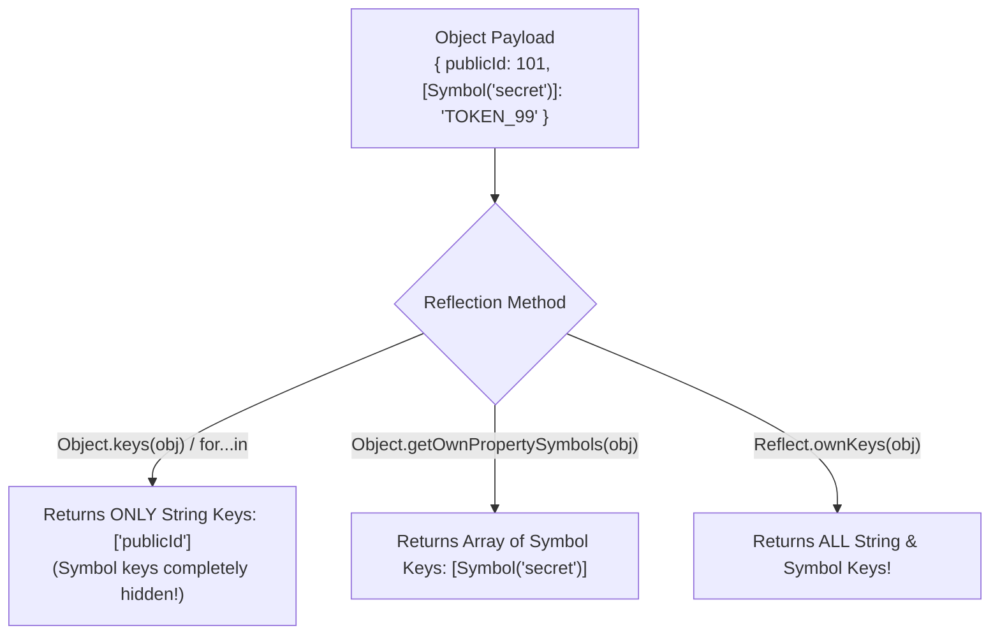
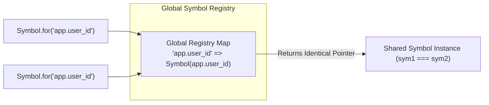

# Module 29: Symbols and Well-Known Symbols — Uniqueness, Global Registry, and Meta-Programming

## Overview

Introduced in ECMAScript 2015 (ES6), **`Symbol`** is a unique and immutable primitive data type.

Every Symbol value generated via `Symbol()` is guaranteed to be **100% unique**, even if created with identical description strings (`Symbol("id") !== Symbol("id")`).

Symbols serve two major architectural purposes in JavaScript:
1. **Collision-Free Object Keys**: Adding non-string property keys to objects that will never collide with third-party keys or framework updates.
2. **Well-Known Symbols Meta-Programming**: Using built-in engine Symbols (`Symbol.iterator`, `Symbol.toPrimitive`, `Symbol.hasInstance`, `Symbol.toStringTag`) to hook into and customize language behavior.

---

## 1. Symbol Uniqueness & Reflection Isolation



```javascript
// 1. Guaranteed Uniqueness
const symA = Symbol("session_id");
const symB = Symbol("session_id");

console.log(symA === symB); // false (Guaranteed unique!)
console.log(typeof symA);   // "symbol"

// 2. Symbol Keys as Non-Colliding Object Properties
const SECRET_KEY = Symbol("internal_auth_token");

const userPayload = {
  username: "Anish",
  [SECRET_KEY]: "BEARER-9001-XYZ" // Non-clashing property
};

console.log("Direct Key Access:", userPayload[SECRET_KEY]); // "BEARER-9001-XYZ"

// Symbol keys are omitted during standard enumeration to prevent accidental leaks
console.log("Object.keys()    :", Object.keys(userPayload)); // ["username"]
console.log("JSON.stringify  :", JSON.stringify(userPayload)); // '{"username":"Anish"}'

// Extracting Symbol keys via Reflection APIs
console.log("Symbol Keys     :", Object.getOwnPropertySymbols(userPayload)); // [Symbol(internal_auth_token)]
```

---

## 2. The Global Symbol Registry (`Symbol.for` & `Symbol.keyFor`)

While `Symbol()` creates an isolated unique symbol every time, `Symbol.for(key)` checks the runtime **Global Symbol Registry**, returning a shared global symbol instance across modules, frames, or micro-frontends:



```javascript
// 1. Symbol.for(key) searches or creates in the Global Registry
const globalSym1 = Symbol.for("app.current_user");
const globalSym2 = Symbol.for("app.current_user");

console.log(globalSym1 === globalSym2); // true (Identical reference!)

// 2. Symbol.keyFor(sym) retrieves string key from Global Registry
console.log(Symbol.keyFor(globalSym1)); // "app.current_user"

// Standalone Symbol() is NOT in the global registry:
const localSym = Symbol("app.current_user");
console.log(Symbol.keyFor(localSym));   // undefined
```

---

## 3. Well-Known Symbols Meta-Programming

JavaScript provides built-in **Well-Known Symbols** on the `Symbol` constructor to allow developers to override engine algorithms:

### Meta-Programming Hook Matrix

| Well-Known Symbol | Language Algorithm Hooked | Purpose |
| :--- | :--- | :--- |
| **`Symbol.iterator`** | `for...of`, `[...iterable]`, destructuring | Makes any object iterable by returning an iterator object. |
| **`Symbol.toPrimitive`**| Unary `+`, `${obj}`, `obj + 5` operator coercion | Customizes type coercion for string, number, and default hints. |
| **`Symbol.hasInstance`**| `instanceof` operator check | Customizes behavior of `obj instanceof Constructor`. |
| **`Symbol.toStringTag`**| `Object.prototype.toString.call(obj)` | Customizes default string tag representation (`"[object TagName]"`). |

```javascript
// Customizing Meta-Programming Contracts via Well-Known Symbols
class CustomRange {
  constructor(start, end) {
    this.start = start;
    this.end = end;
  }

  // 1. Symbol.iterator Hook: Enables for...of loops over CustomRange instance!
  *[Symbol.iterator]() {
    for (let i = this.start; i <= this.end; i++) {
      yield i;
    }
  }

  // 2. Symbol.toStringTag Hook: Customizes Object.prototype.toString.call() tag
  get [Symbol.toStringTag]() {
    return "CustomRangeSequence";
  }
}

const range = new CustomRange(1, 3);

for (const num of range) {
  console.log("Range Item:", num); // Output: 1, 2, 3
}

console.log(Object.prototype.toString.call(range)); // "[object CustomRangeSequence]"
```

---

## Key Production Takeaways

1. **Use Symbols for Private Plugin Keys**: Use Symbols when writing libraries or SDKs to attach private metadata keys to user objects without risking key collisions.
2. **Use `Symbol.for()` Across Separate Modules**: Use `Symbol.for("key")` when sharing symbols across different modules or micro-frontend micro-apps.
3. **Use Well-Known Symbols for Meta-Programming**: Implement `Symbol.iterator` to make custom collection classes directly usable inside `for...of` loops and spread operators.
4. **Remember Symbols are Omitted from JSON**: `JSON.stringify()` completely ignores Symbol keys and values.

