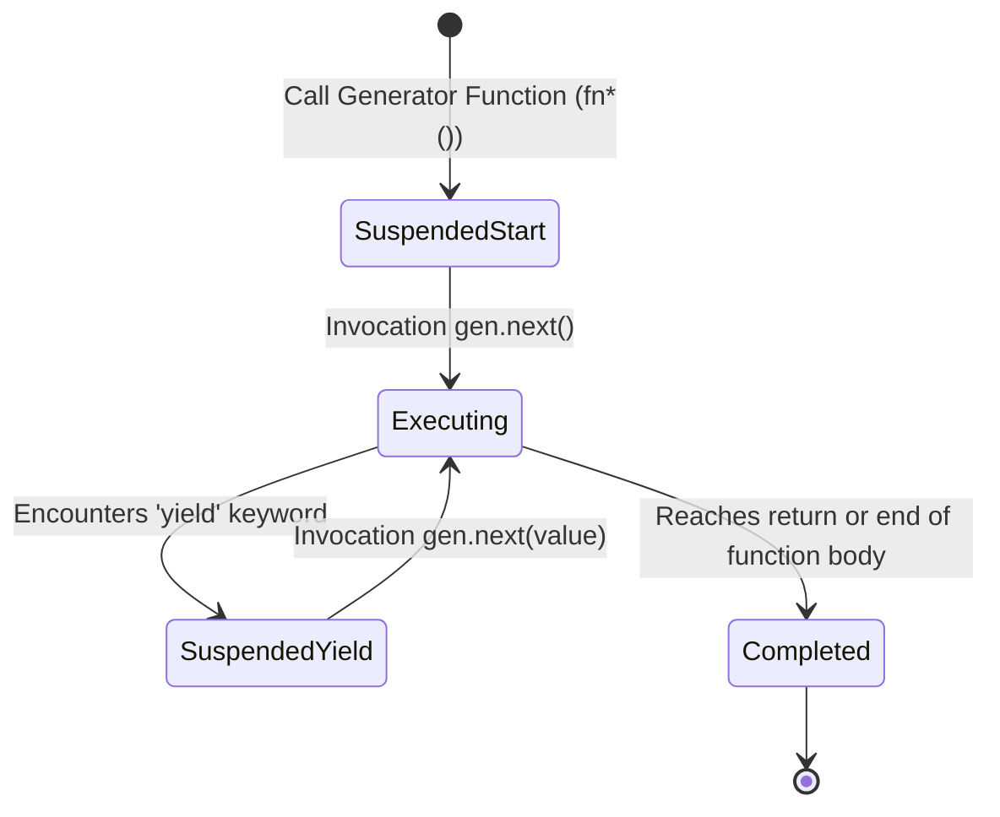
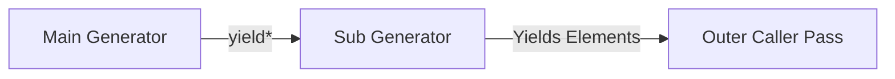

# Module 30: Iterators and Generators — Protocols, Coroutines, and Lazy Streams

## Overview

JavaScript provides two complementary standards for traversing datasets sequentially:
1. **The Iteration Protocols**: The **Iterable Protocol** (`[Symbol.iterator]()`) and **Iterator Protocol** (`.next() => { value, done }`).
2. **Generators (`function*`)**: Special resumable functions that function as **Coroutines**, pausing execution at **`yield`** keywords and resuming when **`.next()`** is invoked.

Under the hood, Google V8 suspends a generator's execution context frame on the heap when `yield` is evaluated, preserving local stack variables and the program counter (PC) until the caller resumes execution.

Understanding bidirectional message passing (`.next(val)`), exception injection (`.throw(err)`), recursive delegation (`yield*`), and **Lazy Data Stream Processing** is essential.

---

## 1. The Iteration Protocol Architecture

```mermaid
flowchart TD
    IterableObj[Iterable Object] -->|Symbol.iterator| IteratorObj[Iterator Object]
    IteratorObj -->|next()| ResultObj["Iterator Result Object<br/>{ value: any, done: boolean }"]
    
    ResultObj --> DoneCheck{Is done === true?}
    DoneCheck -- No --> KeepIterating["Yield Next Element Value"]
    DoneCheck -- Yes --> Complete["Iteration Sequence Terminated"]
```

### Protocol Interface Specifications

```typescript
// 1. Iterable Interface Contract
interface Iterable<T> {
  [Symbol.iterator](): Iterator<T>;
}

// 2. Iterator Interface Contract
interface Iterator<T> {
  next(value?: any): IteratorResult<T>;
  return?(value?: any): IteratorResult<T>;
  throw?(e?: any): IteratorResult<T>;
}

// 3. IteratorResult Contract
interface IteratorResult<T> {
  value: T | undefined;
  done: boolean;
}
```

---

## 2. Generator State Machine Mechanics (`function*` & `yield`)

A Generator function transitions across four internal states during its lifecycle: **Suspended Start**, **Executing**, **Suspended Yield**, and **Completed**.



```javascript
// Generator State Machine Execution Pass
function* stepGenerator() {
  console.log("State 1: Executing initial block");
  const inputA = yield "Yield Step 1";

  console.log("State 2: Received inputA =", inputA);
  const inputB = yield "Yield Step 2";

  console.log("State 3: Received inputB =", inputB);
  return "Generator Fully Completed";
}

const gen = stepGenerator();

// 1. Start execution up to first yield
console.log(gen.next()); 
// Output: "State 1: Executing initial block" -> { value: "Yield Step 1", done: false }

// 2. Resume execution and inject value into inputA
console.log(gen.next("INJECTED_VALUE_A")); 
// Output: "State 2: Received inputA = INJECTED_VALUE_A" -> { value: "Yield Step 2", done: false }

// 3. Resume execution and inject value into inputB
console.log(gen.next("INJECTED_VALUE_B")); 
// Output: "State 3: Received inputB = INJECTED_VALUE_B" -> { value: "Generator Fully Completed", done: true }
```

---

## 3. Delegating Generators (`yield*`)

The **`yield*`** operator delegates iteration execution to another generator or iterable object, flattening nested generator sequences:



```javascript
function* subTaskSequence() {
  yield "SubTask 1: Verify Schema";
  yield "SubTask 2: Encrypt Payload";
}

function* mainWorkflow() {
  yield "Main Step 1: Start Workflow";
  yield* subTaskSequence(); // Delegates iteration pass to subTaskSequence!
  yield "Main Step 2: Complete Workflow";
}

const workflow = mainWorkflow();

for (const step of workflow) {
  console.log("Workflow Step:", step);
}
/*
  Output:
  Workflow Step: Main Step 1: Start Workflow
  Workflow Step: SubTask 1: Verify Schema
  Workflow Step: SubTask 2: Encrypt Payload
  Workflow Step: Main Step 2: Complete Workflow
*/
```

---

## 4. Infinite Memory-Safe Lazy Streams

Generators allow producing infinite sequence streams lazily on-demand without memory overflow risks:

```javascript
// Memory-Safe Infinite Unique ID Generator
function* infiniteIdGenerator(prefix = "ID") {
  let counter = 1;
  while (true) {
    yield `${prefix}-${counter++}`;
  }
}

const idStream = infiniteIdGenerator("TXN");

console.log(idStream.next().value); // "TXN-1"
console.log(idStream.next().value); // "TXN-2"
console.log(idStream.next().value); // "TXN-3"
// Generates items lazily on demand; zero memory heap buildup!
```

---

## Key Production Takeaways

1. **Use Generators for Lazy Evaluation**: Use generators to stream huge multi-gigabyte log files or infinite datasets on-demand to save memory heap space.
2. **Implement `Symbol.iterator` on Custom Collections**: Implement `[Symbol.iterator]` on custom data structure classes to make them natively compatible with `for...of` loops and spread syntax (`[...collection]`).
3. **Use `yield*` for Generator Modularization**: Use `yield*` to decompose complex multi-step generator pipelines into modular sub-generator functions.
4. **Pass Messages with `.next(val)`**: Use `.next(value)` to send messages back into a paused generator execution frame.

