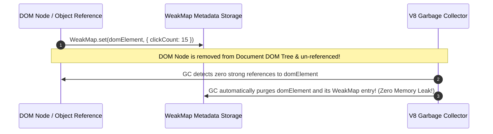

# Module 31: Sets and Maps — Hash Tables, `WeakMap` Garbage Collection, and Key-Value Collections

## Overview

ES6 introduced four specialized Key-Value and Set collection structures: **`Map`**, **`Set`**, **`WeakMap`**, and **`WeakSet`**.

While traditional JavaScript objects only support Strings and Symbols as keys, **`Map`** supports arbitrary key types (including Objects, Functions, and DOM Nodes) while preserving insertion order. **`Set`** enforces unique element collections, eliminating duplicates automatically.

Understanding the difference between strong reference collections (`Map`/`Set`) and **Weak Collections (`WeakMap`/`WeakSet`)** is vital for preventing memory leaks in large-scale applications.

---

## 1. ES6 Collection Architecture Taxonomy

```mermaid
flowchart TD
    Collections[ES6 Collection Data Structures] --> Strong[Strong Reference Collections<br/>- Keys/Values held strongly in RAM<br/>- Iterable via for...of & keys()]
    Collections --> Weak[Weak Reference Collections<br/>- Object Keys held weakly for Garbage Collection<br/>- Non-iterable (No keys(), no size)]

    Strong --> MapStructure["Map: Key-Value Hash Table (Any type as key)"]
    Strong --> SetStructure["Set: Unique Value Hash Collection"]

    Weak --> WeakMapStructure["WeakMap: Object Keys -> Garbage Collectable Metadata"]
    Weak --> WeakSetStructure["WeakSet: Object Members -> Garbage Collectable Set"]
```

---

## 2. Comprehensive Comparison Matrix: `Map` vs. Plain Object (`{}`)

| Feature Dimension | Plain Object (`{}`) | `Map` Collection |
| :--- | :--- | :--- |
| **Supported Key Types** | Strings and Symbols **ONLY** | **ANY Data Type** (Objects, Functions, Primitives) |
| **Key Ordering** | Complex (Integer keys first, then insertion order) | **Guaranteed Exact Insertion Order** |
| **Element Size Lookup** | Manual calculation ($\mathcal{O}(N)$ via `Object.keys(obj).length`) | Direct Property ($\mathcal{O}(1)$ via `map.size`) |
| **Performance Overhead**| Optimized for fixed shape properties | **Optimized for High-Frequency Additions/Deletions** |
| **Prototype Pollution** | Vulnerable via `__proto__` injection | **100% Safe** (No prototype key collisions) |
| **Direct Iteration** | Requires `Object.entries(obj)` | Natively Iterable via `for...of` |

```javascript
const map = new Map();
const objKey = { id: 9001 };
const fnKey = () => {};

// 1. Any type allowed as key in Map!
map.set(objKey, "Object Key Payload");
map.set(fnKey, "Function Key Payload");
map.set(42, "Numeric Key Payload");

console.log(map.get(objKey)); // "Object Key Payload"
console.log(map.size);       // 3

// 2. Iterating Map Entries cleanly
for (const [key, value] of map) {
  console.log("Map Entry:", key, "=>", value);
}
```

---

## 3. The `Set` Collection & Deduplication Patterns

`Set` stores unique values of any type, evaluating uniqueness using the `SameValueZero` equality algorithm (where `NaN === NaN` and `-0 === +0`):

```javascript
// Array Deduplication Pattern
const rawUserIds = [101, 202, 101, 303, 202, 404];

// One-Liner Deduplication via Set and Spread operator
const uniqueUserIds = [...new Set(rawUserIds)];
console.log("Deduplicated IDs:", uniqueUserIds); // [101, 202, 303, 404]

// Set O(1) Fast Membership Testing
const activeSessions = new Set(["S1", "S2", "S3"]);
console.log(activeSessions.has("S2")); // true (O(1) Hash Table Lookup!)
```

---

## 4. `WeakMap` & Memory Leak Prevention Architecture

`WeakMap` is a specialized map where **keys MUST be Objects**, and references to key objects are held **weakly**. If a key object has no other references in code, the Garbage Collector automatically reclaims both the key and its value payload from RAM:



```javascript
// Metadata Association Pattern via WeakMap
const domNodeMetadata = new WeakMap();

function attachNodeMetadata(domElement, metadata) {
  // domElement MUST be an Object!
  domNodeMetadata.set(domElement, metadata);
}

let buttonElement = { id: "submit-btn", tag: "BUTTON" }; // Simulated DOM Node

attachNodeMetadata(buttonElement, { lastClicked: Date.now() });

console.log(domNodeMetadata.get(buttonElement)); // Returns metadata object

// When buttonElement is un-referenced, its entry in WeakMap is automatically Garbage Collected!
buttonElement = null; 
// V8 Garbage Collector reclaims memory automatically without manual cleanup!
```

---

## Key Production Takeaways

1. **Use `Set` for $\mathcal{O}(1)$ Membership Checks and Deduplication**: Replace array searching (`arr.includes(x)`) with `set.has(x)` ($\mathcal{O}(1)$ vs $\mathcal{O}(N)$). Use `[...new Set(array)]` to deduplicate arrays cleanly.
2. **Use `Map` when Keys are Dynamic or Non-Strings**: Prefer `Map` over plain `{}` objects when mapping non-string keys or when insertion order must be strictly preserved.
3. **Use `WeakMap` to Attach Private Metadata**: Use `WeakMap` when attaching private metadata to DOM nodes, class instances, or external objects to prevent memory leaks.
4. **Remember `WeakMap` and `WeakSet` are Non-Iterable**: `WeakMap` and `WeakSet` do not have `.size`, `.keys()`, or `for...of` iteration because garbage collection timing is non-deterministic.

