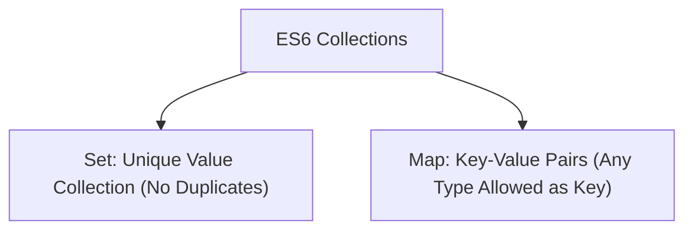

# File 31: Sets and Maps

## Overview
Introduced in ES6, **`Set`** (collection of unique values) and **`Map`** (ordered key-value store supporting any data type as key) complement traditional JavaScript Objects and Arrays.

---

## 1. Set vs Map Data Structures



---

## 2. The `Set` Collection (Unique Elements)
A `Set` automatically rejects duplicate values.

```javascript
const uniqueIds = new Set([10, 20, 10, 30, 20]);

console.log(uniqueIds.size); // 3 (Duplicates removed automatically!)
console.log(uniqueIds.has(20)); // true

uniqueIds.add(40);
uniqueIds.delete(10);

// De-duplicating Arrays shorthand
const rawArray = [1, 2, 2, 3, 4, 4];
const cleanArray = [...new Set(rawArray)]; // [1, 2, 3, 4]
```

---

## 3. The `Map` Collection (Key-Value Store)
Unlike standard objects, `Map` keys can be of **any type** (including Objects, Functions, or Numbers), preserving insertion order.

```javascript
const userMap = new Map();

const userKeyObj = { id: 101 };
userMap.set(userKeyObj, "Active User Payload");

console.log(userMap.get(userKeyObj)); // "Active User Payload"
console.log(userMap.size);            // 1

// Map Iteration
for (const [key, value] of userMap) {
    console.log(key, value);
}
```

---

## 4. Key Differences: `Map` vs Plain Object

| Feature | Plain Object (`{}`) | `Map` |
| :--- | :--- | :--- |
| **Key Types** | Strings or Symbols only | Any Data Type (Objects, Functions, Primitives) |
| **Key Order** | Arbitrary | Preserves exact insertion order |
| **Size Lookup** | Manual (`Object.keys(obj).length`) | Direct `map.size` property |
| **Performance** | General purpose | Optimized for frequent addition/removal |

---

## Key Takeaways
1. Use **`Set`** to store unique values and deduplicate arrays.
2. Use **`Map`** when non-string keys or insertion order preservation is required.
3. Fast $O(1)$ membership checking using **`set.has(val)`** or **`map.has(key)`**.
