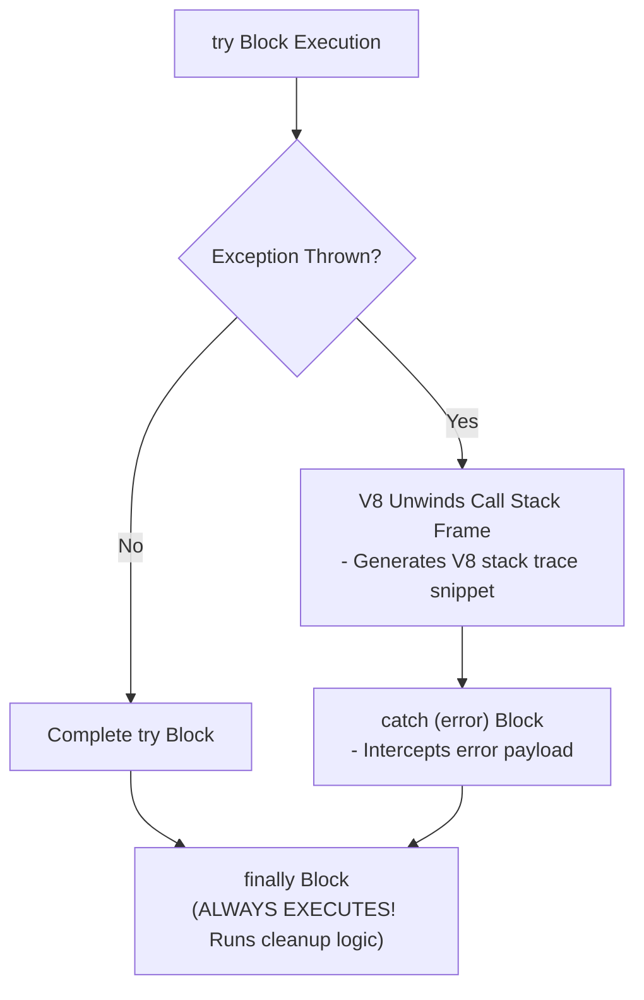
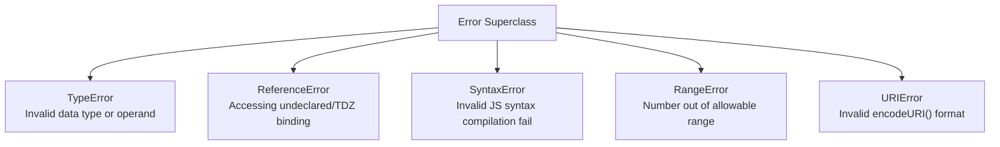
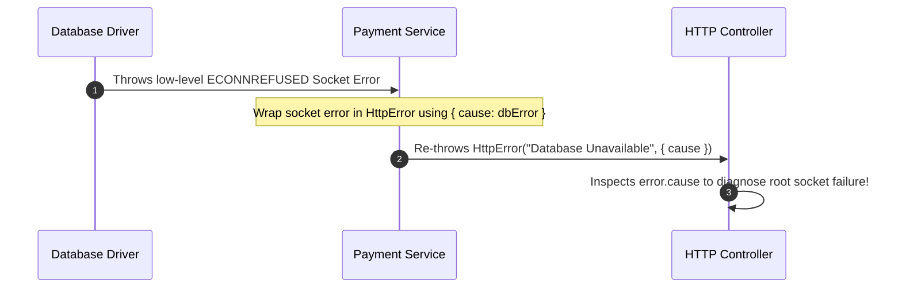

# Module 32: Error Handling — Call Stack Unwinding, Custom Exceptions, and ES2022 Error Chaining

## Overview

Error Handling in JavaScript is the structured mechanism for intercepting, processing, and recovering from runtime exceptions without crashing the execution environment.

When an error is thrown, the V8 engine unwinds the **Call Stack**, searching upward through execution frames for an enclosing **`try...catch`** block.

Understanding built-in error types (`TypeError`, `RangeError`, `ReferenceError`), constructing **Custom Domain Error Classes**, utilizing **ES2022 Error Chaining (`{ cause }`)**, and setting up global unhandled rejection handlers (`process.on('unhandledRejection')`) is vital.

---

## 1. Exception Unwinding Architecture



---

## 2. Built-in JavaScript Error Hierarchy Matrix



### Standard Error Specifications

| Built-In Error Type | Triggering Scenario | Production Code Example |
| :--- | :--- | :--- |
| **`TypeError`** | Operation on incompatible type or `null`/`undefined` dereference. | `null.toString()` or `const fn = 5; fn()` |
| **`ReferenceError`** | Referencing undeclared variables or accessing `let`/`const` in TDZ. | `console.log(unassigned)` |
| **`RangeError`** | Numeric value outside valid bound limits. | `new Array(-5)` or recursion stack overflow |
| **`SyntaxError`** | Parsing invalid code syntax. | `JSON.parse("invalid json")` |

---

## 3. Custom Error Sub-Classes & ES2022 Error Chaining (`{ cause }`)

ES2022 introduced the **Error Cause (`{ cause }`)** option property, allowing low-level system errors to be wrapped and re-thrown inside high-level domain errors without losing original diagnostic stack traces:



```javascript
// 1. Custom Domain Error Sub-Class
class DatabaseConnectionError extends Error {
  constructor(message, statusCode = 500, cause = null) {
    // ES2022: Pass cause to super constructor option payload!
    super(message, { cause });
    this.name = "DatabaseConnectionError";
    this.statusCode = statusCode;

    // Captures clean V8 stack trace excluding constructor frame
    if (Error.captureStackTrace) {
      Error.captureStackTrace(this, DatabaseConnectionError);
    }
  }
}

// 2. High-Level Error Chaining Implementation
function connectToDatabase() {
  try {
    // Low-level system failure simulation
    throw new Error("TCP Socket Connection Timeout on Port 5432");
  } catch (lowLevelError) {
    // Re-throw high-level domain error while preserving low-level cause!
    throw new DatabaseConnectionError(
      "Failed to establish primary database connection pool",
      503,
      lowLevelError // ES2022 Error Cause!
    );
  }
}

try {
  connectToDatabase();
} catch (error) {
  if (error instanceof DatabaseConnectionError) {
    console.log(`High-Level Error (${error.statusCode}):`, error.message);
    console.log("Root Cause Trace:", error.cause.message); // Accesses low-level cause!
  }
}
```

---

## 4. Unhandled Rejection Safeguards & Node.js/Browser Handlers

Always configure global fallback error handlers to catch unhandled async exceptions:

```javascript
// 1. Node.js Process Unhandled Rejection Guard
process.on("unhandledRejection", (reason, promise) => {
  console.error("CRITICAL: Unhandled Promise Rejection detected at:", promise);
  console.error("Reason:", reason);
  // Perform graceful shutdown cleanup...
});

// 2. Browser Window Global Error Guard
if (typeof window !== "undefined") {
  window.addEventListener("unhandledrejection", (event) => {
    console.error("Browser Unhandled Rejection:", event.reason);
  });
}
```

---

## Key Production Takeaways

1. **Use ES2022 `{ cause }` for Error Chaining**: Wrap low-level errors inside high-level domain errors (`new CustomError("Msg", { cause: originalErr })`) to preserve root cause stack traces.
2. **Use `Error.captureStackTrace()` in Custom Error Classes**: Use `Error.captureStackTrace(this, CustomErrorClass)` in custom error constructors for clean V8 stack traces.
3. **Clean Up Resources in `finally` Blocks**: Close database connections, file handles, or network sockets inside `finally` blocks to guarantee execution.
4. **Setup Global Unhandled Rejection Listeners**: Register `process.on('unhandledRejection')` handlers in Node.js applications to log unhandled async errors.

