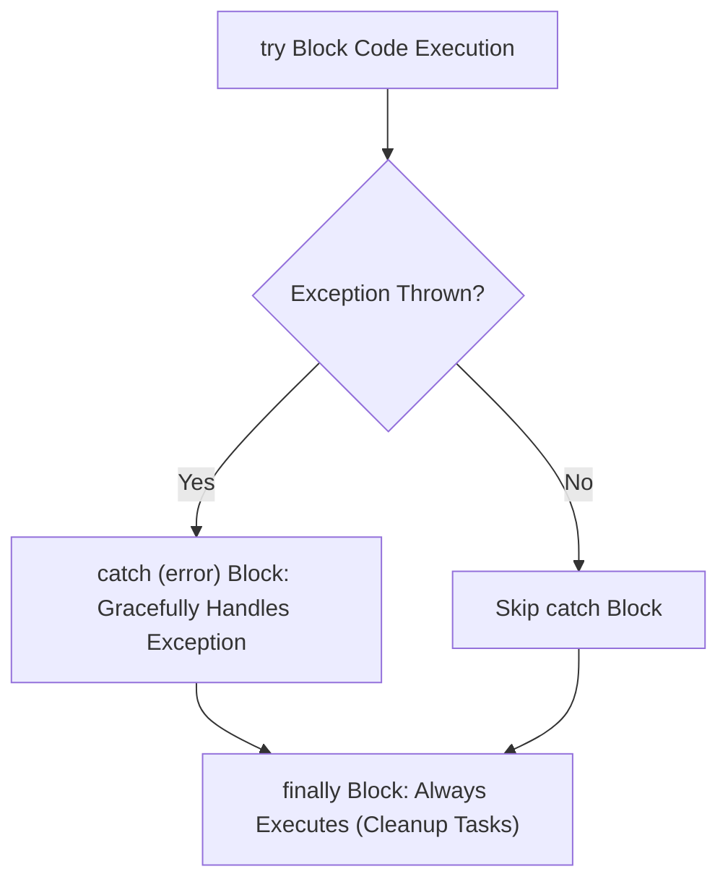

# File 32: Error Handling

## Overview
Error handling enables JavaScript applications to intercept and gracefully recover from runtime exceptions using **`try...catch...finally`** blocks and custom **`Error`** sub-classes.

---

## 1. Exception Flow & Control



---

## 2. Standard `try...catch...finally`

```javascript
function parseJSONData(rawJson) {
    try {
        const data = JSON.parse(rawJson);
        console.log("Parse Successful:", data);
        return data;
    } catch (error) {
        console.error("Parse Failed:", error.name, "-", error.message);
        return null;
    } finally {
        console.log("Cleanup Operations Complete"); // Always runs!
    }
}

parseJSONData('{"valid": true}');
parseJSONData("INVALID_JSON");
```

---

## 3. Throwing Errors & Custom Error Classes

```javascript
class ValidationError extends Error {
    constructor(message, statusCode) {
        super(message);
        this.name = "ValidationError";
        this.statusCode = statusCode;
    }
}

function processAge(age) {
    if (typeof age !== "number") {
        throw new ValidationError("Age must be a numeric value", 400);
    }
    if (age < 18) {
        throw new RangeError("User must be at least 18 years old");
    }
    return "Registration approved";
}

try {
    processAge("invalid");
} catch (error) {
    if (error instanceof ValidationError) {
        console.log(`Validation Error (${error.statusCode}): ${error.message}`);
    } else {
        console.log("Generic Error:", error.message);
    }
}
```

---

## Key Takeaways
1. Wrap unsafe runtime code inside **`try...catch`** blocks to prevent application crashes.
2. Code inside **`finally`** always runs regardless of whether an error occurred.
3. Throw standard error types (`TypeError`, `RangeError`) or create custom **`Error` sub-classes**.
4. Inspect `error.name`, `error.message`, and `error.stack` for debugging.
