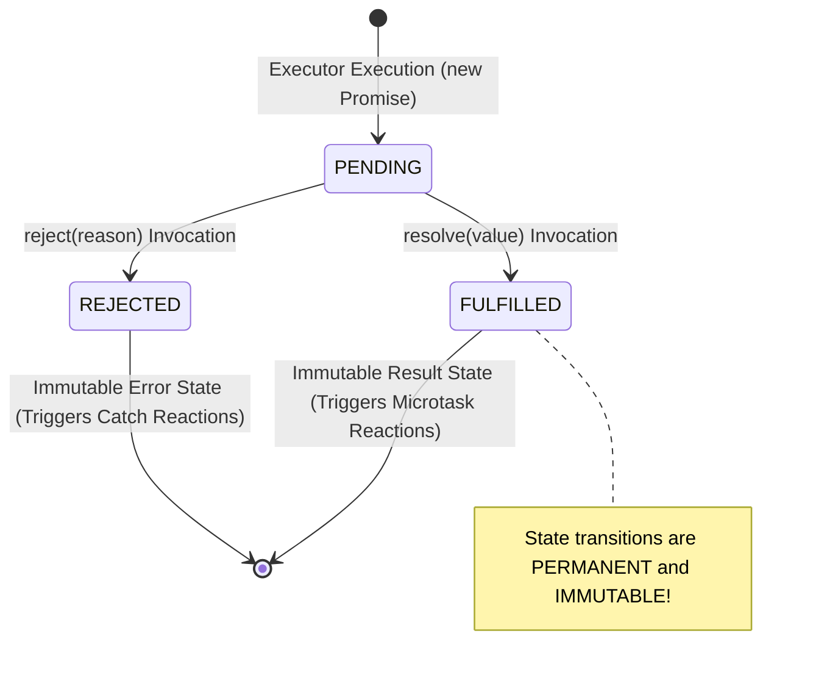
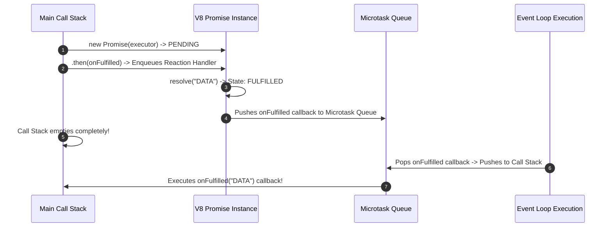
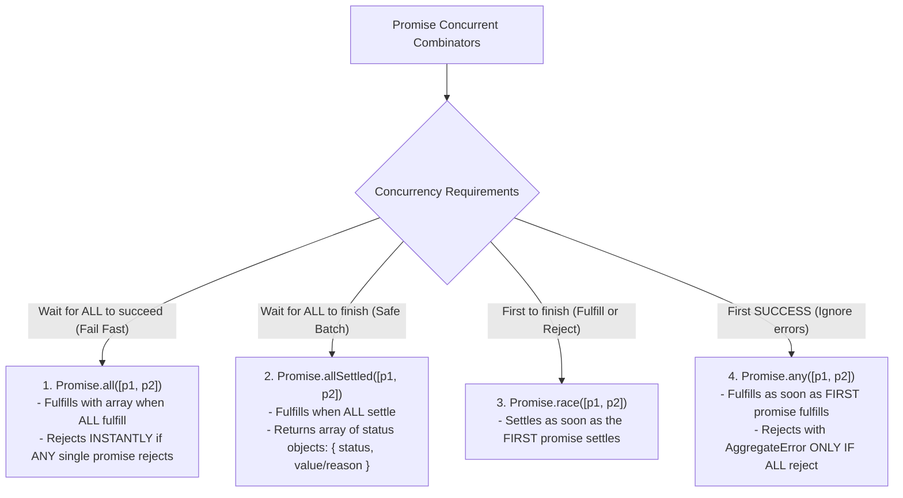

# Module 33: Promises — State Machines, Microtask Queue, and Promise Combinators

## Overview

A **Promise** is an object representing the eventual completion or failure of an asynchronous operation and its resulting value.

Under the hood, Google V8 implements Promises using an internal state machine with three mutually exclusive states:
1. **`Pending`**: Initial state; neither fulfilled nor rejected.
2. **`Fulfilled`**: Asynchronous operation completed successfully (`resolve(value)`).
3. **`Rejected`**: Asynchronous operation failed (`reject(error)`).

Understanding V8 internal slots (`[[PromiseState]]`, `[[PromiseResult]]`), the **Microtask Queue**, Promise Chaining Error Propagation, and the **4 Promise Combinators (`all`, `allSettled`, `race`, `any`)** is vital for asynchronous JavaScript.

---

## 1. Promise State Machine Architecture



---

## 2. V8 Internal Promise Slots & Microtask Queue Pipeline

When `.then()` or `.catch()` is called on a Promise, V8 does not execute the callback synchronously; instead, it registers the callback in the **Microtask Queue**:



```javascript
// Demonstrating Microtask Queue Execution Priority
console.log("1. Synchronous Start");

setTimeout(() => console.log("4. Macrotask Timeout Callback"), 0);

Promise.resolve("3. Microtask Promise Reaction").then((res) => console.log(res));

console.log("2. Synchronous End");

/*
  Execution Order Output:
  1. Synchronous Start
  2. Synchronous End
  3. Microtask Promise Reaction  (Executes BEFORE Macrotasks!)
  4. Macrotask Timeout Callback
*/
```

---

## 3. The 4 Promise Combinators Matrix



```javascript
const fetchConfigA = new Promise((r) => setTimeout(() => r("Config A"), 100));
const fetchConfigB = new Promise((r) => setTimeout(() => r("Config B"), 200));
const failingService = new Promise((_, r) => setTimeout(() => r(new Error("Service Down")), 50));

// 1. Promise.all(): Fails fast if any promise rejects
Promise.all([fetchConfigA, fetchConfigB])
  .then((results) => console.log("Promise.all Success:", results)) // ["Config A", "Config B"]
  .catch((err) => console.error("Promise.all Failed:", err.message));

// 2. Promise.allSettled(): Never short-circuits! Safe for diagnostic batching
Promise.allSettled([fetchConfigA, failingService]).then((results) => {
  console.log("Promise.allSettled Results:", results);
  /*
    [
      { status: 'fulfilled', value: 'Config A' },
      { status: 'rejected', reason: Error: Service Down }
    ]
  */
});

// 3. Promise.any(): Ignores rejections and returns first successful fulfillment
Promise.any([failingService, fetchConfigA]).then((winner) => {
  console.log("Promise.any First Success Winner:", winner); // "Config A"
});
```

---

## 4. Engineering a `Promise.all()` Custom Polyfill

Building a polyfill for `Promise.all()` exposes how concurrent resolution and counter tracking operate:

```javascript
function myPromiseAll(promisesArray) {
  return new Promise((resolve, reject) => {
    if (!Array.isArray(promisesArray)) {
      return reject(new TypeError("Argument must be an Array"));
    }

    const results = [];
    let completedCount = 0;
    const totalPromises = promisesArray.length;

    if (totalPromises === 0) return resolve([]);

    promisesArray.forEach((item, index) => {
      // Coerce item to a Promise using Promise.resolve()
      Promise.resolve(item)
        .then((value) => {
          results[index] = value; // Preserve original index position!
          completedCount++;

          if (completedCount === totalPromises) {
            resolve(results); // All promises fulfilled!
          }
        })
        .catch((error) => {
          reject(error); // Short-circuit reject instantly on first failure!
        });
    });
  });
}

// Verification of Custom Polyfill
myPromiseAll([fetchConfigA, fetchConfigB]).then((res) => {
  console.log("Custom myPromiseAll Result:", res); // ["Config A", "Config B"]
});
```

---

## Key Production Takeaways

1. **Always Return Promises in `.then()` Chains**: Ensure callbacks inside `.then()` return promises or values to prevent breaking the Promise chain.
2. **Use `Promise.allSettled()` for Non-Critical Parallel Requests**: When fetching independent data from multiple endpoints, use `Promise.allSettled()` to prevent one failed request from blocking successful ones.
3. **Use `Promise.all()` for Fail-Fast Microservices**: Use `Promise.all()` when all asynchronous operations are mandatory dependencies for proceeding.
4. **Remember Microtasks Execute Before Macrotasks**: Promise reactions execute in the Microtask Queue, prioritizing them over `setTimeout` and `setImmediate` timers.

