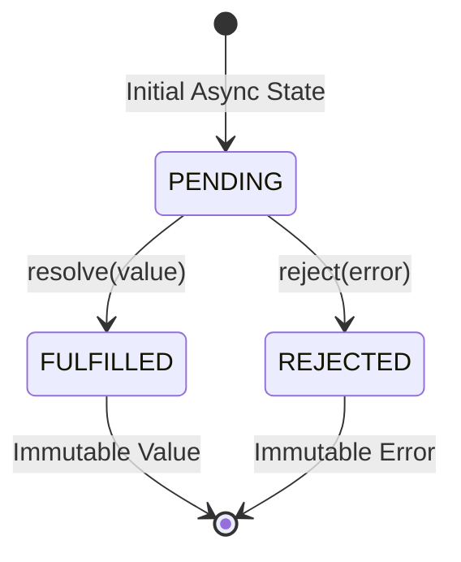

# File 33: Promises

## Overview
A **Promise** is an object representing the eventual completion or failure of an asynchronous operation. Promises eliminate nested "Callback Hell" by providing chainable `.then()`, `.catch()`, and `.finally()` handlers.

---

## 1. Promise State Machine



---

## 2. Creating and Consuming Promises

```javascript
function fetchUserData(userId) {
    return new Promise((resolve, reject) => {
        setTimeout(() => {
            if (userId > 0) {
                resolve({ id: userId, name: "Priya" }); // Fulfill
            } else {
                reject(new Error("Invalid User ID"));   // Reject
            }
        }, 100);
    });
}

// Consuming Promises with Chaining
fetchUserData(101)
    .then(user => {
        console.log("User Fetched:", user.name);
        return user.id; // Returns value to next .then()
    })
    .then(id => {
        console.log("Processing ID:", id);
    })
    .catch(error => {
        console.error("Caught Error:", error.message);
    })
    .finally(() => {
        console.log("Async Pipeline Settled");
    });
```

---

## 3. Promise Combinators Matrix

```javascript
const p1 = new Promise(r => setTimeout(() => r("Service A"), 50));
const p2 = new Promise(r => setTimeout(() => r("Service B"), 100));

// 1. Promise.all: Waits for ALL to fulfill; fails fast if ANY reject
Promise.all([p1, p2]).then(results => console.log(results));

// 2. Promise.allSettled: Waits for ALL to settle; returns status objects array
Promise.allSettled([p1, p2]).then(results => console.log(results));

// 3. Promise.race: Returns the FIRST promise to settle (fulfill or reject)
Promise.race([p1, p2]).then(winner => console.log(winner));

// 4. Promise.any: Returns the FIRST FULFILLED promise (ignores rejections unless all reject)
Promise.any([p1, p2]).then(winner => console.log(winner));
```

---

## Key Takeaways
1. Promises transition between **PENDING**, **FULFILLED**, and **REJECTED** states.
2. Use **`.then()`** for fulfillment reactions and **`.catch()`** for error handling.
3. Always return promises inside `.then()` callbacks to enable clean **Promise Chaining**.
4. Use **`Promise.all()`** for concurrent independent operations.
