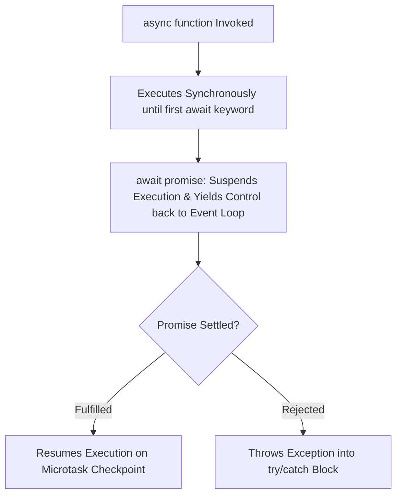

# File 34: Async / Await

## Overview
Introduced in ES2017, **`async/await`** is syntactic sugar built on top of Promises and Generators. It allows writing asynchronous code using familiar synchronous control flow structures (`try...catch`, standard loops).

---

## 1. Async / Await Execution Flow



---

## 2. Implementation & Error Handling

```javascript
function fetchProduct(id) {
    return new Promise(resolve => setTimeout(() => resolve({ id, name: "Laptop" }), 100));
}

// async functions automatically wrap return values into a resolved Promise
async function displayProductInfo(productId) {
    try {
        console.log("Fetching product details...");
        const product = await fetchProduct(productId); // Suspends until promise resolves!
        console.log(`Product: ${product.name} (ID: ${product.id})`);
        return product;
    } catch (error) {
        console.error("Failed to display product:", error.message);
    }
}

displayProductInfo(101);
```

---

## 3. Avoiding Sequential Await Anti-Patterns

```javascript
// BAD Anti-Pattern: Sequential execution (Takes 200ms total)
async function fetchSequential() {
    const user = await fetchUser();       // 100ms
    const config = await fetchConfig();   // 100ms
    return { user, config };
}

// GOOD Pattern: Concurrent execution via Promise.all (Takes 100ms total)
async function fetchConcurrent() {
    const [user, config] = await Promise.all([fetchUser(), fetchConfig()]);
    return { user, config };
}
```

---

## Key Takeaways
1. Mark functions with **`async`** to allow using the **`await`** keyword inside them.
2. `async` functions always return a **Promise**.
3. Use **`try...catch`** blocks to handle asynchronous exceptions cleanly.
4. Avoid sequential `await` calls for independent operations; use **`Promise.all()`** instead.
