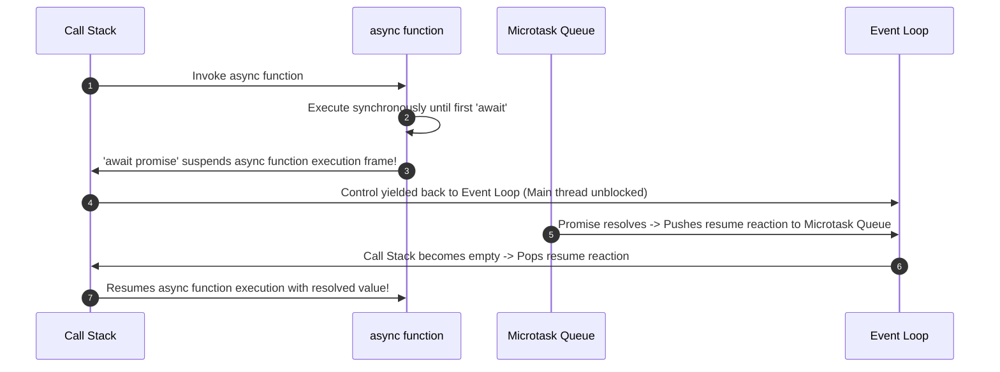

# Module 34: Async / Await — Coroutines, Top-Level Await, and Concurrency Optimizations

## Overview

Introduced in ECMAScript 2017 (ES2017), **`async/await`** is a declarative syntax paradigm built on top of **Promises** and **Generator Coroutines**.

`async/await` enables writing asynchronous code that looks and behaves like synchronous sequential code, allowing developers to use standard control flow constructs (`try...catch`, `for...of`, `if/else`) without callback nesting.

Under the hood, when V8 encounters an **`await`** expression, it suspends the execution frame of the `async` function, registers the promise reaction in the **Microtask Queue**, and yields execution control back to the Event Loop.

Understanding V8 stack suspension, **ES2022 Top-Level `await`**, avoiding sequential `await` bottlenecks, and **Async Iteration (`for await...of`)** is essential.

---

## 1. Async / Await Engine Execution Architecture



---

## 2. Sequential `await` Bottleneck vs. Concurrent Parallel Processing

A common performance bug is sequentially `await`-ing independent asynchronous operations, creating an unnecessary execution waterfall:

```mermaid
gantt
    title Asynchronous Execution Timelines Comparison
    dateFormat  SS
    axisFormat %S sec

    section Sequential (BAD)
    Fetch User (100ms)     :a1, 00, 1s
    Fetch Config (100ms)   :a2, after a1, 1s
    Total Duration = 200ms :crit, a1, 2s

    section Concurrent (GOOD)
    Fetch User (100ms)     :b1, 00, 1s
    Fetch Config (100ms)   :b2, 00, 1s
    Total Duration = 100ms :active, b1, 1s
```

```javascript
// Simulated Asynchronous I/O Calls
const fetchUser = () => new Promise((r) => setTimeout(() => r({ id: 101 }), 100));
const fetchConfig = () => new Promise((r) => setTimeout(() => r({ theme: "dark" }), 100));

// 1. BAD ANTI-PATTERN: Sequential Waterfalls (Takes 200ms total!)
async function loadDashboardSequential() {
  console.time("Sequential-Timer");
  const user = await fetchUser();       // Suspends 100ms
  const config = await fetchConfig();   // Suspends 100ms
  console.timeEnd("Sequential-Timer");  // Output: ~200ms
  return { user, config };
}

// 2. GOOD PATTERN: Parallel Concurrency via Promise.all (Takes 100ms total!)
async function loadDashboardConcurrent() {
  console.time("Concurrent-Timer");
  // Initiates both network requests simultaneously!
  const [user, config] = await Promise.all([fetchUser(), fetchConfig()]);
  console.timeEnd("Concurrent-Timer");  // Output: ~100ms
  return { user, config };
}

loadDashboardSequential();
loadDashboardConcurrent();
```

---

## 3. ES2022 Top-Level `await` in Modules

Before ES2022, `await` could only be used inside an `async` function block. ES2022 introduced **Top-Level `await`**, allowing ES modules to act as asynchronous async dependencies:

```mermaid
flowchart TD
    ModuleA[Module A: Top-Level await db.connect()] --> ModuleB[Module B: import { db } from 'ModuleA']
    
    note1["Module B execution automatically PAUSES until Module A's Top-Level await resolves!"]
```

```javascript
// db-connection.mjs (ES Module using Top-Level await)
const connectionPool = await fetch("https://api.db.com/connect").then((r) => r.json());

export const db = connectionPool; // Module exports resolved connection directly!
```

---

## 4. Async Iteration Stream Processing (`for await...of`)

Use **`for await...of`** to iterate over async iterables or streams (such as Node.js ReadableStreams or async generator functions):

```javascript
// Async Generator producing a paginated data stream
async function* fetchPaginatedUsers() {
  let page = 1;
  while (page <= 3) {
    // Simulates asynchronous API fetch per page
    const users = await new Promise((r) =>
      setTimeout(() => r([`User_${page}_A`, `User_${page}_B`]), 50)
    );
    yield users; // Yields page batch asynchronously
    page++;
  }
}

async function processUserStream() {
  // Consumes async generator page by page cleanly
  for await (const pageBatch of fetchPaginatedUsers()) {
    console.log("Streamed Page Batch:", pageBatch);
  }
}

processUserStream();
```

---

## Key Production Takeaways

1. **Wrap `await` Calls in `try...catch` Blocks**: Always handle asynchronous exceptions with `try...catch` blocks to intercept network or parsing failures.
2. **Never `await` Independent Operations Sequentially**: Initiate independent async tasks concurrently using `Promise.all([p1, p2])` to eliminate execution waterfalls.
3. **Use Top-Level `await` for Asynchronous Module Initialization**: Use ES2022 Top-Level `await` in `.mjs` modules to load dynamic configurations or DB pools before exporting exports.
4. **Use `for await...of` for Async Streams**: Use `for await...of` loops when consuming paginated API data or Node.js readable streams.
