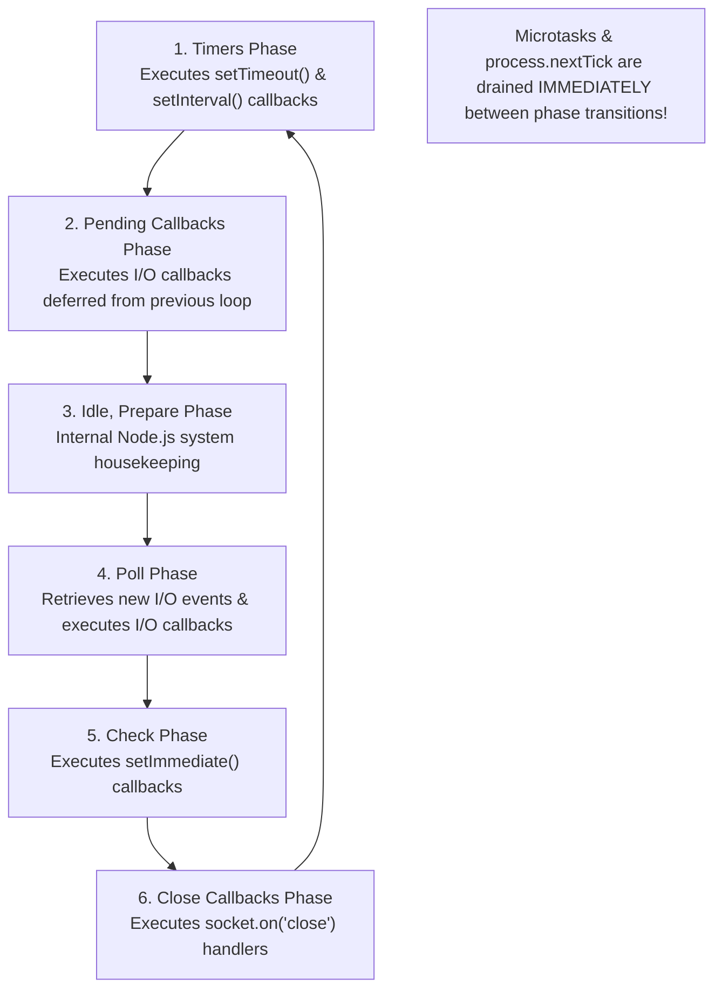
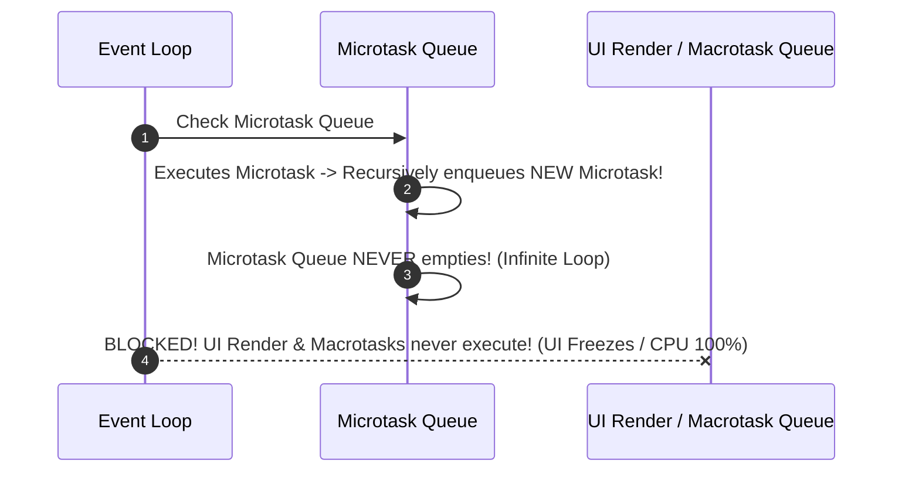

# Module 35: The Event Loop and Asynchronous Concurrency — Microtasks, Macrotasks, and Libuv Phases

## Overview

JavaScript operates on a **Single-Threaded, Non-Blocking, Event-Driven Concurrency Model**.

The **Event Loop** is the underlying coordination loop inside browser engines (V8 + Web APIs) and Node.js (V8 + Libuv) that monitors the **Call Stack** and drains callback queues to enable non-blocking I/O.

Understanding the difference between **Microtasks (`Promise`, `queueMicrotask`, `process.nextTick`)** and **Macrotasks (`setTimeout`, `I/O`, `setImmediate`)**, the Node.js **Libuv 6-Phase Event Loop**, and preventing **Microtask Queue Starvation** is essential.

---

## 1. Event Loop Architecture & Queue Priority

```mermaid
flowchart TD
    Stack["Call Stack (LIFO)<br/>Executes Synchronous JavaScript Code"]
    Host["Host Thread Pool / Web APIs / Libuv<br/>Handles Network, File I/O, Timers"]
    
    subgraph Priority Execution Queues
        NextTick["1. process.nextTick Queue (Node.js Super-Microtask)"]
        Micro["2. Microtask Queue (Promises, queueMicrotask, MutationObserver)"]
        Macro["3. Macrotask / Task Queue (setTimeout, setInterval, setImmediate, I/O)"]
    end

    Stack -- "Offload Async Task" --> Host
    Host -- "Task Settled" --> Priority Execution Queues
    
    Loop["Event Loop Coordinator"]
    Loop -- "Call Stack Empty? 1. Drain nextTick Queue" --> Stack
    Loop -- "2. Drain ENTIRE Microtask Queue" --> Stack
    Loop -- "3. Execute ONE Macrotask -> Re-drain Microtasks" --> Stack
```

### Execution Priority Hierarchy

$$\text{Synchronous Code} > \text{Node } \texttt{process.nextTick()} > \text{Microtasks } (\texttt{Promise}/\texttt{queueMicrotask}) > \text{Macrotasks } (\texttt{setTimeout}/\texttt{setImmediate})$$

---

## 2. Browser Event Loop vs. Node.js Libuv 6-Phase Cycle

In Node.js, the event loop is powered by **Libuv**, which executes callbacks across 6 distinct sequential phases:



```javascript
// Demonstrating Microtask vs Macrotask Execution Order
console.log("1. Sync Execution Start");

setTimeout(() => console.log("6. Macrotask: setTimeout 0ms"), 0);

setImmediate(() => console.log("7. Macrotask: setImmediate (Check Phase)"));

Promise.resolve().then(() => console.log("4. Microtask: Promise Reaction 1"));

queueMicrotask(() => console.log("5. Microtask: queueMicrotask Reaction 2"));

process.nextTick(() => console.log("3. Node Super-Microtask: process.nextTick"));

console.log("2. Sync Execution End");

/*
  Execution Output Order:
  1. Sync Execution Start
  2. Sync Execution End
  3. Node Super-Microtask: process.nextTick  (Highest Priority!)
  4. Microtask: Promise Reaction 1
  5. Microtask: queueMicrotask Reaction 2    (Drains ALL Microtasks!)
  6. Macrotask: setTimeout 0ms
  7. Macrotask: setImmediate (Check Phase)
*/
```

---

## 3. Microtask Queue Starvation Hazard

Because the Event Loop **drains the ENTIRE Microtask Queue completely** before allowing the next macrotask or browser rendering frame to execute, recursively scheduling microtasks creates a severe **Thread Starvation Hang**:



```javascript
// DANGER: Infinite Microtask Loop Starves the Event Loop!
function starveEventLoop() {
  Promise.resolve().then(() => {
    // Recursively enqueues microtask before loop can yield control!
    starveEventLoop(); 
  });
}

// UNCOMMENTING THIS WILL FREEZE YOUR TAB/NODE PROCESS COMPLETELY:
// starveEventLoop();
```

---

## Key Production Takeaways

1. **Never Block the Main Call Stack**: Avoid CPU-bound synchronous loops on the main thread; offload heavy computations to Worker Threads (`worker_threads` or Web Workers).
2. **Remember Microtasks Drain Completely**: The event loop will not render UI frames or execute `setTimeout` callbacks until the Microtask Queue is completely empty.
3. **Use `setImmediate()` in Node.js for I/O Yielding**: Use `setImmediate()` to yield execution to the Check phase without blocking the Poll phase.
4. **Prefer `queueMicrotask()` over `Promise.resolve().then()`**: Use standard `queueMicrotask(() => {})` for explicit microtask scheduling.

