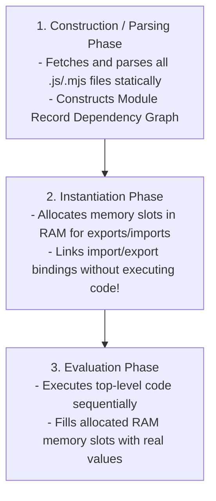

# Module 36: ES Modules vs. CommonJS — Static Analysis, Live Bindings, and Tree-Shaking

## Overview

JavaScript modules organize code into isolated, reusable units with encapsulated scopes.

Modern JavaScript uses **ES Modules (ESM)** (`import`/`export`), standardized in ES6. Legacy Node.js applications use **CommonJS (CJS)** (`require()`/`module.exports`).

Understanding the structural differences between ESM's **3-Phase Static Compilation Pipeline** (Parsing, Instantiation, Evaluation) and CJS's **Dynamic Runtime Evaluation**, **Live Read-Only Bindings vs. Value Copies**, and **Bundler Tree-Shaking** is essential.

---

## 1. ESM 3-Phase Compilation Pipeline



---

## 2. ESM vs. CommonJS Detailed Comparison Matrix

```mermaid
flowchart LR
    subgraph ESM Live Binding (Reference Pointer)
        ExporterESM["Exporter: count = 1"] -->|Live Binding Pointer| ImporterESM["Importer: sees updated count = 2!"]
    end

    subgraph CJS Value Copy (Snapshot Copy)
        ExporterCJS["Exporter: count = 1"] -->|Value Copy Snapshot| ImporterCJS["Importer: stuck with old count = 1!"]
    end
```

### Technical Feature Comparison

| Architectural Aspect | ES Modules (ESM) | CommonJS (CJS) |
| :--- | :--- | :--- |
| **Syntax Standard** | `import` / `export` | `require()` / `module.exports` |
| **Parsing & Loading** | **Static** (Parse-time dependency graph) | **Dynamic** (Runtime synchronous execution) |
| **Import Bindings** | **Live Read-Only References** | **Snapshot Value Copies** |
| **Tree-Shaking Support**| **Native** (Bundlers can drop unused code) | Not Supported (Dynamic `require()` prevents dead-code removal) |
| **Top-Level Await** | **Supported natively** | Not Supported |
| **File Extensions** | `.js`, `.mjs` (`"type": "module"` in `package.json`) | `.js`, `.cjs` |

---

## 3. Live Read-Only Bindings Code Showcase

In ESM, imported variables are **live, read-only references** pointing directly to the exporting module's memory slot:

```javascript
// tracker.mjs (Exporting Module)
export let visitorCount = 100;

export function incrementVisitors() {
  visitorCount++; // Mutates internal module state
}

// main.mjs (Importing Module)
import { visitorCount, incrementVisitors } from "./tracker.mjs";

console.log("Initial Visitor Count:", visitorCount); // 100

incrementVisitors();

// LIVE BINDING: Main module automatically sees the updated value!
console.log("Updated Visitor Count:", visitorCount); // 101

// READ-ONLY RULE: Attempting to mutate imported binding directly throws TypeError!
// visitorCount = 500; // TypeError: Assignment to constant variable / read-only import!
```

---

## 4. Dynamic On-Demand Loading (`import()`)

While static `import` declarations must appear at the top level of a file, **Dynamic `import(specifier)`** expressions can be called inside functions dynamically at runtime, returning a Promise:

```javascript
async function loadHeavyChartLibrary(userRequestedChart) {
  if (userRequestedChart) {
    console.log("Loading chart module on-demand...");

    // Dynamic import loads module asynchronously over the network on demand!
    const { renderPieChart } = await import("./chart-renderer.js");

    renderPieChart("#chart-container", [10, 20, 30]);
  }
}
```

---

## Key Production Takeaways

1. **Use ES Modules for All New JavaScript Projects**: Use ESM (`import`/`export`) to enable static analysis, bundler tree-shaking, and native browser compatibility.
2. **Remember ESM Bindings are Live and Read-Only**: Importers cannot mutate imported variables directly, but mutations inside the exporting module reflect live across all importing modules.
3. **Use Dynamic `import()` for Code Splitting**: Use dynamic `import('./heavyModule.js')` inside async functions to route-split or lazily load large libraries on-demand.
4. **Use `"type": "module"` in `package.json`**: Configure `"type": "module"` in Node.js project `package.json` files to treat `.js` files as ES Modules.

