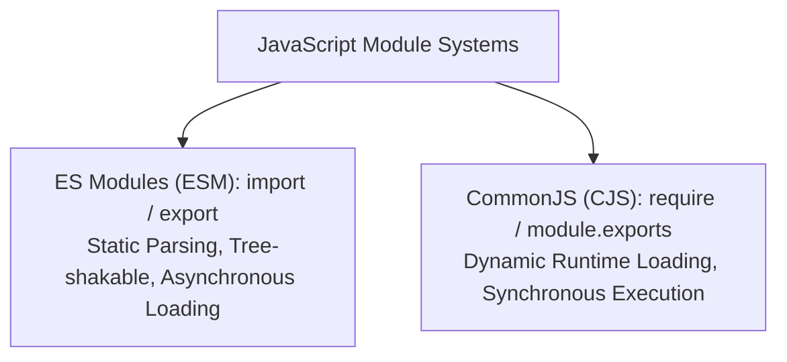

# File 36: ES Modules vs CommonJS

## Overview
JavaScript modules allow breaking code into isolated, reusable files. Modern JavaScript uses **ES Modules (ESM)** (`import`/`export`), while legacy Node.js environments use **CommonJS (CJS)** (`require`/`module.exports`).

---

## 1. ES Modules vs CommonJS Comparison



### Direct Comparison Matrix

| Feature | ES Modules (ESM) | CommonJS (CJS) |
| :--- | :--- | :--- |
| **Syntax** | `import` / `export` | `require()` / `module.exports` |
| **Loading Phase** | Static (Parse-time analysis) | Dynamic (Runtime evaluation) |
| **Tree Shaking** | Supported (Dead code elimination) | Not supported |
| **Top-Level Await**| Supported | Supported only inside async IIFE |
| **Default in** | Modern Browsers, Deno, modern Node (`.mjs`) | Legacy Node.js (`.cjs`) |

---

## 2. ES Module Syntax Examples

### Exporting Named & Default Members (`mathUtils.js`)
```javascript
// Named Exports
export const PI = 3.14159;
export function add(a, b) { return a + b; }

// Default Export
export default function multiply(a, b) { return a * b; }
```

### Importing Members (`app.js`)
```javascript
// Importing Default and Named Exports
import multiply, { PI, add } from "./mathUtils.js";

console.log(PI);           // 3.14159
console.log(add(2, 3));      // 5
console.log(multiply(4, 5)); // 20
```

---

## 3. Dynamic Imports (`import()`)
Dynamic imports allow loading modules on-demand at runtime, returning a Promise.

```javascript
async function loadAnalytics() {
    const { logEvent } = await import("./analytics.js");
    logEvent("User logged in");
}
```

---

## Key Takeaways
1. Use **ES Modules (`import`/`export`)** for modern JavaScript projects.
2. ESM is **statically parsed**, enabling bundler **tree-shaking** optimization.
3. Use **Dynamic `import()`** for lazy-loading modules on-demand.
