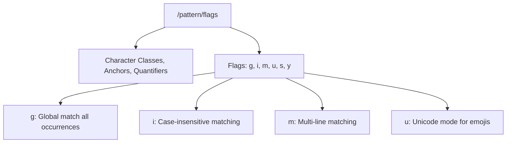

# File 37: Regular Expressions (RegExp)

## Overview
**Regular Expressions (RegExp)** are patterns used to match character combinations within strings. JavaScript supports regular expressions via the built-in `RegExp` class and literal `/pattern/flags` syntax.

---

## 1. RegExp Syntax & Flags



---

## 2. Common Regular Expression Patterns

```javascript
// Literal Pattern Syntax
const emailRegex = /^[a-zA-Z0-9._%+-]+@[a-zA-Z0-9.-]+\.[a-zA-Z]{2,}$/;
console.log(emailRegex.test("user@example.com")); // true

// Phone Number Match Pattern (\d{10})
const phoneRegex = /^\d{10}$/;
console.log(phoneRegex.test("9876543210")); // true
```

---

## 3. Key RegExp Methods

```javascript
const text = "JavaScript release in 1995, ES6 release in 2015";

// 1. RegExp.prototype.test() -> Returns boolean
console.log(/\d{4}/.test(text)); // true

// 2. String.prototype.match() -> Returns array of matches
console.log(text.match(/\d{4}/g)); // ["1995", "2015"]

// 3. String.prototype.replace() -> Replaces matched pattern
console.log(text.replace(/\d{4}/, "YYYY")); // "JavaScript release in YYYY, ES6 release in 2015"
```

---

## Key Takeaways
1. Use **`/pattern/flags`** syntax to create regular expressions.
2. Use **`regex.test(str)`** to quickly check if a pattern exists.
3. Use **`str.match(regex)`** with global flag `/g` to extract all matching instances.
4. Cache static `RegExp` instances outside hot loops to improve performance.
