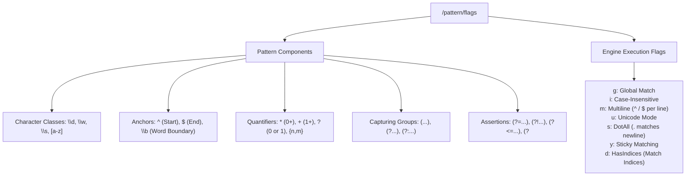
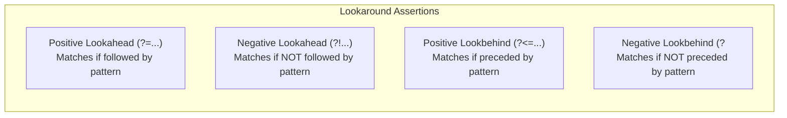
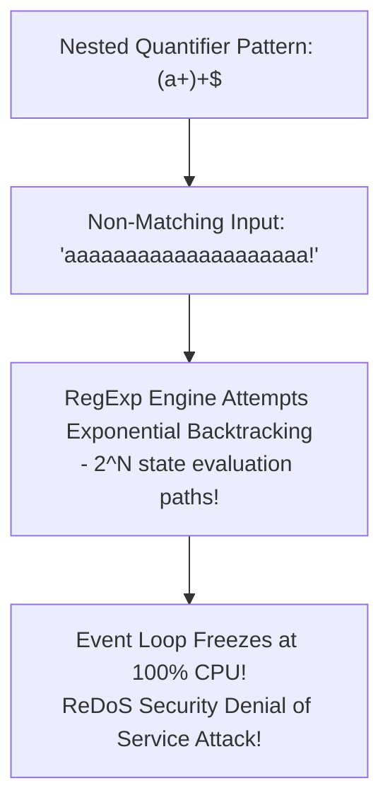

# Module 37: Regular Expressions (RegExp) — Parsing Engines, Lookaround Assertions, and ReDoS Defense

## Overview

A **Regular Expression (RegExp)** is a sequence of characters that forms a search pattern for text matching, validation, extraction, and string transformation.

Under the hood, JavaScript regular expressions execute on non-deterministic or deterministic finite automata engines inside V8.

Understanding **RegExp Engine Flags (`g`, `i`, `m`, `u`, `s`, `y`, `d`)**, **Named Capturing Groups (`(?<name>...)`)**, **Lookahead and Lookbehind Assertions**, and mitigating **ReDoS (Regular Expression Denial of Service) Catastrophic Backtracking** is essential.

---

## 1. RegExp Architecture & Flags Taxonomy



---

## 2. Named Capturing Groups & Lookaround Assertions



```javascript
// 1. Named Capturing Groups: (?<year>\d{4})
const datePattern = /(?<year>\d{4})-(?<month>\d{2})-(?<day>\d{2})/;
const matchResult = datePattern.exec("2026-08-31");

console.log("Matched Year :", matchResult.groups.year);  // "2026"
console.log("Matched Month:", matchResult.groups.month); // "08"
console.log("Matched Day  :", matchResult.groups.day);   // "31"

// 2. Lookahead & Lookbehind Assertions
// Match price ONLY if preceded by INR currency symbol (Positive Lookbehind)
const pricePattern = /(?<=INR\s?)\d+/g;
const text = "Price is INR 4500 for product A and USD 60 for product B";

console.log("INR Prices Matched:", text.match(pricePattern)); // ["4500"]
```

---

## 3. Catastrophic Backtracking Security Hazard (ReDoS)

**ReDoS (Regular Expression Denial of Service)** occurs when a nested quantifier pattern (e.g. `(a+)+$`) forces the RegExp engine into exponential $\mathcal{O}(2^N)$ backtracking attempts when evaluated against non-matching input strings, freezing the single-threaded Event Loop at 100% CPU:



```javascript
// DANGER: ReDoS Catastrophic Backtracking Vulnerability
const vulnerableRegex = /(a+)+$/; 

// UNCOMMENTING THIS WILL FREEZE YOUR CPU THREAD FOR MINUTES:
// vulnerableRegex.test("aaaaaaaaaaaaaaaaaaaaaaaaaaaaaaaaaaaa!");

// SAFE PATTERN: Eliminate nested quantifiers! Use atomic matching or un-nested quantifiers
const safeRegex = /^a+$/;
console.log(safeRegex.test("aaaaaaaaaaaaaaaaaaaaaaaaaaaaaaaaaaaa!")); // Instantly returns false!
```

---

## 4. Modern String RegExp API Suite (`matchAll`, `replaceAll`)

```javascript
const logData = "ERR_01: DB Timeout, ERR_02: Socket Closed, ERR_03: Auth Fail";
const errorPattern = /ERR_(?<id>\d{2}):\s(?<msg>[^,]+)/g;

// String.prototype.matchAll() returns an iterator over ALL matching groups cleanly
for (const match of logData.matchAll(errorPattern)) {
  console.log(`Error Code ${match.groups.id} -> ${match.groups.msg}`);
}
/*
  Output:
  Error Code 01 -> DB Timeout
  Error Code 02 -> Socket Closed
  Error Code 03 -> Auth Fail
*/
```

---

## Key Production Takeaways

1. **Use Named Capturing Groups `(?<name>...)`**: Replace fragile numeric group indices (`match[1]`) with named capturing groups (`match.groups.name`) for readable regex extraction.
2. **Beware of ReDoS Catastrophic Backtracking**: Avoid nesting quantifiers like `(a+)+` or `(a|a)+`. Test complex regex patterns against bad input strings using ReDoS checkers.
3. **Use `matchAll()` for Global Group Iteration**: Use `str.matchAll(globalRegex)` instead of `exec()` loops to cleanly iterate over capturing groups.
4. **Cache Static `RegExp` Objects Outside Hot Loops**: Avoid instantiating `new RegExp(...)` inside `for` loops; compile regex literals once at module load time.

