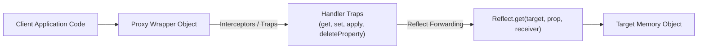
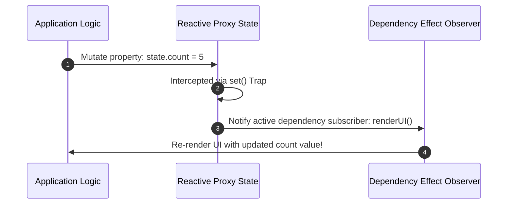
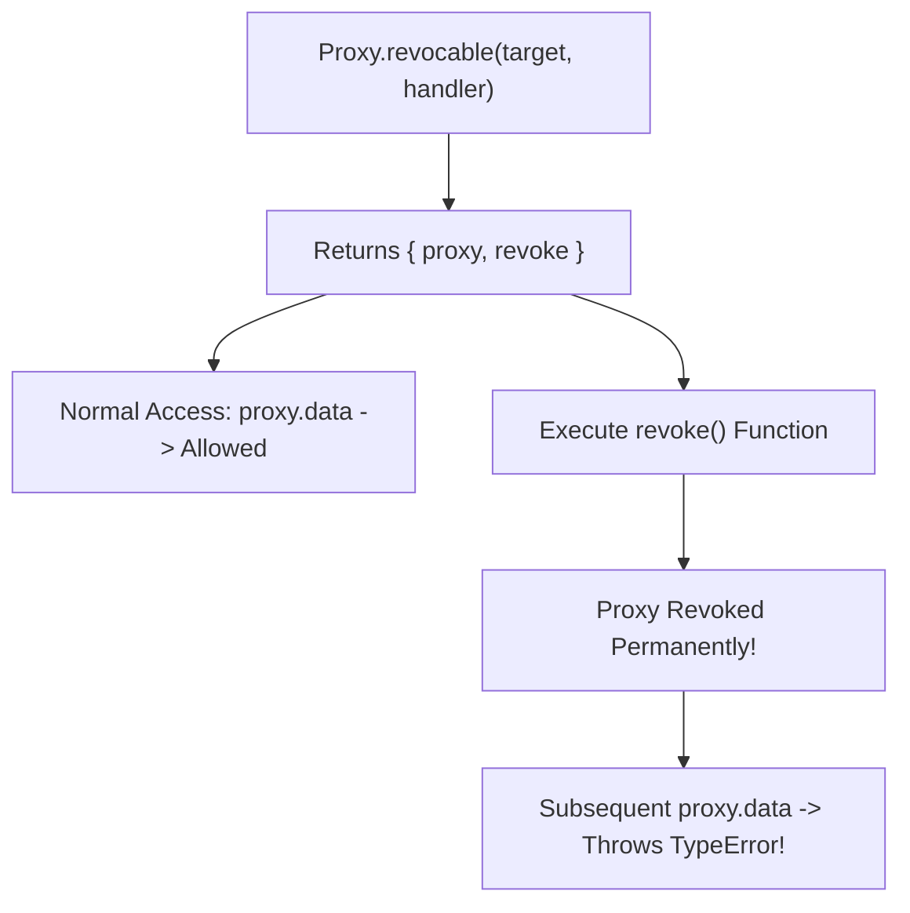

# Module 38: Proxy and Reflect — Meta-Programming, Traps, and Reactive State Management

## Overview

Introduced in ECMAScript 2015 (ES6), **`Proxy`** and **`Reflect`** provide meta-programming capabilities in JavaScript.

A **`Proxy`** wraps a target object, intercepting and customizing its internal fundamental operations (such as property reads, assignments, key enumerations, function calls, and instantiation).

**`Reflect`** is a built-in static object that provides default methods corresponding 1-to-1 with every Proxy trap, forwarding operations cleanly to target objects.

Understanding **The 13 Proxy Traps**, building **Reactive State Management Engines** (like Vue 3's reactivity core), and utilizing **Revocable Proxies** is essential.

---

## 1. Proxy & Reflect Interception Architecture



### The 13 Proxy Traps & Reflect Counterparts

| Proxy Trap | Intercepted Operation | Corresponding `Reflect` Method |
| :--- | :--- | :--- |
| **`get(target, prop, receiver)`** | Property read (`obj.prop`) | `Reflect.get(target, prop, receiver)` |
| **`set(target, prop, val, receiver)`**| Property write (`obj.prop = val`) | `Reflect.set(target, prop, val, receiver)` |
| **`has(target, prop)`** | `in` operator (`'key' in obj`) | `Reflect.has(target, prop)` |
| **`deleteProperty(target, prop)`** | `delete obj.prop` | `Reflect.deleteProperty(target, prop)` |
| **`apply(target, thisArg, args)`** | Function execution (`fn(...args)`) | `Reflect.apply(target, thisArg, args)` |
| **`construct(target, args, newTarget)`**| `new Fn(...args)` instantiation | `Reflect.construct(target, args, newTarget)` |
| **`ownKeys(target)`** | `Object.keys()`, `Reflect.ownKeys()` | `Reflect.ownKeys(target)` |

---

## 2. Building a Reactive State Engine (Vue 3 Core Pattern)

Proxies enable automatic change detection and UI re-rendering when reactive state properties mutate:



```javascript
// Lightweight Reactive Observer Engine
const activeEffects = new Set();

function createEffect(fn) {
  activeEffects.add(fn);
  fn(); // Initial execution pass
}

function reactive(targetObject) {
  return new Proxy(targetObject, {
    get(target, prop, receiver) {
      // Forward operation using Reflect
      return Reflect.get(target, prop, receiver);
    },

    set(target, prop, value, receiver) {
      const oldValue = target[prop];
      const result = Reflect.set(target, prop, value, receiver);

      // If value changed, trigger all active reactive effect listeners!
      if (oldValue !== value) {
        activeEffects.forEach((effect) => effect());
      }
      return result;
    }
  });
}

// Verification of Reactive State Engine
const appState = reactive({ count: 0 });

createEffect(() => {
  console.log("REACTIVE SIGNAL: Count updated to:", appState.count);
});

appState.count = 1; // Logs: "REACTIVE SIGNAL: Count updated to: 1"
appState.count = 2; // Logs: "REACTIVE SIGNAL: Count updated to: 2"
```

---

## 3. Revocable Proxies (`Proxy.revocable()`)

A **Revocable Proxy** can be completely deactivated at runtime. Once revoked, any attempt to access or mutate the proxy throws a `TypeError`, ideal for security sandboxes and memory cleanup:



```javascript
const sensitiveData = { apiToken: "SECRET-BEARER-KEY-99" };
const { proxy, revoke } = Proxy.revocable(sensitiveData, {
  get(target, prop) {
    return target[prop];
  }
});

console.log(proxy.apiToken); // "SECRET-BEARER-KEY-99"

// Revoke access permissions!
revoke();

// Attempting to read properties after revocation throws TypeError:
// console.log(proxy.apiToken); // TypeError: Cannot perform 'get' on a proxy that has been revoked
```

---

## Key Production Takeaways

1. **Always Use `Reflect` Inside Traps**: Always forward unhandled operations using `Reflect.trapName(target, ...args)` to preserve default engine behaviors and correct `this` bindings.
2. **Use Proxies for Reactive Frameworks & Validation**: Use Proxies for state reactivity systems, validation layers, or audit logging abstractions.
3. **Use Revocable Proxies for Security Sandboxes**: Use `Proxy.revocable()` when passing sensitive objects to third-party scripts to revoke permissions after execution.
4. **Be Aware of Performance Overhead**: Proxy traps add microsecond overhead to property accesses and prevent V8 Inline Caching optimizations; avoid wrapping high-frequency loops in proxies.

