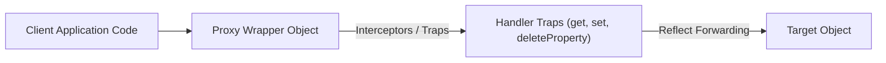

# File 38: Proxy and Reflect

## Overview
Introduced in ES6, **`Proxy`** enables creating a wrapper around a target object to intercept and customize fundamental object operations (getting, setting, deleting properties). **`Reflect`** provides default built-in methods for performing these operations directly.

---

## 1. Proxy Architecture



---

## 2. Creating a Proxy Interceptor

```javascript
const targetUser = { name: "Rajesh", age: 30 };

const handler = {
    // Intercept property reading
    get(target, prop, receiver) {
        console.log(`Property '${prop}' was read`);
        return Reflect.get(target, prop, receiver);
    },

    // Intercept property writing with validation
    set(target, prop, value, receiver) {
        if (prop === "age" && (typeof value !== "number" || value < 0)) {
            throw new TypeError("Age must be a positive number!");
        }
        console.log(`Setting property '${prop}' to '${value}'`);
        return Reflect.set(target, prop, value, receiver);
    }
};

const proxyUser = new Proxy(targetUser, handler);

console.log(proxyUser.name); // Logs access notification, returns "Rajesh"
proxyUser.age = 31;          // Logs mutation notification
// proxyUser.age = -5;       // Throws TypeError!
```

---

## 3. Practical Use Cases for Proxy
1. **Reactivity Systems**: Powers Vue 3 and MobX state reactivity tracking.
2. **Validation Layer**: Guards object mutations with custom type validation.
3. **Logging & Analytics Audit**: Automatically logs all read/write accesses to objects.

---

## Key Takeaways
1. **`Proxy`** wraps target objects to trap and customize low-level object operations.
2. **`Reflect`** provides matching methods to safely forward unhandled operations to the target object.
3. Common traps include **`get`**, **`set`**, **`deleteProperty`**, and **`has`**.
