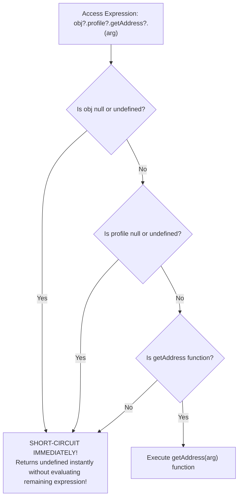

# Module 39: Optional Chaining and Nullish Coalescing — Short-Circuiting, `??`, and Logical Assignment

## Overview

Introduced in ECMAScript 2020 (ES2020), **Optional Chaining (`?.`)** and **Nullish Coalescing (`??`)** eliminate verbose guard checks (`a && a.b && a.b.c`) and safe default fallbacks.

ES2021 expanded these capabilities by introducing **Logical Assignment Operators (`??=`, `||=`, `&&=`)**.

Understanding the exact **Short-Circuiting Rules of `?.`**, the precise behavioral difference between `??` (checking `null`/`undefined` only) and `||` (checking all 8 falsy values), and operator precedence constraints is essential.

---

## 1. Optional Chaining (`?.`) Execution Architecture



### The 3 Optional Chaining Syntax Variants

| Variant Syntax | Purpose | Code Example |
| :--- | :--- | :--- |
| **Property Access (`?.prop`)** | Safely read property of optional object. | `user?.profile?.name` |
| **Element Access (`?.[expr]`)**| Safely index optional array or key. | `users?.[0]?.roles?.[key]` |
| **Method Call (`?.()`)** | Safely invoke optional function. | `config.onSuccess?.(payload)` |

```javascript
const userResponse = {
  id: 101,
  metadata: {
    tags: ["admin", "dev"]
  }
};

// 1. Safe Property & Element Access
console.log("Tag 0:", userResponse?.metadata?.tags?.[0]); // "admin"
console.log("Missing City:", userResponse?.profile?.address?.city); // undefined (No crash!)

// 2. Safe Optional Method Call
const customLogger = {
  log: (msg) => console.log("[LOG]:", msg)
};
const emptyLogger = {};

customLogger.log?.("Application Started"); // Logs: "[LOG]: Application Started"
emptyLogger.log?.("Application Started");  // Safely short-circuits without TypeError!
```

---

## 2. Nullish Coalescing (`??`) vs. Logical OR (`||`)

```mermaid
flowchart TD
    InputVal[Evaluated Left-Hand Operand] --> CheckType{Which Operator?}

    CheckType -- "Logical OR (||)" --> CheckFalsy{Is operand ANY of the 8 Falsy values?<br/>false, 0, -0, 0n, '', null, undefined, NaN}
    CheckFalsy -- Yes --> Fallback1[Return Right-Hand Default Value]
    CheckFalsy -- No --> Value1[Return Left-Hand Operand]

    CheckType -- "Nullish Coalescing (??)" --> CheckNullish{Is operand ONLY null or undefined?}
    CheckNullish -- Yes --> Fallback2[Return Right-Hand Default Value]
    CheckNullish -- No --> Value2[Return Left-Hand Operand (Preserves 0, '', false!)]
```

```javascript
// Comparing || vs ?? when setting defaults for valid 0 or empty string values:
const userConfig = {
  timeoutMs: 0,        // 0 is a valid timeout setting!
  defaultTitle: "",    // Empty string is a valid title setting!
  retryCount: null     // Missing value
};

// BUG with Logical OR (||): Falsy 0 and '' are improperly overwritten!
console.log("OR Timeout :", userConfig.timeoutMs || 5000);   // 5000 (BUG! Overwrote valid 0!)
console.log("OR Title   :", userConfig.defaultTitle || "Untitled"); // "Untitled" (BUG!)

// CORRECT with Nullish Coalescing (??): Preserves 0 and ''!
console.log("Nullish Timeout:", userConfig.timeoutMs ?? 5000);   // 0 (Correct!)
console.log("Nullish Title  :", userConfig.defaultTitle ?? "Untitled"); // "" (Correct!)
console.log("Nullish Retry  :", userConfig.retryCount ?? 3);     // 3 (Correctly replaced null!)
```

---

## 3. Logical Assignment Operators (`??=`, `||=`, `&&=`)

Introduced in ES2021, Logical Assignment Operators combine logical evaluation with assignment:

```javascript
const appSettings = {
  maxConnections: 0,
  theme: null
};

// 1. Nullish Logical Assignment (??=): Assigns ONLY if current value is null or undefined
appSettings.maxConnections ??= 10; // Preserves 0!
appSettings.theme ??= "dark";       // Replaces null with "dark"!

console.log("Max Connections:", appSettings.maxConnections); // 0
console.log("Theme          :", appSettings.theme);          // "dark"
```

> [!WARNING]
> **Syntax Precedence Constraint**: You cannot directly mix `??` with `&&` or `||` without explicit parentheses (e.g. `(a ?? b) || c`). Writing `a ?? b || c` throws a compilation `SyntaxError` to avoid ambiguity.

---

## Key Production Takeaways

1. **Use `?.` to Replace Verbose Guard Chains**: Replace `user && user.profile && user.profile.city` with clean optional chaining `user?.profile?.city`.
2. **Use `??` Instead of `||` for Numeric or String Defaults**: Use `??` when assigning fallbacks for numeric values, flags, or string inputs to preserve valid `0`, `false`, and `""` inputs.
3. **Use `??=` for Deferred Default State Initialization**: Use `settings.theme ??= 'dark'` to initialize unassigned properties without overwriting legitimate values.
4. **Group Mixed Logical Operators with Parentheses**: Always wrap mixed `??`, `&&`, and `||` operators inside explicit parentheses to prevent `SyntaxError` compilation crashes.

