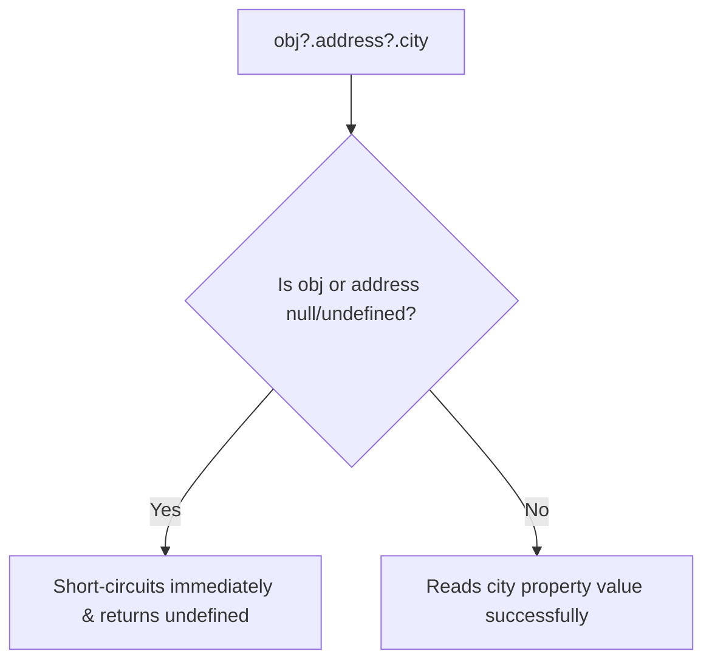

# File 39: Optional Chaining and Nullish Coalescing

## Overview
Introduced in ES2020, **Optional Chaining (`?.`)** allows safely accessing nested object properties without throwing `TypeError` exceptions if an intermediate reference is `null` or `undefined`. **Nullish Coalescing (`??`)** provides a safe fallback operator that handles `0` and `""` correctly.

---

## 1. Optional Chaining (`?.`)



```javascript
const user = {
    name: "Priya",
    profile: {
        address: { city: "Bengaluru" }
    }
};

const guest = { name: "Guest" };

// Safe Access without Optional Chaining (Verbose)
const cityOld = guest.profile && guest.profile.address && guest.profile.address.city;

// Safe Access with Optional Chaining (Clean)
console.log(user?.profile?.address?.city);  // "Bengaluru"
console.log(guest?.profile?.address?.city); // undefined (No TypeError thrown!)

// Optional Method Invocations
console.log(user.getCustomData?.()); // undefined (Does not crash if method missing)
```

---

## 2. Nullish Coalescing (`??`) vs Logical OR (`||`)

```javascript
// Logical OR (||) treats ALL falsy values (0, "", false, null, undefined) as missing
const count = 0;
console.log(count || 10); // 10 (BUG! 0 was valid!)

// Nullish Coalescing (??) checks ONLY null or undefined
console.log(count ?? 10); // 0 (Correct!)
```

---

## Key Takeaways
1. Use **`?.`** to safely navigate nested properties or optional method calls without runtime crashes.
2. Use **`??`** to provide fallback defaults while preserving legitimate falsy values like `0` or `""`.
