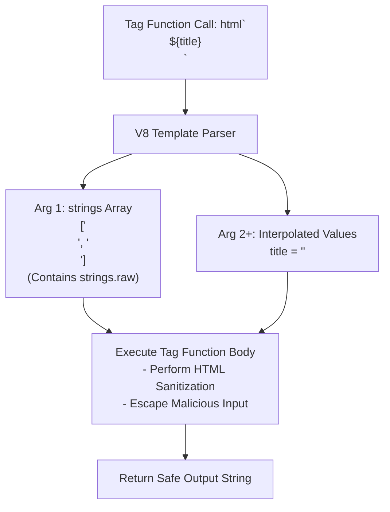
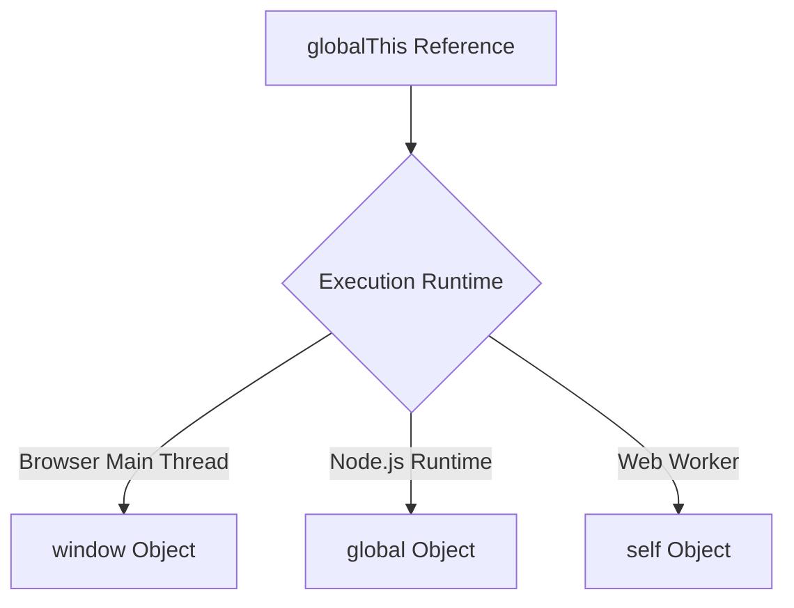

# Module 40: Tagged Templates & Modern JS Utilities — Tag Functions, `globalThis`, and `Object.hasOwn`

## Overview

Modern ECMAScript standards introduced powerful meta-programming and utility syntax extensions:
1. **Tagged Template Literals**: Custom tag functions (`tag\`string ${expr}\``) that intercept and transform raw string literals and interpolated expressions before final string evaluation.
2. **Universal Global Object (`globalThis`)**: Standardized environment-agnostic reference pointing to the global object (`window` in Browsers, `global` in Node.js, `self` in Workers).
3. **`Object.hasOwn()` (ES2022)**: Robust replacement for `Object.prototype.hasOwnProperty.call()`.
4. **Numeric Separators (ES2021)**: Readable visual delimiters inside numeric literals (`1_500_000`).

---

## 1. Tagged Template Literal Engine Architecture

When a tagged template literal is evaluated, JavaScript invokes the tag function, passing:
- **Argument 1**: An array of frozen static template literal string segments (`strings`).
- **Arguments 2...N**: The evaluated results of all interpolated expression placeholders (`...values`).



```javascript
// Security Sanitization Pipeline via Tagged Template Literal
function html(strings, ...values) {
  return strings.reduce((accumulator, currentString, index) => {
    const rawVal = values[index - 1];
    
    // Sanitize string inputs against XSS attacks
    const sanitizedVal = typeof rawVal === "string"
      ? rawVal.replace(/</g, "&lt;").replace(/>/g, "&gt;").replace(/"/g, "&quot;")
      : String(rawVal ?? "");

    return accumulator + sanitizedVal + currentString;
  });
}

const userInput = '<script>alert("XSS Attack!");</script>';
const safeHTML = html`<div class="comment">${userInput}</div>`;

console.log("Sanitized HTML Output:", safeHTML);
// Output: <div class="comment">&lt;script&gt;alert(&quot;XSS Attack!&quot;);&lt;/script&gt;</div>
```

---

## 2. `globalThis` Cross-Runtime Resolution

Before ES2020, accessing the global object required environment checking across `window`, `global`, or `self`:



```javascript
// Environment-Agnostic Global Method Attachment
function registerGlobalLogger(loggerFn) {
  // globalThis works seamlessly across Node.js, V8, Browsers, and Deno!
  globalThis.__CUSTOM_LOGGER__ = loggerFn;
}

registerGlobalLogger((msg) => console.log("[GLOBAL]:", msg));
globalThis.__CUSTOM_LOGGER__("System Diagnostic Ready");
```

---

## 3. Safe Property Check: `Object.hasOwn()` (ES2022)

ES2022 introduced **`Object.hasOwn(obj, prop)`**, replacing legacy `Object.prototype.hasOwnProperty` which throws errors on `Object.create(null)` objects:

```mermaid
flowchart TD
    CheckCall["Check Property: Object.hasOwn(dictionary, 'key')"] --> SafeCheck{Is obj created via Object.create(null)?}

    SafeCheck -- Yes --> WorksSafely["Works Safely! Returns boolean without prototype lookup"]
    SafeCheck -- No --> WorksSafely
```

```javascript
// 1. DANGER: Prototype-less Object throws TypeError with legacy hasOwnProperty!
const nullProtoDict = Object.create(null);
nullProtoDict.key = "Value";

// nullProtoDict.hasOwnProperty("key"); // TypeError: nullProtoDict.hasOwnProperty is not a function!

// 2. SAFE: Object.hasOwn() works on ALL objects safely!
console.log("Object.hasOwn Result:", Object.hasOwn(nullProtoDict, "key")); // true (Safe!)

// 3. Numeric Separators (ES2021)
const annualRevenue = 1_500_000_000; // 1.5 Billion (Readable visual separator)
console.log("Numeric Value:", annualRevenue); // 1500000000
```

---

## Key Production Takeaways

1. **Use Tagged Templates for Sanitization & SQL Guarding**: Use tagged template literals for XSS escaping, SQL parameter binding, and i18n localization pipelines.
2. **Use `globalThis` for Universal Cross-Platform Code**: Replace runtime environment detection checks (`typeof window !== 'undefined'`) with `globalThis`.
3. **Use `Object.hasOwn()` Over `hasOwnProperty`**: Replace `obj.hasOwnProperty('key')` with `Object.hasOwn(obj, 'key')` to prevent crashes on prototype-less objects.
4. **Use Numeric Separators for Large Numbers**: Use `1_000_000` to improve readability of large financial or byte constants in source code.

