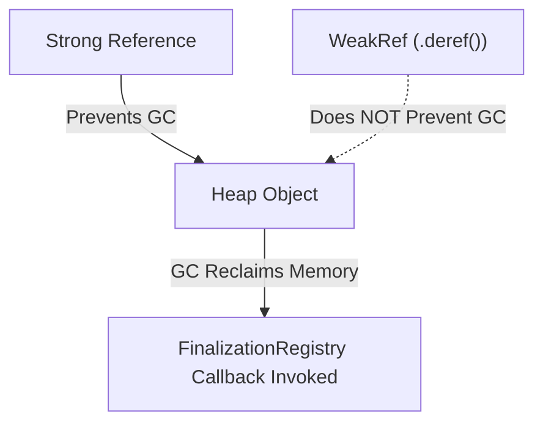

# File 41: WeakRef and FinalizationRegistry

## Overview
**`WeakRef`** and **`FinalizationRegistry`** (ES2021) provide low-level memory management capabilities. `WeakRef` allows referencing an object weakly without preventing Garbage Collection, while `FinalizationRegistry` executes a cleanup callback when registered objects are garbage collected.

---

## 1. Weak References Architecture



---

## 2. Using `WeakRef`
A `WeakRef` holds a weak reference to its target object. Calling `.deref()` returns the target object if it is still alive in memory, or `undefined` if GC has collected it.

```javascript
let cacheTarget = { id: "HEAVY_DATA_LOAD", payload: new Array(10000).fill("x") };

const weakReference = new WeakRef(cacheTarget);

// Fetching object from WeakRef
console.log(weakReference.deref()?.id); // "HEAVY_DATA_LOAD"

// Release strong reference
cacheTarget = null;
// Once GC executes, weakReference.deref() will return undefined automatically!
```

---

## 3. Using `FinalizationRegistry`
Registers a callback to execute cleanup tasks when an object is garbage collected.

```javascript
const registry = new FinalizationRegistry((heldValue) => {
    console.log(`Object tagged '${heldValue}' was collected by Garbage Collector`);
});

let tempObject = { name: "Temporary" };
registry.register(tempObject, "temp-object-tag");

tempObject = null; // Eligible for GC collection
```

> **Warning**: `FinalizationRegistry` callbacks are non-deterministic. Do not rely on them for essential business logic cleanup.

---

## Key Takeaways
1. **`WeakRef`** references objects weakly without blocking Garbage Collection.
2. Use **`.deref()`** to safely access target objects if they are still alive.
3. **`FinalizationRegistry`** notifies applications after objects have been collected.
