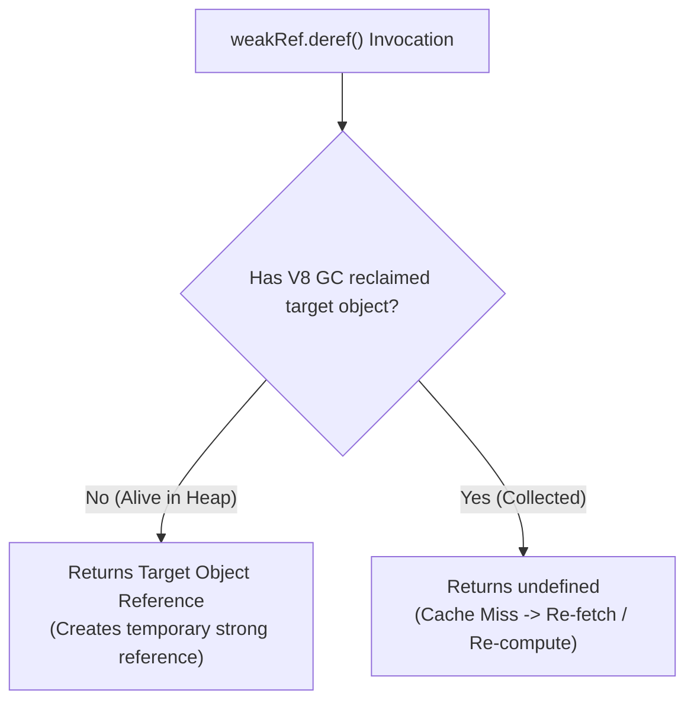
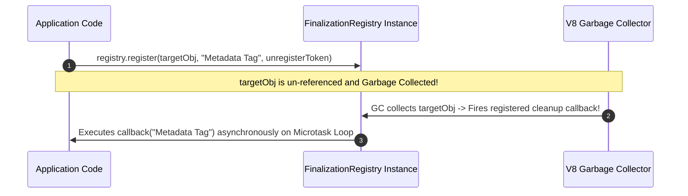

# Module 41: WeakRef and FinalizationRegistry — Low-Level Memory Management & GC Callbacks

## Overview

Introduced in ECMAScript 2021 (ES2021), **`WeakRef`** and **`FinalizationRegistry`** provide low-level memory management capabilities in JavaScript.

Normally, as long as a variable holds a **Strong Reference** to an object, the V8 Garbage Collector cannot reclaim that object's heap memory.

A **`WeakRef`** allows holding a reference to an object without preventing Garbage Collection. **`FinalizationRegistry`** permits registering cleanup callbacks that trigger after an object instance has been garbage collected.

Understanding **`.deref()` pointer inspection**, register/unregister tokens, and the **Non-Deterministic Nature of Garbage Collection** is essential.

---

## 1. Strong Reference vs. WeakRef Architecture

```mermaid
flowchart TD
    subgraph Strong Reference Memory Link
        VariableA[Active Variable A] -->|Strong Reference| HeapObj1["Heap Object 1<br/>(GC CANNOT Collect!)"]
    end

    subgraph WeakRef Memory Link
        VariableB[Active Variable B] -->|Strong Reference| WeakInstance["WeakRef Instance"]
        WeakInstance -.->|Weak Pointer (.deref())| HeapObj2["Heap Object 2<br/>(GC CAN Reclaim Anytime!)"]
    end
```

---

## 2. Weak Caching with `WeakRef` (`.deref()`)

The `.deref()` method returns the target object if it is still alive in memory, or `undefined` if the V8 Garbage Collector has reclaimed it:



```javascript
// Weak Cache for Heavy CPU Data Payloads
const heavyImageCache = new Map(); // Key -> WeakRef(ImagePayload)

function getCachedImage(imageId) {
  const weakRef = heavyImageCache.get(imageId);
  
  if (weakRef) {
    const cachedImage = weakRef.deref(); // Safely inspect pointer!
    if (cachedImage) {
      console.log(`Cache HIT for Image [${imageId}]`);
      return cachedImage;
    }
  }

  console.log(`Cache MISS for Image [${imageId}]. Fetching fresh payload...`);
  const freshImage = { id: imageId, pixels: new Array(1000000).fill(255) };
  
  // Store WeakRef inside Cache Map so RAM can be freed under memory pressure!
  heavyImageCache.set(imageId, new WeakRef(freshImage));
  return freshImage;
}

let img1 = getCachedImage("img_101");
console.log(getCachedImage("img_101").id); // Cache HIT!

img1 = null; // Un-reference strong handle; GC can now reclaim img_101!
```

---

## 3. Resource Cleanup via `FinalizationRegistry`

`FinalizationRegistry` lets you register cleanup callbacks that fire after an object has been garbage collected (e.g. freeing external C++ bindings, WASM handles, or temp files):



```javascript
// 1. Instantiate FinalizationRegistry with Cleanup Callback
const cleanupRegistry = new FinalizationRegistry((heldValue) => {
  console.log(`[GC CLEANUP]: Native Resource '${heldValue}' was collected by V8 GC.`);
});

function allocateNativeHandle() {
  let nativeResource = { id: "WASM_BUFFER_9001" };
  const unregisterToken = {}; // Used to unregister callback if needed

  // Register object with registry
  cleanupRegistry.register(nativeResource, "WASM_BUFFER_9001", unregisterToken);

  // If needed, unregister manually:
  // cleanupRegistry.unregister(unregisterToken);

  nativeResource = null; // Eligible for Garbage Collection!
}

allocateNativeHandle();
```

> [!CAUTION]
> **Garbage Collection Non-Determinism Hazard**: Never rely on `FinalizationRegistry` for essential application logic (like saving database transactions or closing file descriptors). Garbage Collection timing is non-deterministic; GC sweeps may delay for minutes or never run at all if memory pressure remains low!

---

## Key Production Takeaways

1. **Use `WeakRef` for Memory-Sensitive Caches**: Use `WeakRef` when caching large images, buffers, or calculated datasets to allow V8 to reclaim memory under high RAM pressure.
2. **Always Check `.deref()` for `undefined`**: Always inspect if `weakRef.deref()` returned `undefined` before accessing properties on the target.
3. **Never Rely on `FinalizationRegistry` for Critical Logic**: Use `FinalizationRegistry` only as a secondary fallback metric; handle explicit cleanup synchronously using `dispose()` or `try...finally` blocks.
4. **Avoid Creating WeakRef Wrappers Excessively**: WeakRef objects themselves consume small amounts of heap space; use them judiciously for heavy payloads.

