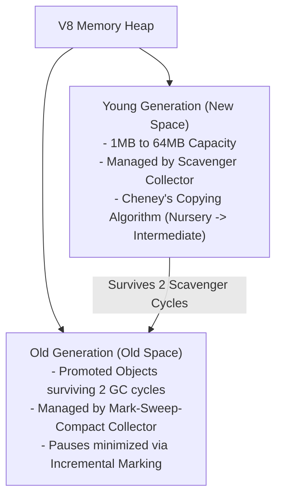
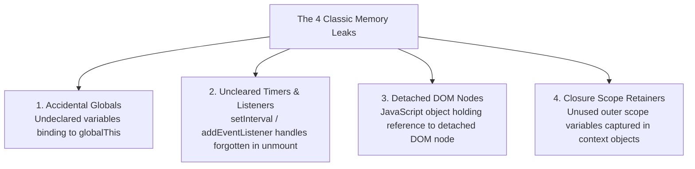
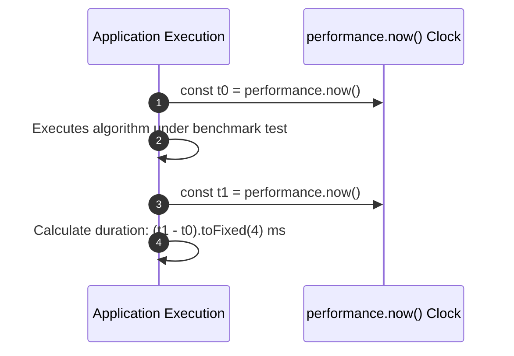

# Module 42: Memory Management & Performance Optimization — V8 Garbage Collection, Leaks, and Benchmarking

## Overview

JavaScript memory is allocated dynamically in the **V8 Memory Heap** and reclaimed automatically by the **V8 Garbage Collector (GC)**.

V8 uses a **Generational Garbage Collection Hypothesis**: most objects die young. Therefore, V8 splits memory into:
1. **Young Generation (New Space)**: Managed by a fast **Scavenger Collector** using Cheney's Copying Algorithm.
2. **Old Generation (Old Space)**: Managed by a **Mark-Sweep-Compact Collector** for long-lived objects.

Understanding memory leak causes, high-resolution microsecond benchmarking via `performance.now()`, and optimizing V8 Hidden Classes and Inline Caches is essential.

---

## 1. V8 Memory Heap & Generational GC Architecture



### V8 Collector Comparison

| GC Collector | Target Space | Algorithm Strategy | Execution Frequency & Latency |
| :--- | :--- | :--- | :--- |
| **Scavenger (Minor GC)** | Young Generation (New Space) | Cheney's Parallel Copying Algorithm | Extremely frequent, ultra-low latency (~1ms to 5ms pause). |
| **Mark-Sweep-Compact (Major GC)** | Old Generation (Old Space) | Incremental Marking, Sweeping & Compacting | Infrequent, higher latency (~10ms to 100ms pause). |

---

## 2. The 4 Classic JavaScript Memory Leaks



```javascript
// 1. LEAK PATTERN: Uncleared Timers
function startLeakyInterval() {
  const largeArray = new Array(1000000).fill("DATA");
  setInterval(() => {
    // Retains 'largeArray' in memory heap indefinitely!
    console.log("Timer Tick:", largeArray.length);
  }, 1000);
}

// FIX PATTERN: Return cleanup handler
function startCleanInterval() {
  const largeArray = new Array(1000000).fill("DATA");
  const timerId = setInterval(() => {
    console.log("Timer Tick:", largeArray.length);
  }, 1000);

  return () => clearInterval(timerId); // Call to un-reference!
}

// 2. V8 PERFORMANCE ANTI-PATTERN: Deleting Properties Degrades Hidden Classes
const userPoint = { x: 10, y: 20 };

// DANGER: 'delete' forces V8 to drop Hidden Class optimization and fallback to Slow Dictionary Mode!
delete userPoint.x; 

// FIX PATTERN: Set to null or undefined to preserve Fast Monomorphic In-Object Shape!
userPoint.y = null;
```

---

## 3. High-Precision Microsecond Benchmarking

Use **`performance.now()`** instead of `Date.now()`. `performance.now()` returns a high-resolution, monotonic timestamp in milliseconds with microsecond precision ($\frac{1}{1000}\text{th}$ of a ms), unaffected by system clock adjustments:



```javascript
function benchmarkAlgorithm(taskFn, iterations = 10000) {
  const startTimestamp = performance.now();

  for (let i = 0; i < iterations; i++) {
    taskFn();
  }

  const endTimestamp = performance.now();
  const totalDurationMs = endTimestamp - startTimestamp;
  const avgDurationPerOpMs = totalDurationMs / iterations;

  return {
    totalDurationMs: totalDurationMs.toFixed(4),
    avgDurationPerOpMs: avgDurationPerOpMs.toFixed(6)
  };
}

const benchmarkResult = benchmarkAlgorithm(() => {
  Math.sqrt(144) * Math.sin(45);
}, 100000);

console.log(`Total Execution Time : ${benchmarkResult.totalDurationMs} ms`);
console.log(`Average Per Operation: ${benchmarkResult.avgDurationPerOpMs} ms`);
```

---

## Key Production Takeaways

1. **Avoid `delete` Operator on Hot Objects**: Never use `delete obj.prop` in performance-critical code; set properties to `null` or `undefined` to preserve V8 Hidden Classes.
2. **Always Clear Intervals and Event Listeners**: Always invoke `clearInterval(timerId)` and `removeEventListener()` when components unmount or operations complete.
3. **Use `performance.now()` for Benchmarking**: Use `performance.now()` for microsecond-precise algorithm profiling instead of `Date.now()`.
4. **Clean Up Detached DOM References**: Nullify JavaScript variables pointing to DOM elements after removing them from the DOM tree.

