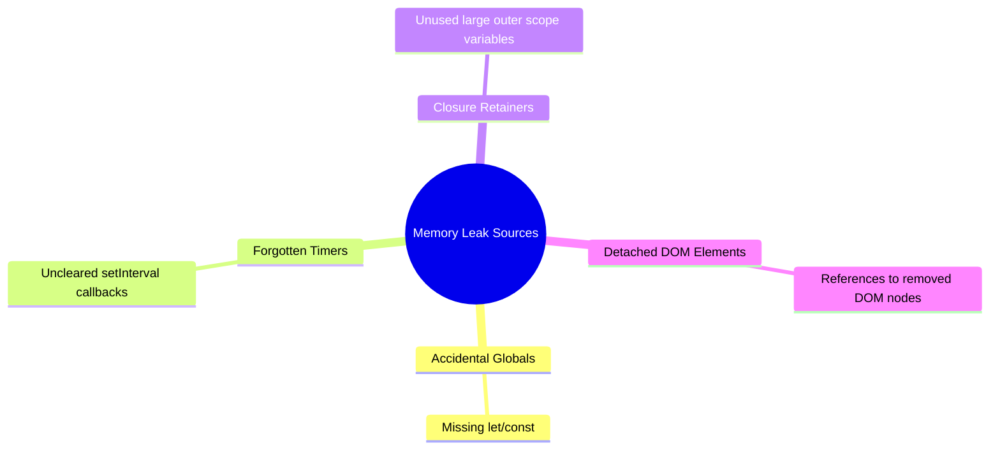

# File 42: Memory Management and Performance Optimization

## Overview
JavaScript memory allocation is managed automatically via Garbage Collection. Writing high-performance code requires understanding memory retention, avoiding memory leaks, and measuring execution time accurately using `performance.now()`.

---

## 1. Top Memory Leak Sources & Fixes



---

## 2. Memory Leak Examples & Mitigations

### 1. Uncleared Timers
```javascript
// BAD: Interval runs indefinitely, accumulating data
function startLeakyTimer() {
    const logData = [];
    setInterval(() => {
        logData.push(Date.now()); // Memory grows forever!
    }, 1000);
}

// FIX: Always return a cleanup handle to stop timers
function startCleanTimer() {
    const logData = [];
    const timerId = setInterval(() => {
        logData.push(Date.now());
        if (logData.length > 50) logData.shift(); // Cap array size
    }, 1000);

    return () => clearInterval(timerId); // Cleanup handle
}
```

### 2. High-Precision Timing
```javascript
const { performance } = require("perf_hooks");

const start = performance.now();
// Operation...
const duration = performance.now() - start;
console.log(`Duration: ${duration.toFixed(3)}ms`);
```

---

## Key Takeaways
1. Avoid **accidental globals**, **uncleared intervals**, and **unbounded array growth**.
2. Measure performance using **`performance.now()`** for high-resolution monotonic timestamps.
3. Clean up event listeners and timers when components unmount or complete.
