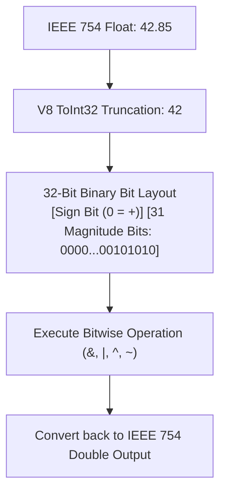
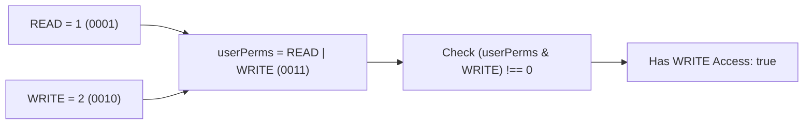

# Module 43: Bitwise Operators & Binary Manipulations — Bitmasks, Two's Complement, and Fast Math

## Overview

JavaScript **Bitwise Operators** convert standard 64-bit IEEE 754 floating-point numbers into **32-bit Signed Integers** (via the internal ECMAScript **`ToInt32`** algorithm) to execute bit-level operations.

Bitwise operations process numbers bit-by-bit at the machine hardware level, making them ideal for high-performance **Permission Bitmask Systems**, binary protocol decoding, graphics manipulation, and fast mathematical tricks.

Understanding Two's Complement binary notation, the difference between **Signed Right Shift (`>>`)** and **Zero-Fill Unsigned Right Shift (`>>>`)**, and bitwise tricks is essential.

---

## 1. 32-Bit Signed Two's Complement Representation

When a bitwise operation occurs, JavaScript converts the operand into a 32-bit binary sequence represented in **Two's Complement** format:



---

## 2. Comprehensive Bitwise Operators Reference Matrix

| Operator | Name | Bitwise Evaluation Rule | Mathematical Equivalent |
| :--- | :--- | :--- | :--- |
| **`&`** | **Bitwise AND** | Sets bit to `1` ONLY if both bits are `1`. | Mask intersection |
| **`\|`** | **Bitwise OR** | Sets bit to `1` if either bit is `1`. | Mask combination |
| **`^`** | **Bitwise XOR** | Sets bit to `1` if bits are different (toggle). | Bitwise toggling |
| **`~`** | **Bitwise NOT** | Inverts all 32 bits (`1` $\to$ `0`, `0` $\to$ `1`). | `-(x + 1)` |
| **`<<`** | **Left Shift** | Shifts bits left, filling right with `0`. | $x \times 2^n$ |
| **`>>`** | **Signed Right Shift** | Shifts bits right, preserving original sign bit. | $\lfloor x / 2^n \rfloor$ |
| **`>>>`**| **Unsigned Right Shift** | Shifts bits right, zero-filling left side. | Returns positive Unsigned 32-bit Integer |

```mermaid
flowchart TD
    subgraph Signed Shift (>>) vs Unsigned Shift (>>>)
        InputVal["Negative Integer: -10 (11111111...11110110)"]
        
        InputVal --> ShiftSigned["Signed Shift: -10 >> 2<br/>- Preserves Sign Bit (Fills left with 1s)<br/>- Result: -3"]
        
        InputVal --> ShiftUnsigned["Unsigned Shift: -10 >>> 2<br/>- Zero-Fills Left Side with 0s!<br/>- Result: 1073741821 (Large Positive Number!)"]
    end
```

---

## 3. Production Architecture: Permission Bitmask Systems

Bitmasks allow packing multiple boolean flags into a single 32-bit integer, saving memory and allowing fast bitwise permission checks:



```javascript
// Defining Permission Flag Bits using Left Shift (1 << n)
const PERMISSION_READ    = 1 << 0; // 0001 (1)
const PERMISSION_WRITE   = 1 << 1; // 0010 (2)
const PERMISSION_EXECUTE = 1 << 2; // 0100 (4)
const PERMISSION_DELETE  = 1 << 3; // 1000 (8)

// 1. Granting Permissions using Bitwise OR (|)
let currentRole = PERMISSION_READ | PERMISSION_WRITE; // 0011 (3)

// 2. Checking Permission using Bitwise AND (&)
const canExecute = (currentRole & PERMISSION_EXECUTE) !== 0; // false
const canWrite = (currentRole & PERMISSION_WRITE) !== 0;     // true

console.log("Can Execute:", canExecute); // false
console.log("Can Write  :", canWrite);   // true

// 3. Toggling Permission using Bitwise XOR (^)
currentRole = currentRole ^ PERMISSION_WRITE; // Toggles WRITE off -> 0001 (1)
console.log("Can Write After Toggle:", (currentRole & PERMISSION_WRITE) !== 0); // false

// 4. Revoking Permission using Bitwise AND NOT (& ~)
currentRole = currentRole & ~PERMISSION_READ; // Clears READ bit -> 0000 (0)
console.log("Final Role Value:", currentRole); // 0
```

---

## 4. Fast Bitwise Math Tricks

```javascript
// 1. Fast Integer Truncation (~~x instead of Math.trunc(x))
console.log("~~4.9  :", ~~4.9);   // 4
console.log("~~-4.9 :", ~~-4.9);  // -4

// 2. Fast Even/Odd Parity Check ((x & 1) === 0)
const isEven = (num) => (num & 1) === 0;
console.log("Is 14 Even:", isEven(14)); // true
console.log("Is 15 Even:", isEven(15)); // false

// 3. Power of 2 Check ((x & (x - 1)) === 0)
const isPowerOfTwo = (n) => n > 0 && (n & (n - 1)) === 0;
console.log("Is 16 Power of 2:", isPowerOfTwo(16)); // true
console.log("Is 18 Power of 2:", isPowerOfTwo(18)); // false
```

---

## Key Production Takeaways

1. **Use Bitwise Operators for Flag Bitmasks**: Use bitwise operations (`|`, `&`, `^`) when storing multiple feature flags or user permissions inside a single integer column or payload.
2. **Remember Bitwise Operators Truncate to 32-Bit Signed Integers**: Bitwise operations drop fractional float parts and operate strictly within 32-bit signed integer limits ($[-2^{31}, 2^{31}-1]$).
3. **Use `>>>` for Unsigned 32-bit Integer Conversion**: Use Zero-Fill Unsigned Right Shift (`val >>> 0`) to force negative numbers into positive unsigned 32-bit integers.
4. **Use `~~x` for Fast 32-Bit Truncation**: Use `~~x` as a fast alternative to `Math.trunc(x)` for 32-bit numbers.

