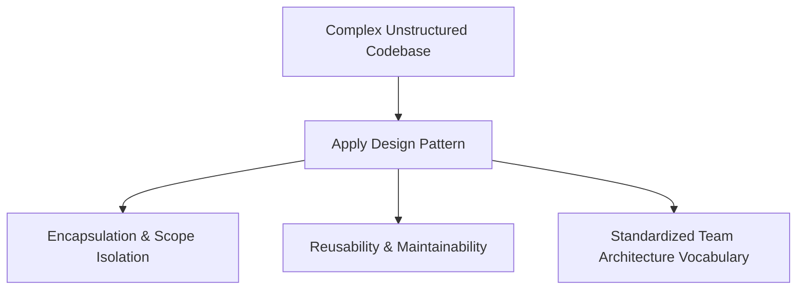
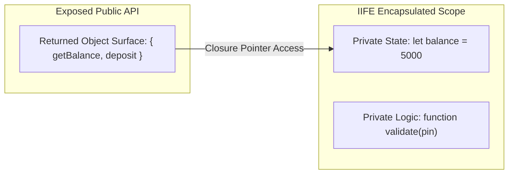

# File 01: Design Patterns Intro and The Module Pattern

## Overview
A **Design Pattern** is a reusable, proven technical blueprint for solving common software architecture problems. The **Module Pattern** is one of the foundational patterns in JavaScript, enabling encapsulation, private variable shielding, and structured public API surfaces.

---

## 1. Why Use Design Patterns?



---

## 2. The Module Pattern Architecture
Before native ES6 modules existed, JavaScript developers created private variables using **IIFEs (Immediately Invoked Function Expressions)** and **Closures**.



---

## 3. Module Pattern Implementation

```javascript
// Classic IIFE Module Pattern
const BankModule = (function () {
    // Private Variables & Internal Helper Methods (Hidden from global scope)
    let balance = 5000;
    const accountId = "ACC-99482";

    function logTransaction(type, amount) {
        console.log(`[${accountId}] ${type}: ₹${amount}`);
    }

    // Exposed Public API Surface
    return {
        getBalance() {
            return balance;
        },
        deposit(amount) {
            if (amount <= 0) return "Invalid deposit amount";
            balance += amount;
            logTransaction("DEPOSIT", amount);
            return balance;
        }
    };
})();

console.log(BankModule.getBalance()); // 5000
BankModule.deposit(1500);             // "[ACC-99482] DEPOSIT: ₹1500"
// console.log(BankModule.balance);   // undefined (Encapsulated & Private!)
```

---

## 4. Modern ES6 Module Pattern
Modern JavaScript uses native file-level modules via **`export`** and **`import`**, providing static module resolution and tree-shaking support.

```javascript
// accountModule.js (ES6 Module)
let balance = 5000; // Private to module scope

export function getBalance() {
    return balance;
}

export function deposit(amount) {
    balance += amount;
    return balance;
}
```

---

## Key Takeaways
1. Design patterns provide **proven structural solutions** to software engineering problems.
2. The **Module Pattern** leverages **IIFEs and closures** to create private variables.
3. Only properties explicitly returned in the public object surface are accessible to outside callers.
4. Native **ES6 Modules (`import`/`export`)** are statically analyzed, file-scoped, and tree-shakable.
