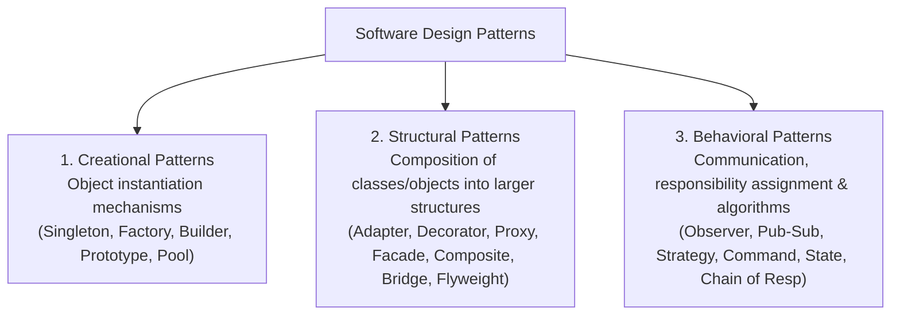
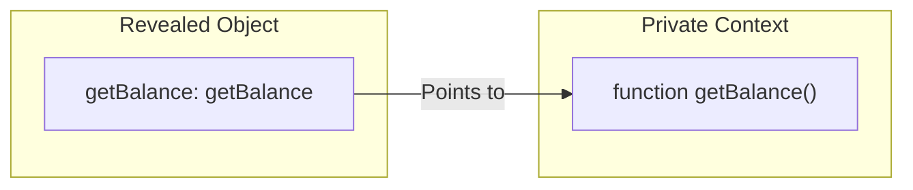

# Module 01: Design Patterns Intro & The Module Pattern — Encapsulation, IIFEs, and ES6 Modules

## Overview

A **Design Pattern** is a formalized, reusable architectural solution to a recurring design problem in software engineering. Popularized by the Gang of Four (GoF), design patterns provide a standardized vocabulary and structured blueprints for object creation, component composition, and behavioral communication.

The **Module Pattern** is a fundamental JavaScript pattern used to achieve **Encapsulation** and **Scope Isolation**. Before native ES6 modules existed, developers leveraged IIFEs (Immediately Invoked Function Expressions) and Closures to emulate private fields and expose clean public API surfaces.

Understanding pattern classification (Creational, Structural, Behavioral), the **Revealing Module Pattern (RMP)**, and modern **ES Modules** is essential.

---

## 1. Design Pattern Classification Taxonomy



---

## 2. The Module Pattern Architecture & Encapsulation

```mermaid
flowchart TD
    subgraph Encapsulated Private Lexical Scope (Closure Heap)
        PrivateState["Private Variables: let balance = 5000"]
        PrivateHelper["Private Function: function validateTx(pin)"]
    end

    subgraph Exposed Public API Surface
        PublicAPI["Public Interface Object<br/>{ getBalance(), deposit() }"]
    end

    PublicAPI -->|Closure Reference| PrivateState
    PublicAPI -->|Closure Reference| PrivateHelper
```

### Module Pattern Variations Comparison Matrix

| Pattern Variant | Private Scope Mechanism | Public Interface | Key Advantage | Major Drawback |
| :--- | :--- | :--- | :--- | :--- |
| **Classic IIFE Module** | IIFE Lexical Closure | Object literal returning anonymous functions | Strict privacy & scope protection | Harder to unit-test private functions |
| **Revealing Module (RMP)** | IIFE Lexical Closure | Object mapping public keys to private pointers | Clean, consistent syntax surface | Overridden public functions cannot update internal references |
| **ES6 Native Modules** | File-level Module Scope | `export` / `export default` statements | Static analysis, tree-shaking, native engine support | Requires bundler or Node `.mjs` configuration |

---

## 3. Code Showcase: Classic IIFE vs. Revealing Module Pattern

```javascript
// 1. Revealing Module Pattern (RMP) Implementation
const BankAccountModule = (function () {
  // Private Variables & Internal Helper Functions
  let balance = 5000;
  const accountNumber = "ACC-994821";

  function logTransaction(type, amount) {
    console.log(`[${accountNumber}] ${type}: Rs.${amount}`);
  }

  function getBalance() {
    return balance;
  }

  function deposit(amount) {
    if (amount <= 0) throw new Error("Invalid deposit amount");
    balance += amount;
    logTransaction("DEPOSIT", amount);
    return balance;
  }

  // Explicitly Reveal Public Pointer Mapping
  return {
    getBalance,
    deposit
  };
})();

console.log("Account Balance:", BankAccountModule.getBalance()); // 5000
BankAccountModule.deposit(1500); // "[ACC-994821] DEPOSIT: Rs.1500"

// Direct access to private scope fails safely:
console.log("Private Balance Access:", BankAccountModule.balance); // undefined
```

```javascript
// 2. Modern ES6 Module Pattern (accountService.mjs)
let accountBalance = 10000; // Private to file module scope!

export function fetchBalance() {
  return accountBalance;
}

export function applyInterest(rate = 0.05) {
  accountBalance += accountBalance * rate;
  return accountBalance;
}
```

---

## 4. Revealing Module Pattern Memory Reference Warning



> [!WARNING]
> **Revealing Module Pointer Nuance**: If an external caller overrides `BankAccountModule.getBalance = newFn`, internal functions inside the IIFE closure will still call the original `getBalance` internal pointer, not the overridden public property.

---

## Key Production Takeaways

1. **Use ES Modules (`import`/`export`) for Modern Projects**: Prefer native ES Modules over legacy IIFE patterns to take advantage of static tree-shaking and module dependency graphs.
2. **Use Module Patterns to Prevent Global Scope Pollution**: Wrap utilities, stores, and service instances inside modules to avoid attaching temporary variables to `globalThis`.
3. **Understand Closure Lifetime**: Remember that variables retained inside IIFE closures remain allocated in heap memory as long as the exposed public API object is referenced.
4. **Leverage Revealing Module Pattern for Clear API Layouts**: Use RMP when constructing browser-side libraries without build step tools to clearly demarcate private internals from exposed methods.

