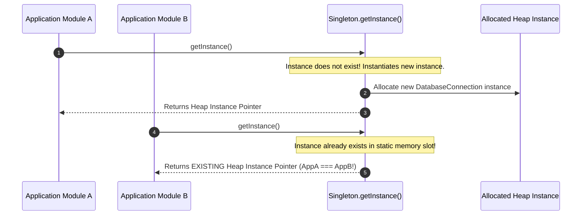
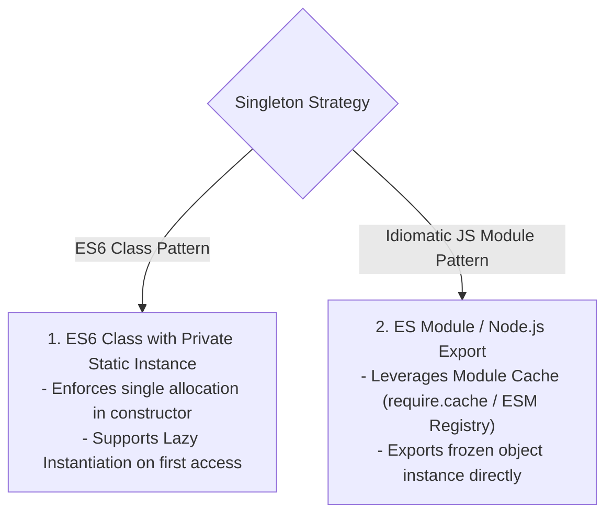
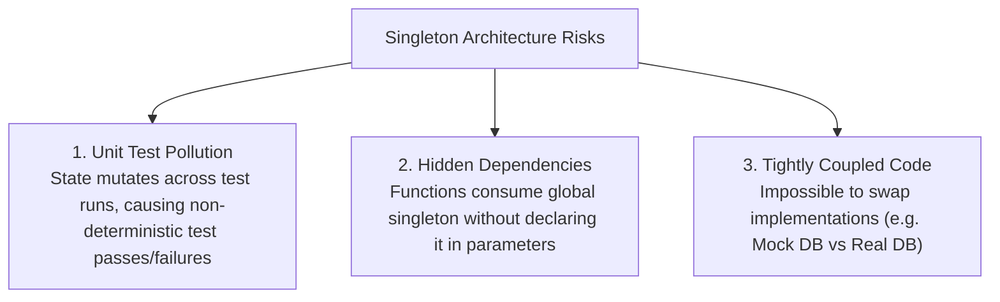

# Module 02: The Singleton Pattern — Global State, Module Caching, and Test Isolation Hazards

## Overview

The **Singleton Pattern** is a Creational design pattern that restricts the instantiation of a class to **exactly one single instance** throughout the application lifecycle, providing a unified global access point to that instance.

In JavaScript, Singletons are frequently used for shared infrastructure components such as **Database Connection Pools**, **Application Configuration Managers**, **Centralized Loggers**, and **Global Redux/Pinia State Stores**.

Understanding the difference between **Lazy Instantiation** and **Eager Instantiation**, leveraging **Node.js/ESM Module Caching**, and avoiding **Global State Testing Hazards** is essential.

---

## 1. Singleton Structural Architecture



---

## 2. Instantiation Strategies: Class-Based vs. Idiomatic ES Module



### Singleton Implementation Comparison

| Dimension | ES6 Class Singleton | Idiomatic ES Module Export |
| :--- | :--- | :--- |
| **Instantiation Timing** | **Lazy** (Instantiates on first `getInstance()` call) | **Eager** (Instantiates when file is imported) |
| **Memory Allocation** | Explicit check in constructor/static method | Managed by V8 Module Registry Cache |
| **Immutability Guard** | Requires `Object.freeze(this)` inside constructor | `Object.freeze(exportedInstance)` |
| **Subclassing Support**| Supported via inheritance | Not supported (Plain object export) |

---

## 3. Code Showcase: ES6 Class Singleton vs. ESM Module Cache

```javascript
// 1. ES6 Class Singleton with Lazy Instantiation
class DatabasePool {
  static #instance = null; // Private static instance holder (ES2022)

  constructor(connectionURI) {
    // Prevent direct instantiation if instance already exists
    if (DatabasePool.#instance) {
      return DatabasePool.#instance;
    }

    this.connectionURI = connectionURI;
    this.connectionCount = 0;
    this.isPoolActive = true;

    // Freeze instance to prevent runtime property tampering
    Object.freeze(this);
    DatabasePool.#instance = this;
  }

  static getInstance(connectionURI = "mongodb://localhost:27017/prod") {
    if (!DatabasePool.#instance) {
      DatabasePool.#instance = new DatabasePool(connectionURI);
    }
    return DatabasePool.#instance;
  }

  query(sql) {
    return `[DB:${this.connectionURI}] Executing: ${sql}`;
  }
}

// Instantiation Verification
const db1 = DatabasePool.getInstance("mongodb://primary-db:27017");
const db2 = new DatabaseConnection ? DatabasePool.getInstance("mongodb://backup-db:27017") : db1;

console.log(db1 === db2); // true (Both variables point to identical memory address!)
console.log(db2.connectionURI); // "mongodb://primary-db:27017" (First params preserved!)
```

```javascript
// 2. Idiomatic ES Module Singleton (logger.mjs)
const loggerState = {
  logs: [],
  log(message) {
    const entry = `[${new Date().toISOString()}] ${message}`;
    this.logs.push(entry);
    console.log(entry);
  },
  clear() {
    this.logs.length = 0;
  }
};

// Freeze object to prevent external mutation of method pointers
Object.freeze(loggerState);

export default loggerState; // ES Module Registry guarantees single cached instance!
```

---

## 4. Testing Hazards & Architecture Pitfalls

While Singletons are easy to implement, they introduce serious architectural risks if overused:



> [!CAUTION]
> **Testing Isolation Hazard**: Singletons preserve internal state across unit tests. If Test A mutates a Singleton state store, Test B may fail unpredictably. Always provide a reset method (`resetForTesting()`) or use **Dependency Injection (DI)** in production architectures.

---

## Key Production Takeaways

1. **Use ES Module Exports for Simple Singletons**: In modern JS/TS, a plain object export (`export default Object.freeze({...})`) is the cleanest idiomatic Singleton.
2. **Use `Object.freeze(instance)`**: Always freeze Singleton instances to prevent external code from deleting or replacing methods at runtime.
3. **Prefer Dependency Injection over Hardcoded Singletons**: Pass instance references into function parameters rather than calling `Singleton.getInstance()` inside business logic.
4. **Expose Reset Hooks for Test Environments**: If a Singleton holds mutable state, expose a protected `resetInstanceForTesting()` hook so unit tests start with a clean state.

