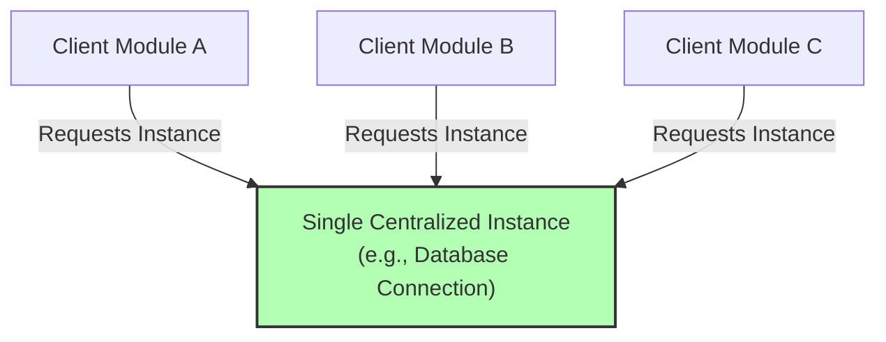

# File 02: The Singleton Pattern

## Overview
The **Singleton Pattern** ensures that a class or object constructor instantiates **exactly one single instance** throughout the entire application lifecycle, providing a centralized global point of access to that instance (such as database connections, logger utilities, or configuration stores).

---

## 1. Singleton Structural Architecture



---

## 2. ES6 Class Singleton Implementation

```javascript
class DatabaseConnection {
    static #instance = null; // Private static instance holder

    constructor(connectionString) {
        // Enforce single instance allocation
        if (DatabaseConnection.#instance) {
            return DatabaseConnection.#instance;
        }

        this.connectionString = connectionString;
        this.isConnected = true;

        // Store reference to self
        DatabaseConnection.#instance = this;
    }

    static getInstance(connectionString = "mongodb://localhost:27017/prod") {
        if (!DatabaseConnection.#instance) {
            DatabaseConnection.#instance = new DatabaseConnection(connectionString);
        }
        return DatabaseConnection.#instance;
    }

    query(sql) {
        return `Executing '${sql}' on ${this.connectionString}`;
    }
}

// Instantiation attempts
const db1 = new DatabaseConnection("mongodb://localhost:27017/prod");
const db2 = new DatabaseConnection("mongodb://remote-server:27017/dev");

console.log(db1 === db2); // true (Both references point to identical instance!)
console.log(db2.connectionString); // "mongodb://localhost:27017/prod" (First params preserved!)
```

---

## 3. Module Scope Singleton (Idiomatic JavaScript)
In ES6 environments, Node.js and browser module bundlers cache module exports automatically, making a simple object export an **implicit Singleton**.

```javascript
// logger.js - Exporting an Object Instance directly
const logger = {
    logs: [],
    log(msg) {
        this.logs.push(`[${new Date().toISOString()}] ${msg}`);
    }
};

Object.freeze(logger); // Prevents property modifications
export default logger;
```

---

## Key Takeaways
1. Singletons guarantee that **only one instance** of a resource exists in memory.
2. Useful for global shared state: **Database Pools**, **App Config**, **Loggers**, **State Stores**.
3. In ES6, **module exports** act as implicit singletons due to module caching.
4. Take care to avoid creating global state bottlenecks or testing isolation issues.
