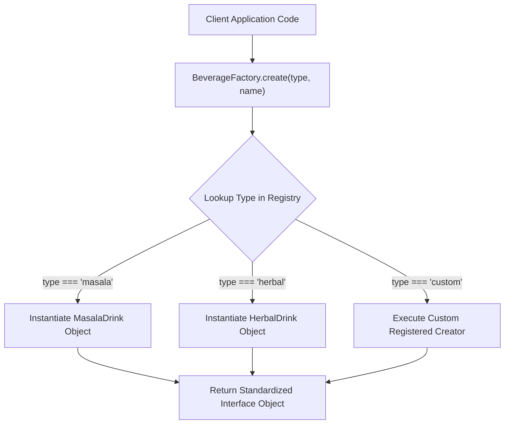
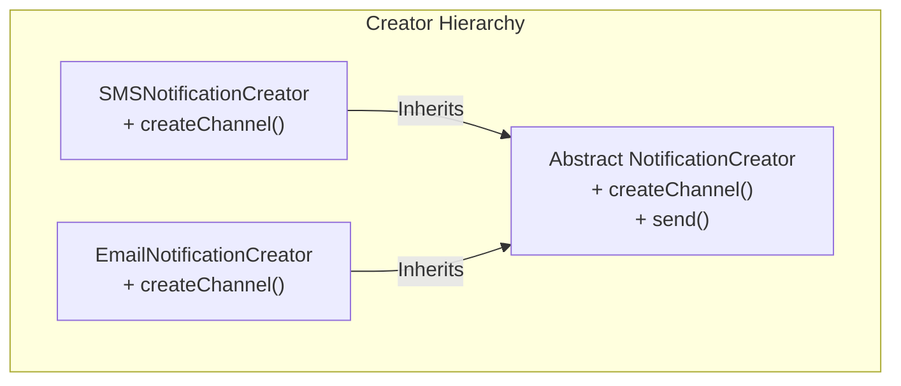

# Module 03: The Factory Pattern — Simple Factory, Factory Method, and Dynamic Registries

## Overview

The **Factory Pattern** is a Creational design pattern that provides an abstraction interface for instantiating objects without exposing the underlying constructor logic directly to the calling client.

Instead of directly invoking `new ConcreteClass()` throughout application code, clients request objects through a centralized Factory.

Understanding the difference between a **Simple Factory**, the formal Gang of Four **Factory Method Pattern**, and the **Dynamic Registration Factory** (which satisfies SOLID's **Open/Closed Principle**) is essential.

---

## 1. Factory Pattern Structural Architecture



---

## 2. Factory Pattern Taxonomy Comparison Matrix

| Factory Variant | Instantiation Strategy | Extensibility Strategy | SOLID Alignment |
| :--- | :--- | :--- | :--- |
| **Simple Factory** | Single function with `switch`/`if` branching | Requires editing factory code for new types | Violates Open/Closed Principle |
| **Factory Method (GoF)** | Subclasses override abstract factory method | Extend subclass hierarchy | High Open/Closed compliance |
| **Registration Factory** | Dynamic `Map` storage (`register(type, creator)`) | Add new types at runtime via `register()` | **100% Open/Closed Compliant** |

---

## 3. Code Showcase: Simple Factory vs. Dynamic Registration Factory

```javascript
// 1. Simple Factory Function (Branching Approach)
function createNotification(channelType, payload) {
  const timestamp = new Date().toISOString();

  switch (channelType) {
    case "SMS":
      return { type: "SMS", body: payload.message, recipient: payload.phone, timestamp };
    case "EMAIL":
      return { type: "EMAIL", body: payload.message, recipient: payload.email, timestamp };
    case "PUSH":
      return { type: "PUSH", body: payload.message, deviceId: payload.deviceId, timestamp };
    default:
      throw new Error(`Unsupported notification channel: ${channelType}`);
  }
}

console.log(createNotification("SMS", { message: "OTP: 9948", phone: "+919876543210" }));
```

```javascript
// 2. Dynamic Registration Factory (Open/Closed Principle Compliance)
class NotificationFactory {
  #channels = new Map();

  // Register new notification type at runtime without mutating existing code!
  registerChannel(channelType, creatorFn) {
    if (typeof creatorFn !== "function") {
      throw new TypeError("Creator must be a function");
    }
    this.#channels.set(channelType.toUpperCase(), creatorFn);
  }

  createNotification(channelType, payload) {
    const creator = this.#channels.get(channelType.toUpperCase());
    if (!creator) {
      throw new Error(`Channel '${channelType}' is not registered in NotificationFactory.`);
    }
    return creator(payload);
  }
}

// Client Code Usage
const factory = new NotificationFactory();

// Register channels dynamically
factory.registerChannel("SMS", (p) => ({ type: "SMS", text: p.message, phone: p.phone }));
factory.registerChannel("WHATSAPP", (p) => ({ type: "WHATSAPP", text: p.message, waId: p.waId }));

// Instantiation
const waMsg = factory.createNotification("WHATSAPP", { message: "Order Confirmed!", waId: "WA-889" });
console.log("Created Message:", waMsg);
```

---

## 4. Factory Method Subclassing Diagram



---

## Key Production Takeaways

1. **Use Factories to Decouple Object Creation**: Centralize object creation inside a factory to isolate calling code from changes in constructor signatures or instantiation logic.
2. **Use Dynamic Registries for Plug-and-Play Systems**: Implement a `Map`-based registration factory so new plugins or handlers can register themselves without modifying core factory code.
3. **Use Simple Factories for Low Complexity**: If object types are fixed and small ($\le 4$ types), use a simple factory function to avoid unnecessary class abstractions.
4. **Throw Meaningful Errors for Unregistered Types**: Ensure factories throw explicit errors when requested types are missing to simplify debugging.

