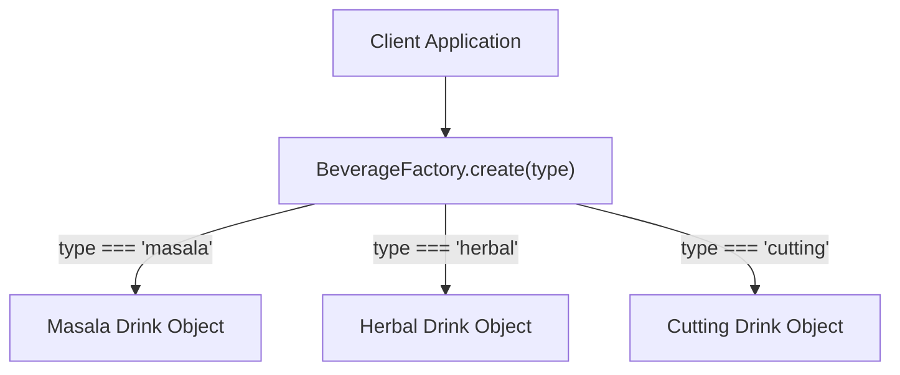

# File 03: The Factory Pattern

## Overview
The **Factory Pattern** provides an interface for creating objects without explicitly specifying their exact concrete classes or constructor functions. Object creation logic is centralized inside a factory method or registry.

---

## 1. Factory Pattern Architecture



---

## 2. Simple Factory & Registration Factory

```javascript
// 1. Simple Factory Function
function makeDrink(type, name) {
    const base = { name, madeBy: "Master Brewer" };

    if (type === "masala") {
        return { ...base, type, strength: 8, price: 15 };
    } else if (type === "cutting") {
        return { ...base, type, strength: 7, price: 10 };
    } else {
        throw new Error("Unknown beverage type: " + type);
    }
}

// 2. Factory with Dynamic Registration (Open/Closed Principle)
class BeverageRegistry {
    constructor() {
        this.creators = new Map();
    }

    register(type, creatorFn) {
        this.creators.set(type, creatorFn);
    }

    create(type, name) {
        const creator = this.creators.get(type);
        if (!creator) throw new Error("Unregistered type: " + type);
        return creator(name);
    }
}

const registry = new BeverageRegistry();
registry.register("herbal", name => ({ name, type: "herbal", price: 25 }));

const myHerbal = registry.create("herbal", "Kerala Herbal");
console.log(myHerbal); // { name: 'Kerala Herbal', type: 'herbal', price: 25 }
```

---

## Key Takeaways
1. Factories **decouple object creation** logic from calling code.
2. Promotes the **Open/Closed Principle**: Registration-based factories allow adding new types without editing existing factory code.
3. Useful when object creation involves complex setup, conditional branching, or dynamic types.
