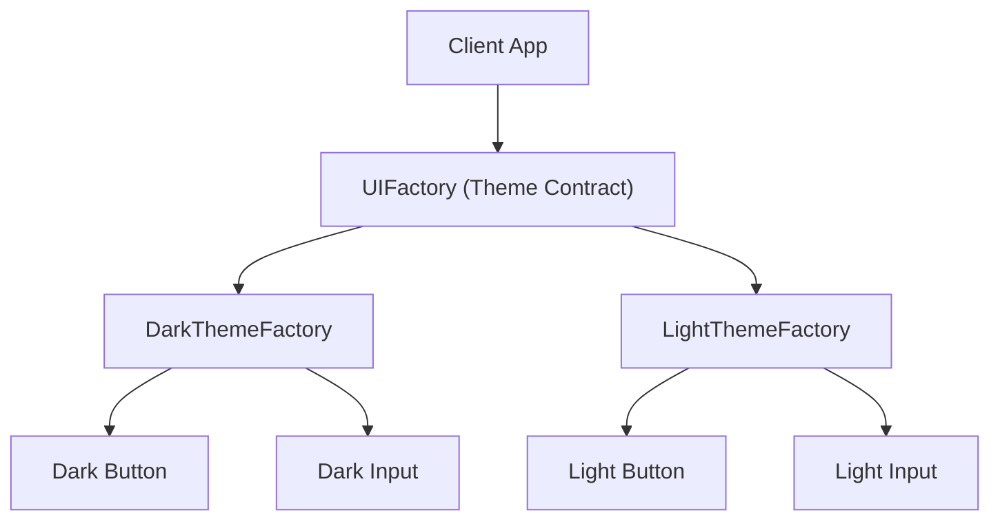

# File 04: The Abstract Factory Pattern

## Overview
The **Abstract Factory Pattern** provides an interface for creating **families of related or dependent objects** without specifying their concrete classes. It guarantees that created objects belong to a consistent theme or environment (such as UI themes, OS widgets, or database driver families).

---

## 1. Abstract Factory Architecture



---

## 2. Implementation: Multi-Theme UI Components

```javascript
// Product Interfaces
class Button { render() {} }
class TextField { render() {} }

// Concrete Products: Dark Theme Family
class DarkButton extends Button {
    render() { return "<button style='background: #333; color: #fff;'>Dark Button</button>"; }
}
class DarkTextField extends TextField {
    render() { return "<input style='background: #222; color: #fff;' />"; }
}

// Concrete Products: Light Theme Family
class LightButton extends Button {
    render() { return "<button style='background: #fff; color: #000;'>Light Button</button>"; }
}
class LightTextField extends TextField {
    render() { return "<input style='background: #eee; color: #000;' />"; }
}

// Abstract Factory Families
class DarkThemeFactory {
    createButton() { return new DarkButton(); }
    createTextField() { return new DarkTextField(); }
}

class LightThemeFactory {
    createButton() { return new LightButton(); }
    createTextField() { return new LightTextField(); }
}

// Application Code (Theme-Agnostic)
function renderUI(factory) {
    const btn = factory.createButton();
    const input = factory.createTextField();
    console.log(btn.render());
    console.log(input.render());
}

renderUI(new DarkThemeFactory());  // Renders Dark UI Family
renderUI(new LightThemeFactory()); // Renders Light UI Family
```

---

## Key Takeaways
1. Abstract Factories create **families of related products** guaranteed to work together.
2. Eliminates product mismatch bugs (e.g., mixing dark inputs with light buttons).
3. Highly useful for multi-platform (macOS/Windows), multi-theme (Dark/Light), or multi-database engines.
