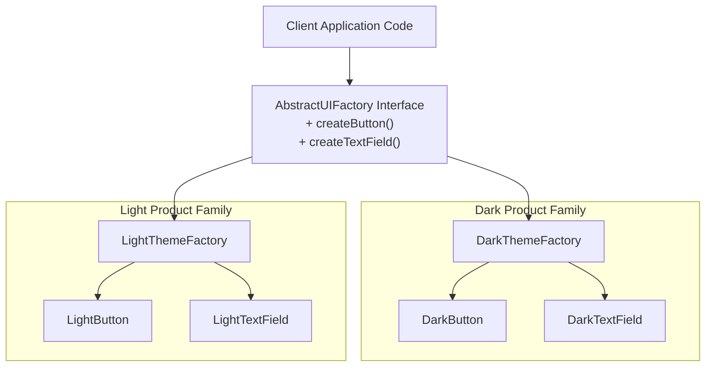
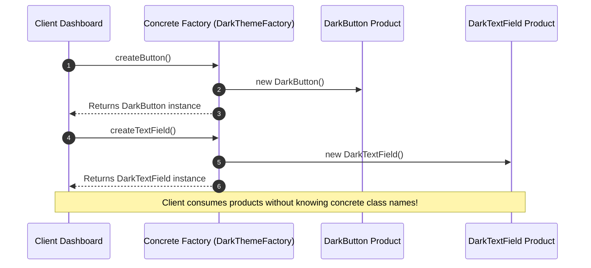

# Module 04: The Abstract Factory Pattern — Product Families, UI Design Systems, and Cross-Platform Engines

## Overview

The **Abstract Factory Pattern** is a Creational design pattern that provides an interface for producing **families of related or dependent objects** without specifying their concrete classes.

Unlike the standard Factory Method pattern (which creates a single product variant), an Abstract Factory guarantees that all products instantiated by a concrete factory belong to a **matching compatible theme or ecosystem** (e.g. Dark Theme UI controls, macOS Native Widgets, or AWS Cloud Infrastructure Drivers).

Understanding **Product Family Constraints**, interface contracts, and distinguishing Abstract Factories from Factory Methods is essential.

---

## 1. Abstract Factory Structural Architecture



---

## 2. Factory Patterns Comparison Matrix

| Pattern Type | Created Object Scope | Key Architectural Intent | Primary Use Case |
| :--- | :--- | :--- | :--- |
| **Simple Factory** | Single product instance based on parameter | Encapsulate conditional `switch`/`if` creation logic | Creating logger instances based on string type |
| **Factory Method** | Single product subclass override | Allow subclasses to decide which class to instantiate | Document parsers creating PDF/CSV renderers |
| **Abstract Factory** | **Family of multiple related products** | Guarantee product compatibility across a theme/environment | UI component suites (Dark/Light) or Cloud Services |

---

## 3. Code Showcase: Multi-Theme UI Design System

```javascript
// 1. Abstract Product Interface Contracts (Base Classes)
class Button {
  render() { throw new Error("Method 'render()' must be implemented"); }
}
class TextField {
  render() { throw new Error("Method 'render()' must be implemented"); }
}

// 2. Concrete Product Family 1: Dark Theme Controls
class DarkButton extends Button {
  render() { return "<button style='background: #1e1e1e; color: #ffffff;'>Dark Button</button>"; }
}
class DarkTextField extends TextField {
  render() { return "<input style='background: #2d2d2d; color: #ffffff;' placeholder='Dark Input...' />"; }
}

// 3. Concrete Product Family 2: Light Theme Controls
class LightButton extends Button {
  render() { return "<button style='background: #ffffff; color: #000000;'>Light Button</button>"; }
}
class LightTextField extends TextField {
  render() { return "<input style='background: #f5f5f5; color: #000000;' placeholder='Light Input...' />"; }
}

// 4. Concrete Factories enforcing Product Family Consistency
class DarkThemeFactory {
  createButton() { return new DarkButton(); }
  createTextField() { return new DarkTextField(); }
}

class LightThemeFactory {
  createButton() { return new LightButton(); }
  createTextField() { return new LightTextField(); }
}

// 5. Client Code (100% Theme-Agnostic!)
function renderApplicationDashboard(uiFactory) {
  const submitBtn = uiFactory.createButton();
  const emailInput = uiFactory.createTextField();

  console.log("Rendering UI Components:");
  console.log(submitBtn.render());
  console.log(emailInput.render());
}

// Instantiation & Execution
renderApplicationDashboard(new DarkThemeFactory());  // Guarantees 100% Dark Family Components!
renderApplicationDashboard(new LightThemeFactory()); // Guarantees 100% Light Family Components!
```

---

## 4. Client-Factory Interaction Sequence



---

## Key Production Takeaways

1. **Use Abstract Factory for Cohesive Product Families**: Use Abstract Factory when an application requires multiple related products (e.g. Buttons, Inputs, Dialogs) that must fit a single consistent theme or operating system.
2. **Prevent Mismatched Component Bugs**: Using an Abstract Factory eliminates bugs where a developer accidentally pairs a Light Theme button with a Dark Theme text input.
3. **Decouple Client Code from Concrete Classes**: The client application only interacts with abstract interfaces (`Button`, `TextField`), making it easy to add a new `HighContrastThemeFactory` without changing client render loops.
4. **Beware of Adding New Product Types**: Adding a new product type (e.g. `createCheckbox()`) requires modifying the abstract factory interface and every concrete factory subclass.

