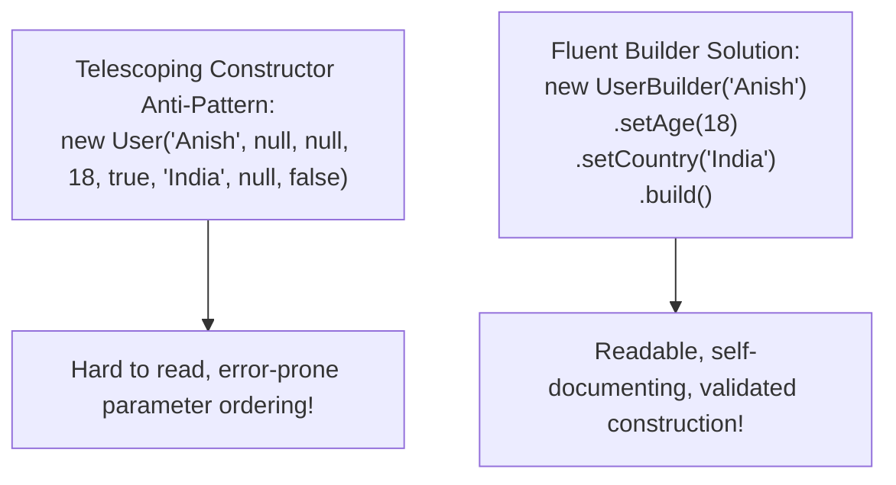
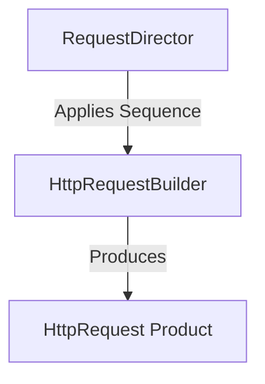

# Module 05: The Builder Pattern — Fluent Interfaces, Method Chaining, and Telescoping Constructor Defense

## Overview

The **Builder Pattern** is a Creational design pattern that separates the step-by-step construction of a complex object from its final representation.

In traditional object-oriented programming, constructing complex objects with many optional parameters leads to the **Telescoping Constructor Anti-Pattern** (e.g. `new User("Anita", null, null, true, false, 30, null)`).

The Builder pattern resolves this anti-pattern by providing a **Fluent Interface** where step-by-step configuration methods return `this`, concluding with an explicit **`.build()`** call that validates inputs and constructs an immutable product object.

---

## 1. Builder Structural Architecture


---

## 2. Constructor Anti-Patterns vs. Builder Matrix



### Construction Patterns Comparison

| Architectural Approach | Readability & Maintainability | Optional Params Handling | Parameter Order Dependency | Validation Timing |
| :--- | :--- | :--- | :--- | :--- |
| **Telescoping Constructor** | Poor (Cryptic `null`/`undefined` positional args) | Poor | **Strict Positional Ordering** | At constructor invocation |
| **Plain Options Object (`{}`)** | Moderate (Descriptive key names) | Good | Order Independent | Scattered throughout logic |
| **Fluent Builder Pattern** | **Excellent** (Self-documenting method chaining) | **Excellent** | **Order Independent** | **Centralized inside `.build()`** |

---

## 3. Code Showcase: Fluent HTTP Request Builder

```javascript
// Product Object (Immutable Data Contract)
class HttpRequest {
  constructor(builder) {
    this.url = builder.url;
    this.method = builder.method;
    this.headers = Object.freeze({ ...builder.headers });
    this.queryParams = Object.freeze({ ...builder.queryParams });
    this.body = builder.body;
    this.timeoutMs = builder.timeoutMs;
    Object.freeze(this); // Enforce full instance immutability!
  }
}

// Fluent Builder Class
class HttpRequestBuilder {
  constructor() {
    this.url = "";
    this.method = "GET"; // Default HTTP method
    this.headers = {};
    this.queryParams = {};
    this.body = null;
    this.timeoutMs = 5000; // Default timeout
  }

  setURL(url) {
    this.url = url;
    return this; // Return 'this' to allow method chaining!
  }

  setMethod(method) {
    this.method = method.toUpperCase();
    return this;
  }

  addHeader(key, value) {
    this.headers[key] = value;
    return this;
  }

  addQueryParam(key, value) {
    this.queryParams[key] = value;
    return this;
  }

  setBody(bodyData) {
    this.body = bodyData;
    return this;
  }

  setTimeout(ms) {
    this.timeoutMs = ms;
    return this;
  }

  // Centralized Validation & Instantiation Step
  build() {
    if (!this.url) {
      throw new Error("Cannot build HttpRequest: URL property is mandatory.");
    }
    if (["POST", "PUT", "PATCH"].includes(this.method) && !this.body) {
      console.warn(`[HttpRequestBuilder]: Method '${this.method}' usually requires a request body.`);
    }
    return new HttpRequest(this); // Instantiates immutable product!
  }
}

// Fluent Chaining Execution
const request = new HttpRequestBuilder()
  .setURL("https://api.payments.com/v1/charge")
  .setMethod("POST")
  .addHeader("Content-Type", "application/json")
  .addHeader("Authorization", "Bearer TOKEN_SECURE_99")
  .addQueryParam("currency", "INR")
  .setBody({ amount: 4500, customerId: "CUST-101" })
  .setTimeout(3000)
  .build();

console.log("Built Request Object:", request);
```

---

## 4. Director Pattern Variation

In formal GoF terminology, a **Director** class can orchestrate predefined builder construction sequences (e.g., `buildJSONPostRequest()`, `buildQuickGetRequest()`):



```javascript
class RequestDirector {
  static buildJSONPost(builder, url, body) {
    return builder
      .setURL(url)
      .setMethod("POST")
      .addHeader("Content-Type", "application/json")
      .setBody(body)
      .build();
  }
}

const quickPost = RequestDirector.buildJSONPost(
  new HttpRequestBuilder(),
  "https://api.store.com/orders",
  { orderId: 9001 }
);
console.log("Director Post Request:", quickPost.headers);
```

---

## Key Production Takeaways

1. **Use Builder for Objects with 4+ Configuration Options**: Avoid cryptic constructor argument lists (`new Obj(a, null, true, null)`) by switching to a fluent builder.
2. **Perform Centralized Validation inside `.build()`**: Perform structural and semantic validation checks inside the final `.build()` method before creating the product.
3. **Freeze Constructed Products for Immutability**: Call `Object.freeze(this)` inside the product constructor to guarantee the builder produces immutable instance snapshots.
4. **Always Return `this` for Chaining**: Ensure every configuration setter in the builder explicitly returns `this`.

