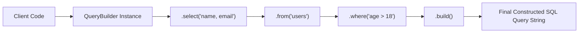

# File 05: The Builder Pattern

## Overview
The **Builder Pattern** separates the construction of a complex object from its representation, allowing step-by-step object configuration using fluent, chainable method calls (`.setX().setY().build()`).

---

## 1. Builder Pattern Architecture



---

## 2. Implementation: Fluent SQL Query Builder

```javascript
class QueryBuilder {
    constructor() {
        this.fields = [];
        this.tableName = "";
        this.conditions = [];
        this.limitValue = null;
    }

    select(...fields) {
        this.fields.push(...fields);
        return this; // Returns 'this' for method chaining!
    }

    from(table) {
        this.tableName = table;
        return this;
    }

    where(condition) {
        this.conditions.push(condition);
        return this;
    }

    limit(num) {
        this.limitValue = num;
        return this;
    }

    build() {
        if (!this.tableName) throw new Error("Table name is required");
        
        const fieldStr = this.fields.length > 0 ? this.fields.join(", ") : "*";
        let query = `SELECT ${fieldStr} FROM ${this.tableName}`;
        
        if (this.conditions.length > 0) {
            query += ` WHERE ${this.conditions.join(" AND ")}`;
        }
        
        if (this.limitValue) {
            query += ` LIMIT ${this.limitValue}`;
        }

        return query + ";";
    }
}

// Fluent Method Chaining Usage
const query = new QueryBuilder()
    .select("name", "email", "role")
    .from("users")
    .where("status = 'ACTIVE'")
    .where("age >= 18")
    .limit(10)
    .build();

console.log(query);
// Output: "SELECT name, email, role FROM users WHERE status = 'ACTIVE' AND age >= 18 LIMIT 10;"
```

---

## Key Takeaways
1. Solves the **Telescoping Constructor Problem** (constructors with 10+ optional parameters).
2. Enables step-by-step object construction using **fluent method chaining (`return this`)**.
3. Clear validation can be performed during the final **`.build()`** call.
