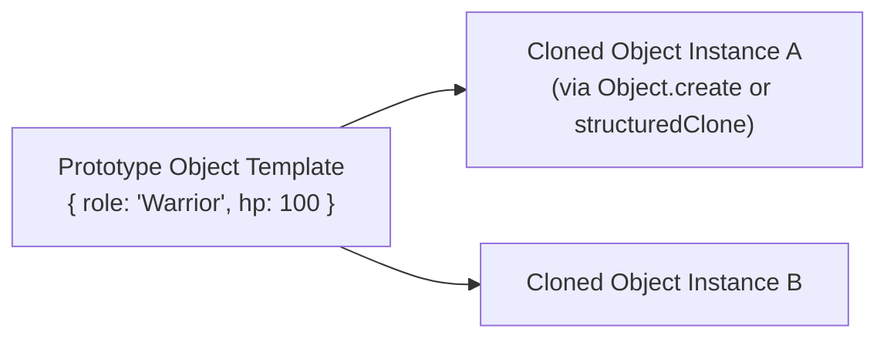

# File 06: The Prototype Pattern

## Overview
The **Prototype Pattern** creates new objects by cloning an existing prototype object instance rather than instantiating new objects from scratch. In JavaScript, this relies on prototype linkage via `Object.create()` or `structuredClone()`.

---

## 1. Prototype Pattern Architecture



---

## 2. Object Cloning Implementation

```javascript
// Prototype Object Blueprint
const gameCharacterPrototype = {
    role: "Warrior",
    health: 100,
    inventory: ["Sword", "Shield"],
    clone() {
        // Deep clone instance using structuredClone
        return structuredClone(this);
    }
};

// Creating Cloned Instances
const warrior1 = gameCharacterPrototype.clone();
warrior1.name = "Thorin";
warrior1.inventory.push("Magic Ring");

const warrior2 = gameCharacterPrototype.clone();
warrior2.name = "Gimli";

console.log(warrior1.name, warrior1.inventory); // "Thorin", ["Sword", "Shield", "Magic Ring"]
console.log(warrior2.name, warrior2.inventory); // "Gimli",  ["Sword", "Shield"] (Independent memory!)
```

---

## Key Takeaways
1. Clones existing instances to avoid heavy initialization costs.
2. Uses **`structuredClone()`** for deep copy independence.
3. Native to JavaScript due to prototype-based object inheritance.
