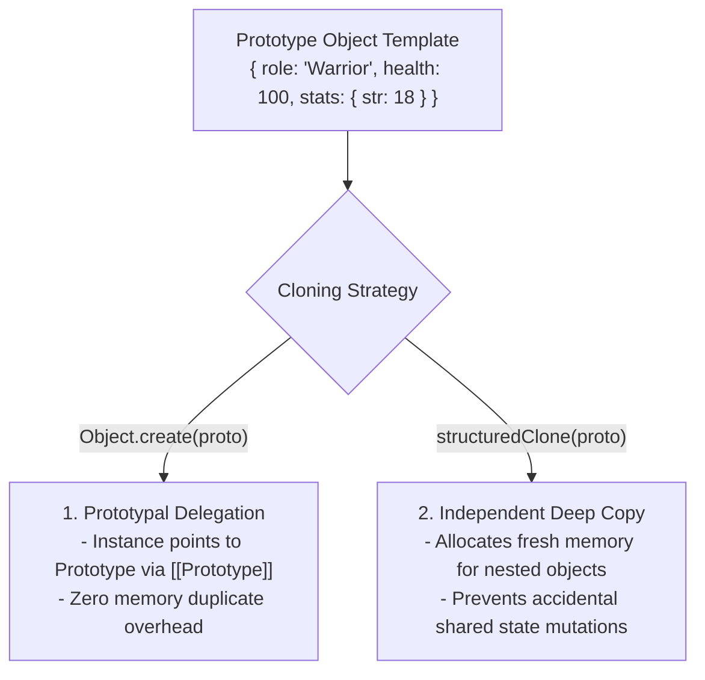
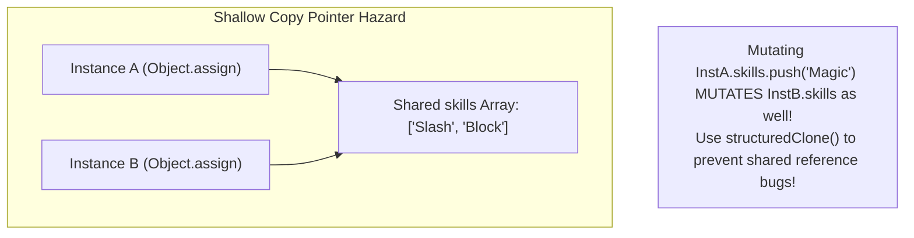

# Module 06: The Prototype Pattern — Object Delegation, `Object.create()`, and `structuredClone()`

## Overview

The **Prototype Pattern** is a Creational design pattern that instantiates new objects by **cloning an existing prototype instance** rather than creating new instances from scratch using class constructors or expensive initializations.

In JavaScript, prototypal inheritance is natively baked into the V8 language engine. Prototype cloning can be achieved in two distinct ways:
1. **Prototypal Link Delegation (`Object.create(proto)`)**: New instances inherit properties dynamically via the `[[Prototype]]` lookup chain.
2. **Deep Instance Copying (`structuredClone(target)`)**: Creates a complete independent deep copy of an object's memory heap space.

Understanding **Shallow Copying Hazards**, `structuredClone()`, and performance benefits is essential.

---

## 1. Prototype Pattern Structural Architecture



---

## 2. Cloning Strategy Matrix

| Cloning Strategy | Mechanism | Nested Memory Independence | Method Inheritance | Performance Cost |
| :--- | :--- | :--- | :--- | :--- |
| **`Object.create(proto)`** | Prototypal Delegation (`[[Prototype]]`) | Shared via Prototype Chain | Native Prototype Link | **Ultra-Fast** ($\mathcal{O}(1)$ pointer assignment) |
| **`Object.assign({}, proto)`** | Shallow Copy | **Shared Nested References!** (Hazard) | Copies enumerable own keys | Fast |
| **`structuredClone(proto)`** | Deep Native Binary Copy | **100% Independent Memory Space** | Does NOT copy functions/methods | Moderate (Deep heap traversal) |

---

## 3. Code Showcase: Prototypal Delegation vs. Deep Copy Cloning

```javascript
// Prototype Blueprint Object
const baseCharacterPrototype = {
  role: "Warrior",
  health: 100,
  stamina: 50,
  skills: ["Slash", "Block"], // Nested Array (Reference hazard in shallow copies!)

  attack() {
    return `${this.name} attacks with ${this.skills[0]}!`;
  },

  // 1. Method for Prototypal Delegation
  createInstance(name) {
    const instance = Object.create(this); // Inherits base properties via [[Prototype]]
    instance.name = name;
    return instance;
  },

  // 2. Method for Deep Copy Cloning
  cloneDeep(name) {
    const cloned = structuredClone(this); // Deep copy of nested objects/arrays!
    cloned.name = name;
    // Restore function methods lost during structuredClone:
    cloned.attack = this.attack; 
    return cloned;
  }
};

// 1. Using Prototypal Delegation (Object.create)
const warrior1 = baseCharacterPrototype.createInstance("Thorin");
console.log(warrior1.attack()); // "Thorin attacks with Slash!"
console.log(Object.getPrototypeOf(warrior1) === baseCharacterPrototype); // true

// 2. Demonstrating Deep Copy Independence via structuredClone
const warrior2 = baseCharacterPrototype.cloneDeep("Gimli");
warrior2.skills.push("Berserk"); // Mutates warrior2's independent array ONLY!

console.log("Warrior 2 Skills:", warrior2.skills); // ["Slash", "Block", "Berserk"]
console.log("Prototype Skills:", baseCharacterPrototype.skills); // ["Slash", "Block"] (Unpolluted!)
```

---

## 4. Shallow Copy Hazard Diagram



---

## Key Production Takeaways

1. **Use `Object.create(proto)` for Memory Efficiency**: Use `Object.create(proto)` when creating thousands of objects that share common methods and default state without memory duplicates.
2. **Use `structuredClone()` for Deep Independence**: Use native `structuredClone()` to clone complex state trees containing nested arrays, Maps, Sets, and Dates without shared reference hazards.
3. **Avoid Legacy `JSON.parse(JSON.stringify())`**: `structuredClone()` natively handles circular references, Maps, Sets, TypedArrays, and BigInts, whereas `JSON.parse/stringify` fails.
4. **Re-Attach Methods After `structuredClone()`**: Remember that `structuredClone()` omits function methods; re-attach prototype functions or use prototypal delegation if methods are needed.

