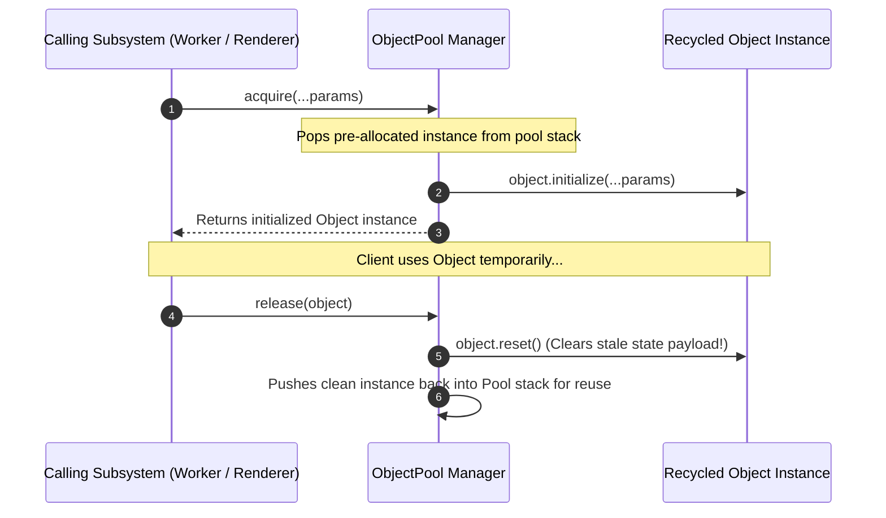

# Module 07: The Object Pool Pattern — Resource Reuse, V8 GC Pause Defense, and Memory Recycling

## Overview

The **Object Pool Pattern** is a Creational design pattern that manages a container of pre-allocated, reusable objects.

Instead of continuously instantiating and garbage-collecting objects inside high-frequency execution loops (such as 60 FPS Canvas/WebGL game rendering, audio processing, or TCP socket streaming), clients **acquire** an existing object from the pool, use it temporarily, and **release** it back to the pool for recycling.

By eliminating frequent heap allocations, the Object Pool pattern drastically reduces **V8 Garbage Collector (GC) Scavenger Pauses** and prevents memory fragmentation.

---

## 1. Object Pool Lifecycle Architecture



---

## 2. Allocation Strategy Comparison Matrix

| Instantiation Approach | Allocation Mechanism | V8 GC Overhead | Latency Spikes | Ideal Use Case |
| :--- | :--- | :--- | :--- | :--- |
| **Standard Instantiation (`new`)** | Heap allocation per request | **High** (Frequent Scavenger minor GC sweeps) | Unpredictable GC pauses (~5ms - 50ms) | Low-frequency business logic |
| **Fixed Object Pool** | Pre-allocates N objects upfront | **Near Zero** | Monotonic, smooth execution | 60 FPS WebGL, Canvas, Physics engines |
| **Dynamic Expanding Object Pool** | Pre-allocates N, grows on demand | Low (Growth triggers minor allocation) | Minimal | Database socket pools, HTTP connection pools |

---

## 3. Code Showcase: High-Performance Object Pool

```javascript
// Reusable Resource (Particle Node for WebGL Engine)
class Particle {
  constructor() {
    this.x = 0;
    this.y = 0;
    this.vx = 0;
    this.vy = 0;
    this.life = 0;
    this.inUse = false;
  }

  // Active Initialization (Called during acquire)
  init(x, y, vx, vy, life) {
    this.x = x;
    this.y = y;
    this.vx = vx;
    this.vy = vy;
    this.life = life;
    this.inUse = true;
  }

  // State Reset Safeguard (Called during release to prevent stale data leaks!)
  reset() {
    this.x = 0;
    this.y = 0;
    this.vx = 0;
    this.vy = 0;
    this.life = 0;
    this.inUse = false;
  }
}

// Recyclable Object Pool Manager
class ParticlePool {
  #availablePool = [];
  #maxCapacity;

  constructor(initialSize = 100, maxCapacity = 500) {
    this.#maxCapacity = maxCapacity;

    // Pre-allocate initial object pool in memory heap upfront
    for (let i = 0; i < initialSize; i++) {
      this.#availablePool.push(new Particle());
    }
  }

  acquire(x, y, vx, vy, life) {
    let particle;

    if (this.#availablePool.length > 0) {
      particle = this.#availablePool.pop(); // Reuse existing pre-allocated instance!
    } else if (this.totalAllocated < this.#maxCapacity) {
      console.warn("[ParticlePool]: Pool depleted. Dynamically allocating new Particle.");
      particle = new Particle(); // Dynamic growth fallback
    } else {
      throw new Error("[ParticlePool]: Maximum pool capacity reached! Failed to acquire.");
    }

    particle.init(x, y, vx, vy, life);
    return particle;
  }

  release(particle) {
    if (!particle || !particle.inUse) {
      console.warn("[ParticlePool]: Attempted to release invalid or already-released object.");
      return;
    }

    // MANDATORY STEP: Completely clear stale state before returning to pool!
    particle.reset();
    this.#availablePool.push(particle);
  }

  get availableCount() {
    return this.#availablePool.length;
  }
}

// Execution Benchmark Simulation
const pool = new ParticlePool(50, 200);

// Acquire particle from pool
const p1 = pool.acquire(10, 20, 1.5, -2.0, 100);
console.log("Acquired Particle:", p1.x, p1.y, "Available in Pool:", pool.availableCount); // 49

// Release particle back to pool for recycling
pool.release(p1);
console.log("After Release, Available in Pool:", pool.availableCount); // 50
console.log("Released Particle Reset Check (inUse):", p1.inUse); // false (Safely reset!)
```

---

## 4. V8 Garbage Collection Defense Diagram

```mermaid
flowchart TD
    subgraph Without Object Pool
        Loop1["High-Frequency Loop (60 FPS)"] -->|new Obj() x 10,000| HeapBuild1["Fast Heap Expansion"]
        HeapBuild1 -->|Triggers| GCPause1["V8 Scavenger / Major GC Pause!<br/>(Frame Drop / UI Jitter!)"]
    end

    subgraph With Object Pool
        Loop2["High-Frequency Loop (60 FPS)"] -->|acquire() / release()| PoolRecycle["Recycles Fixed Array Memory"]
        PoolRecycle -->|Zero New Allocations| FlatHeap["Flat Memory Graph (Zero GC Pauses!)"]
    end
```

---

## Key Production Takeaways

1. **Use Object Pools to Eliminate GC Pauses**: Implement Object Pools in high-frequency performance-critical code (such as WebGL, WebSockets, audio synthesis, and game engines) to prevent V8 GC frame drops.
2. **Mandatory Object Reset on Release**: Always implement a robust `.reset()` method that wipes all stale references and properties when an object is released back to the pool.
3. **Prevent Double-Release Corruption**: Use an `inUse` flag or internal tracker to prevent a caller from releasing the same object back to the pool twice.
4. **Pre-allocate Pool Size Intelligently**: Pre-allocate the pool size based on peak usage benchmarks to minimize dynamic allocation growth during runtime.

