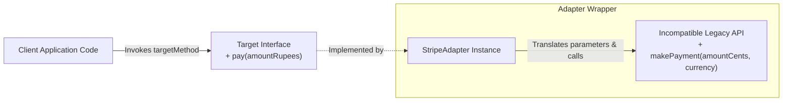
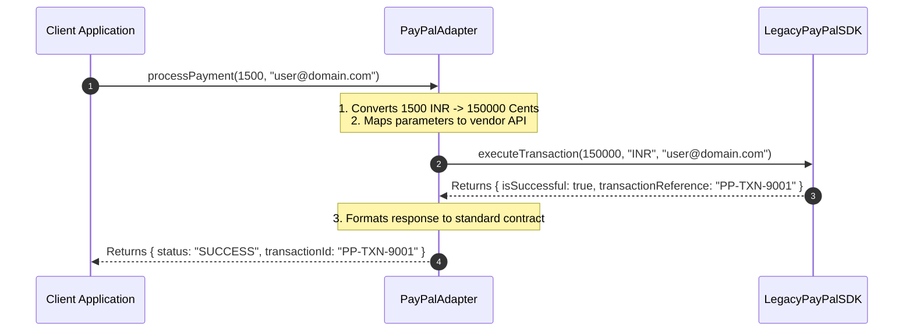

# Module 08: The Adapter Pattern — Interface Translation, API Wrapping, and Object Composition

## Overview

The **Adapter Pattern** is a Structural design pattern that enables objects with incompatible interfaces to collaborate by converting the interface of one object into an interface expected by the client.

In JavaScript applications, Adapters act as **Wrapper Bridges**, translating method signatures, parameter data formats, and return values between client code and incompatible third-party libraries, legacy APIs, or external microservices.

Understanding the difference between **Object Adapters** (utilizing composition) and **Class Adapters** (utilizing inheritance), and distinguishing Adapters from Facades and Proxies is essential.

---

## 1. Adapter Structural Architecture



---

## 2. Structural Patterns Comparison Matrix

| Pattern Name | Primary Architectural Purpose | Interface Change Behavior | Target Relationship |
| :--- | :--- | :--- | :--- |
| **Adapter Pattern** | Converts incompatible interfaces to match client expectations | **Translates / Changes Interface** | Wraps existing adaptee instance |
| **Facade Pattern** | Simplifies complex subsystem into single unified API | **Simplifies Interface** | Wraps multiple subsystem services |
| **Proxy Pattern** | Controls & traps access to underlying object | **Keeps Identical Interface** | Wraps target object transparently |
| **Bridge Pattern** | Decouples abstraction from implementation hierarchy | **Separates Interfaces** | Bridges two independent hierarchies |

---

## 3. Code Showcase: Payment Gateway Object Adapter

```javascript
// 1. Expected Client Target Contract
class StandardPaymentGateway {
  processPayment(amountInINR, userEmail) {
    throw new Error("Method 'processPayment' must be implemented");
  }
}

// 2. Incompatible Third-Party Adaptee (Legacy Vendor API)
class LegacyPayPalSDK {
  executeTransaction(centsValue, currencyCode, clientAccount) {
    console.log(`[PayPal SDK]: Processing ${centsValue} cents in ${currencyCode} for ${clientAccount}`);
    return { isSuccessful: true, transactionReference: "PP-TXN-9001" };
  }
}

// 3. Object Adapter Implementation (Composition Strategy)
class PayPalAdapter extends StandardPaymentGateway {
  #payPalInstance;

  constructor(payPalInstance) {
    super();
    this.#payPalInstance = payPalInstance;
  }

  // Translates standard processPayment(amountINR, email) -> executeTransaction(cents, currency, account)
  processPayment(amountInINR, userEmail) {
    // 1. Data Transformation: Convert INR to Cents
    const centsAmount = Math.round(amountInINR * 100);
    
    // 2. Delegate to Adaptee method signature
    const rawResponse = this.#payPalInstance.executeTransaction(centsAmount, "INR", userEmail);

    // 3. Format Response to match Client Expectations
    return {
      status: rawResponse.isSuccessful ? "SUCCESS" : "FAILED",
      transactionId: rawResponse.transactionReference,
      amountPaidINR: amountInINR
    };
  }
}

// Client Execution
const legacyVendor = new LegacyPayPalSDK();
const paymentGateway = new PayPalAdapter(legacyVendor);

const paymentResult = paymentGateway.processPayment(1500, "user@domain.com");
console.log("Client Normalized Result:", paymentResult);
```

---

## 4. Adapter Translation Sequence



---

## Key Production Takeaways

1. **Use Adapters to Shield Code from Third-Party Breaking Changes**: Wrap external SDKs inside Adapters so vendor API changes only require updating the Adapter, not application code.
2. **Prefer Object Adapters (Composition) over Class Adapters**: Use composition (`this.#adaptee = adaptee`) inside Adapters to decouple the Adapter from specific class hierarchies.
3. **Normalize Data Formats and Units**: Use Adapters to transform data representations (e.g., converting Cents to Rupees, or ISO dates to Unix timestamps).
4. **Isolate Legacy Code Refactoring**: Wrap legacy subsystem interfaces inside Adapters when refactoring legacy codebases to maintain backwards compatibility.

