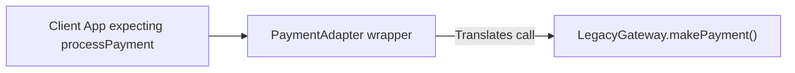

# File 08: The Adapter Pattern

## Overview
The **Adapter Pattern** converts the interface of a class or service into another interface that clients expect. It acts as a wrapper bridge, allowing incompatible classes (such as third-party payment gateways or legacy APIs) to work together seamlessly without modifying source code.

---

## 1. Adapter Pattern Architecture



---

## 2. Payment Gateway Adapter Implementation

```javascript
// New Standard Payment Interface expected by App
class StandardPaymentProcessor {
    pay(amountInRupees) {
        throw new Error("Abstract method");
    }
}

// Incompatible Third-Party / Legacy Service
class LegacyStripeGateway {
    makePayment(centsAmount, currency) {
        console.log(`Legacy Stripe charged ${centsAmount} cents in ${currency}`);
        return { success: true, txnId: "TXN_99812" };
    }
}

// Payment Adapter
class StripeAdapter extends StandardPaymentProcessor {
    constructor(stripeGateway) {
        super();
        this.stripe = stripeGateway;
    }

    // Translates standard pay(rupees) call to legacy makePayment(cents, currency)
    pay(amountInRupees) {
        const cents = amountInRupees * 100;
        const result = this.stripe.makePayment(cents, "INR");
        return { status: result.success ? "COMPLETED" : "FAILED", id: result.txnId };
    }
}

// Client application uses standard interface
const adapter = new StripeAdapter(new LegacyStripeGateway());
const response = adapter.pay(500); // Pass ₹500
console.log(response); // { status: 'COMPLETED', id: 'TXN_99812' }
```

---

## Key Takeaways
1. Adapters **wrap incompatible APIs** to match expected client contracts.
2. Isolates third-party library API breaking changes behind a stable wrapper.
3. Allows legacy code refactoring without breaking client consumption.
