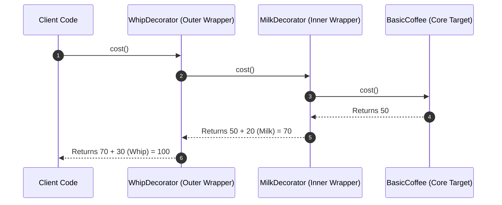

# Module 09: The Decorator Pattern — Dynamic Behavior Extension, Functional Wrappers, and Class Decorators

## Overview

The **Decorator Pattern** is a Structural design pattern that allows dynamically attaching new behaviors or responsibilities to an object at runtime without altering its original source code or creating bloated inheritance hierarchies.

Without Decorators, extending object behavior using subclassing leads to **Combinatorial Class Explosion** (e.g. creating `CoffeeWithMilk`, `CoffeeWithMilkAndSugar`, `CoffeeWithMilkAndSugarAndWhip`, requiring $2^N$ subclass permutations for $N$ features).

In JavaScript, Decorators can be implemented using **Object Wrapping Layers**, **Higher-Order Decorator Functions**, or standard **TC39 Decorator Proposals (`@decorator`)**.

---

## 1. Class Explosion vs. Decorator Composition Architecture

```mermaid
flowchart TD
    subgraph Inheritance Class Explosion (BAD)
        Base[Base Coffee] --> C1[CoffeeWithMilk]
        Base --> C2[CoffeeWithSugar]
        Base --> C3[CoffeeWithMilkAndSugar]
        Base --> C4[CoffeeWithMilkAndSugarAndWhip]
    end

    subgraph Decorator Composition (GOOD)
        BaseObj[Basic Coffee Object] --> DecMilk[withMilk Decorator]
        DecMilk --> DecSugar[withSugar Decorator]
        DecSugar --> DecWhip[withWhip Decorator]
    end
```

---

## 2. Decorator Wrapper Execution Pipeline



---

## 3. Code Showcase: Object Wrapper vs. Functional HOF Decorator

```javascript
// 1. Core Component Interface & Base Implementation
class BaseService {
  execute(data) {
    return `Processed payload: ${data}`;
  }
}

// 2. Functional HOF Decorator: Logging Add-On
function withLogging(targetService) {
  const originalExecute = targetService.execute;

  targetService.execute = function (data) {
    console.log(`[LOG - BEFORE]: Executing service with input: ${data}`);
    const result = originalExecute.call(this, data); // Delegate call
    console.log(`[LOG - AFTER ]: Result produced: ${result}`);
    return result;
  };

  return targetService;
}

// 3. Functional HOF Decorator: Performance Timing Add-On
function withPerformanceTiming(targetService) {
  const originalExecute = targetService.execute;

  targetService.execute = function (data) {
    const t0 = performance.now();
    const result = originalExecute.call(this, data);
    const t1 = performance.now();
    console.log(`[PERF TIMING]: Operation duration: ${(t1 - t0).toFixed(4)} ms`);
    return result;
  };

  return targetService;
}

// Composition Execution: Chaining Multiple Decorators Dynamically!
let myService = new BaseService();

// Dynamically decorate with Logging and Performance Timing!
myService = withLogging(myService);
myService = withPerformanceTiming(myService);

myService.execute("ORDER_PAYLOAD_9001");
```

---

## 4. TC39 / TypeScript Class Method Decorators (`@decorator`)

Modern ECMAScript / TypeScript provides native decorator syntax (`@decorator`) for annotating class methods and properties at compile/evaluation time:

```javascript
// Method Decorator Simulation (TC39 Specification Signature)
function readonly(target, propertyKey, descriptor) {
  descriptor.writable = false; // Prevents overriding method at runtime
  return descriptor;
}

class UserAccount {
  constructor(name) {
    this.name = name;
  }

  // @readonly
  getUserID() {
    return `ID-${this.name.toUpperCase()}`;
  }
}
```

---

## Key Production Takeaways

1. **Use Decorators Over Subclassing for Add-On Behaviors**: Decorators allow combining features flexibly at runtime rather than creating dozens of rigid subclasses.
2. **Preserve Method Signatures in Decorators**: Ensure decorator wrappers maintain identical method parameters and return types so calling code is unaffected.
3. **Keep Decorators Focused on Single Responsibilities**: Follow the Single Responsibility Principle by writing small, focused decorators (e.g. `withLogging`, `withCaching`, `withMetrics`).
4. **Order of Decoration Matters**: Be mindful of execution ordering when stacking multiple decorators (e.g., executing authentication before caching vs. caching before authentication).

