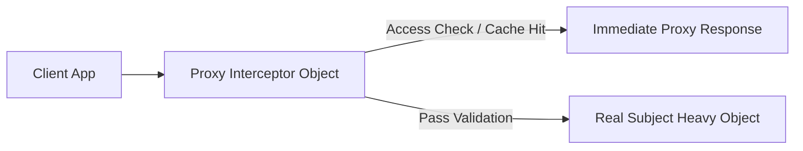

# File 10: The Proxy Pattern

## Overview
The **Proxy Pattern** provides a surrogate or placeholder object that controls access to another underlying target object, allowing operations such as access logging, lazy initialization, caching, or property mutation validation.

---

## 1. Proxy Architecture



---

## 2. Implementation: Caching & Validation Proxy

```javascript
// Real Expensive API Service
class HeavyDataService {
    fetchData(key) {
        console.log(`[NETWORK CALL] Fetching heavy payload for key: ${key}`);
        return { data: `Payload for ${key}`, timestamp: Date.now() };
    }
}

// Caching Proxy Wrapper
class DataServiceProxy {
    constructor() {
        this.service = new HeavyDataService();
        this.cache = new Map();
    }

    fetchData(key) {
        if (!key) throw new Error("Key is required");

        // Return from cache if hit
        if (this.cache.has(key)) {
            console.log(`[CACHE HIT] Returning stored payload for key: ${key}`);
            return this.cache.get(key);
        }

        // Delegate call to Real Service
        const result = this.service.fetchData(key);
        this.cache.set(key, result);
        return result;
    }
}

const proxy = new DataServiceProxy();
proxy.fetchData("user_101"); // Network Call executed
proxy.fetchData("user_101"); // Cache Hit returned instantly!
```

---

## Key Takeaways
1. Proxies **control access** to target objects.
2. Supports **Virtual Proxies** (lazy initialization), **Protection Proxies** (access validation), and **Caching Proxies**.
3. Built into JavaScript natively via the `new Proxy(target, handler)` constructor.
